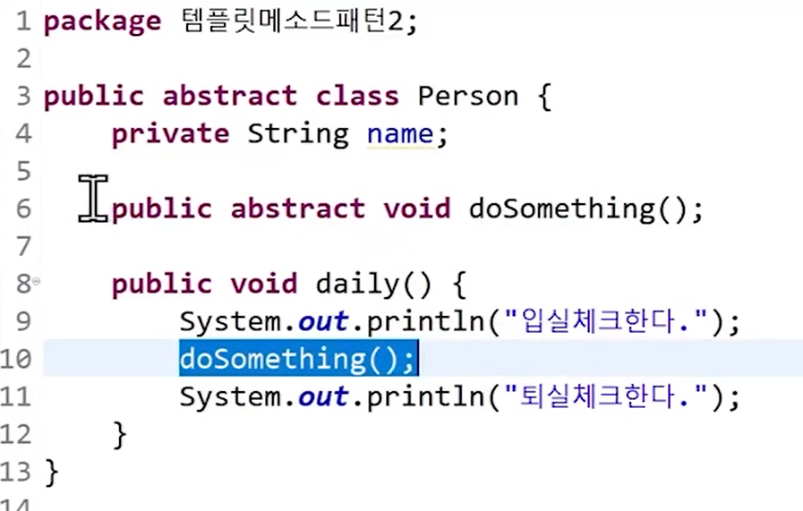
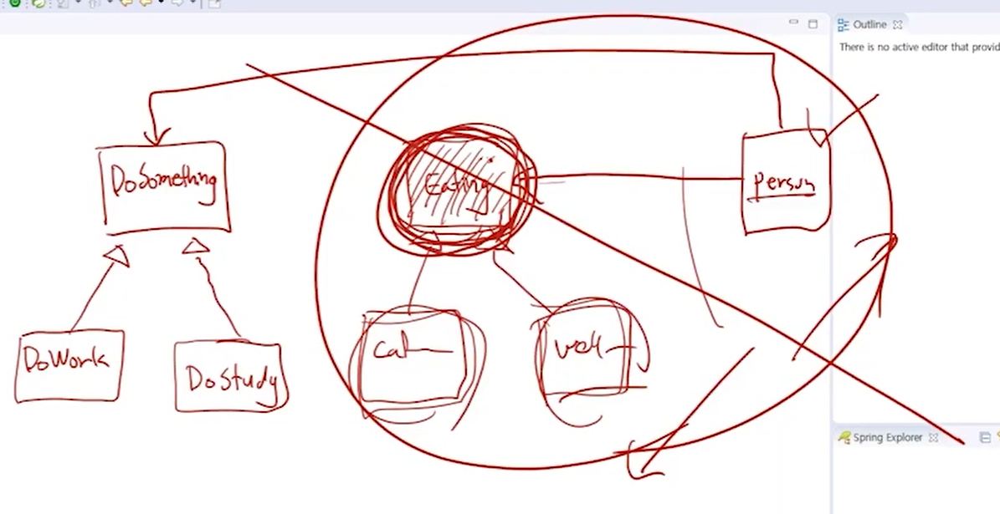
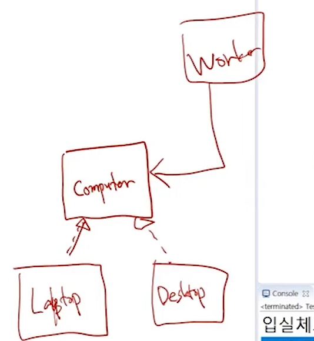
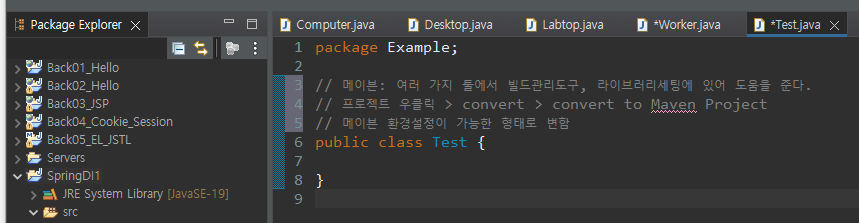
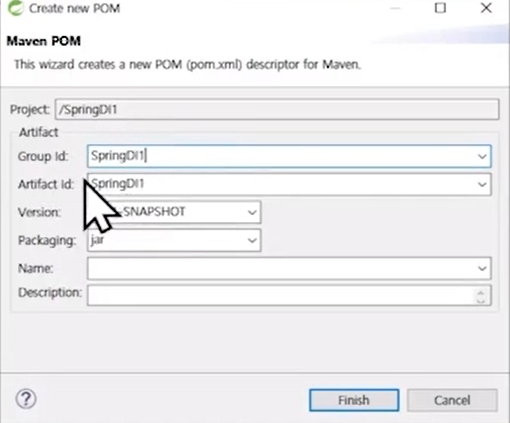
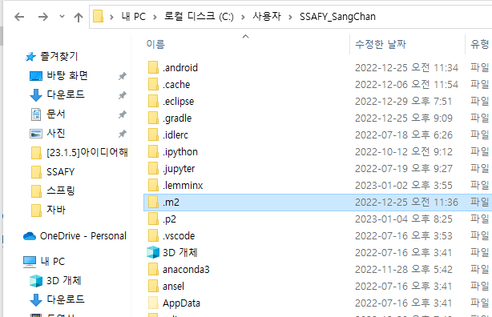
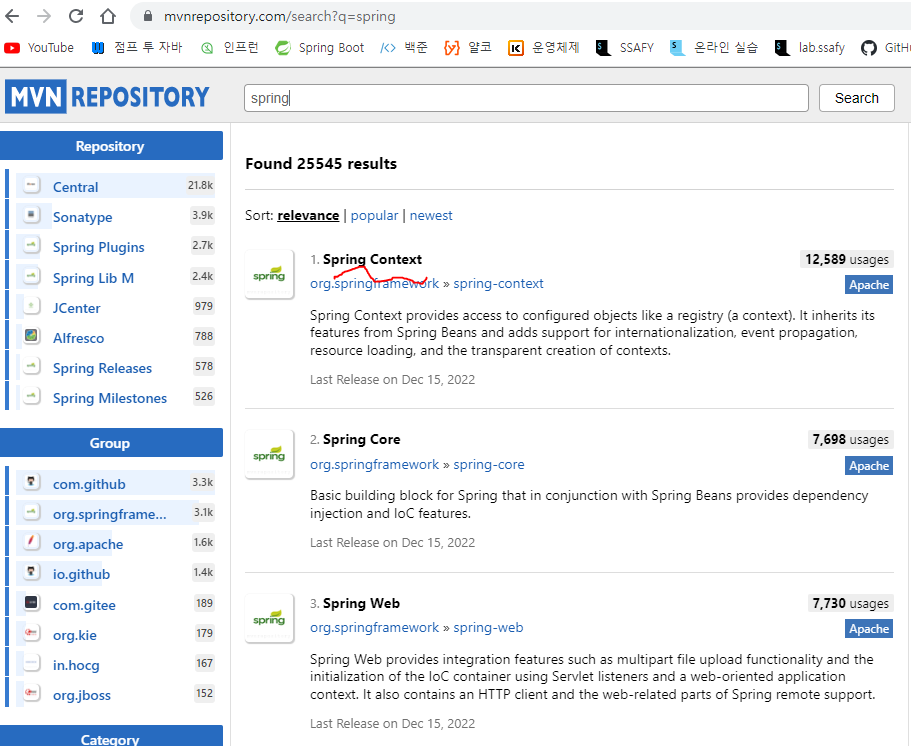
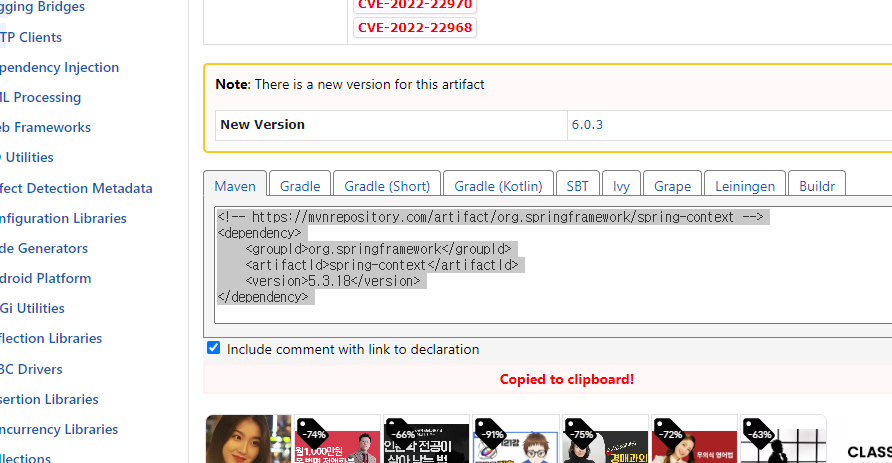
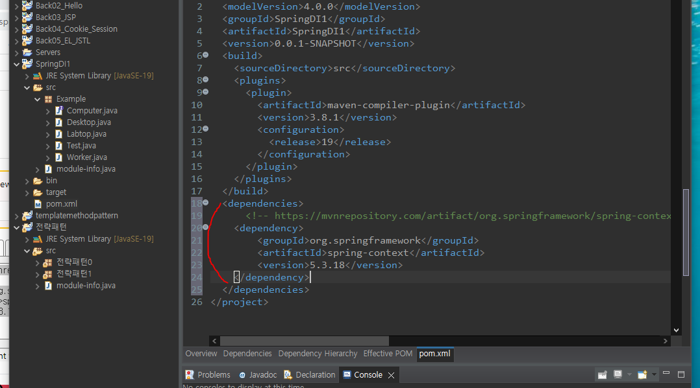
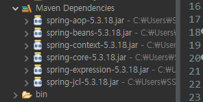

# SpringFramework

- 공통 구조를 어떻게 잘 가져갈지가 근본 시작점



> 템플릿 메서드를 만들어 놓고 서로 달라지는 부분만 추상메서드로 처리함으로써 저 부분만 자식 클래스가 결정하도록 만들어주는 것이 템플릿메서드패턴이었다.


### 팩토리 메소드 패턴

- 한 곳에서 객체를 모두 만들고 객체 주입으로 생성만 한다.

```java
package 전략패턴1;

public class Personfactory {
	static DoSomething work = new Dowork();
	static DoSomething study = new DoStudy();
	static Eating cafeteria = new EatCafeteria();
	static Eating wellStory = new EatWellStory();
	
	public static Person getInstance(String type) {
		Person p = new Person();
		switch(type) {
		case "Employee":
			p.setDoSomething(work);
			p.setEating(wellStory);
			break;
		case "Student":
			p.setDoSomething(study);
			p.setEating(cafeteria);
			break;
		case "SSAFY":
			p.setDoSomething(study);
			p.setEating(wellStory);
			break;
		}
		return p;
	}
}

package 전략패턴1;

public class Test {
	public static void main(String[] args) {
//		// 객체를 만들고, 의존관계를 연결하는 작업을 스프링 프레임워크에서 모두 책임진다.
//		Dowork work = new Dowork();
//		DoStudy study = new DoStudy();
//		EatWellStory wellStory = new EatWellStory();
//		EatCafeteria cafeteria = new EatCafeteria();
//		// Employee
//		// 같은 클래스이지만 객체별로 적절한 전략을 선택할 수 있게 만듦.
//		Person employee = new Person();
//		employee.setDoSomething(work);
//		employee.setEating(wellStory);
//		
//		Person student = new Person();
//		student.setDoSomething(study);
//		student.setEating(cafeteria);
//		
//		Person ssafy = new Person();
//		ssafy.setDoSomething(study);
//		ssafy.setEating(wellStory);
		
		Person employee = Personfactory.getInstance("Employee");
	}
}
```


### 학습목표

0. Framework에 대한 이해
1. DI, IOC 개념 숙지
2. spring 개발 환경 구축(`sts` 다운)
3. spring 환경 설정
   - 컨테이너에 객체 등록, 의존 관계
   - 컨테이너로부터 객체 회수

> `Person` -> `DoSomething` 타입에 대한 의존성은 `DoSomething`을 통해서 인터페이스 타입으로 느슨하게 의존하고, 객체 생성에 대한 의존성은 `Person`이 직접하는 것이 아니라 `Personfactory`가 객체 생성을 담당한다.


- Spring 라이브러리 세팅
- Spring 설정 파일 작성법
- Spring container 빌드

> Spring 라이브러리가 세팅이 되어야 하고, Spring 설정 파일은 어떻게 만들며, 설정 파일의 구성은 어떻게 되어 있고, 이 설정 파일로 어떻게 Spring container를 만들어내는지, 그리고 Spring 설정 파일에 어떻게 객체를 등록하는지, 빌드된 컨테이너로부터 객체를 어떻게 받아오는지, 설정 파일에 등록되어 있는 객체들끼리 어떻게 의존 관계를 설정하는지



> `Eating`의 설계가 완료되는 시점에서 `Person`은 인터페이스를 바탕으로 다른 설계를 진행하고, `Cafeteria`아랑`Wellstroy`는 `Person`과 별개로 `Eating`을 규격에 맞춰서 구현하면 되기 때문에 `Eating`이라는 구격 아래에 분업이 가능하다.



> 이를 활용해서 예제 연습, 인터페이스에 결합하면 느슨한 결합, `Computer`를 `Labtop`이나 `Desktop`으로 한정하면 강한 결합이다.



> Spirng 옆에 `J`가 적혀 있음. 



> 총 세 가지의 식별자가 존재 Group id는 우리의 팀까지, Artifact id는 현재의 프로젝트를 나타낸다. 저 두 가지로 이 세상의 모든 프로젝트를 상호 식별할 수 있다. 메이븐은 자동으로 라이브러리를 받아서 세팅해주는데 고장이 잘 난다.
>
> 만약 빨간 줄이 나오면 `alt` + `F5` 눌러서 `update maven`하면 됨

```java
package Example;

// 메이븐: 여러 가지 툴에서 빌드관리도구, 라이브러리세팅에 있어 도움을 준다.
// 프로젝트 우클릭 > configure > convert to Maven Project
// 메이븐 환경설정이 가능한 형태로 변함
// 메이븐에 문제 있을 때
// 1. alt + F5 update project.(플젝 우클릭 > 메이븐 > Update Project)
// 2. 상단메뉴 project > clean
// 3. 이클립스 다 끄고, 사용자 > .m2폴더 삭제
public class Test {

}
```



> C > 사용자 > 유저 이름 > .m2폴더 에 지금까지 썼던 라이브러리가 들어있음. 다운 받은 `jar`파일이 해쉬까지 뜨면서 검증했으면서도 파일 크기가 안 맞아서 실행되지 않는 경우가 많음 -> 다운로드가 잘못되어서 라이브러리가 꼬임 -> 삭제하고 이클립스 다시 키면 다시 다운 받음 -> 이렇게해서 해결되는 경우가 많음
>
> 메이븐에서 잘 되지 않을 경우 위 3가지 메뉴얼을 진행해보기



> `Spring Core`에도 `DI`와 `Ioc` 기능이 있는데 더 확장판인 `Spring Context`를 사용하자



> 복사 후 메이븐 세팅



> `pom.xml` 파일에 넣는다



> 다운 되어짐. 여러 개의 jar파일이 세팅. 스프링 컨텍스트가 돌기 위해서는 6개의 jar파일이 필요해서 번거로움. mysql은 하나라서 그냥 다운 받고 path 설정해주면 됨.
>
> 라이브러리의 의존 관계가 복잡할수록 메이븐 같은 빌드 관리 도구를 사용해야함.