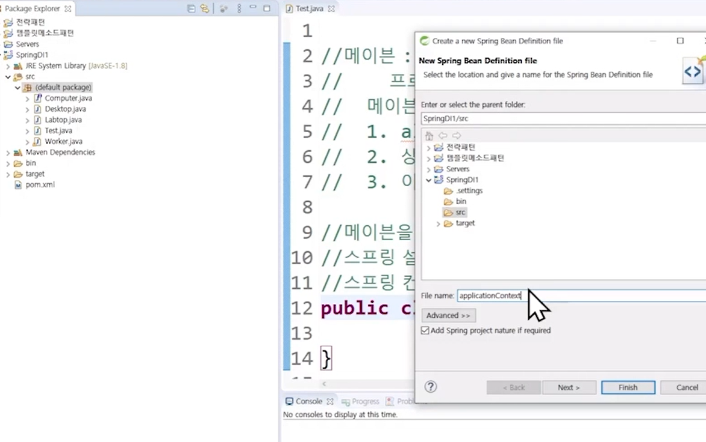
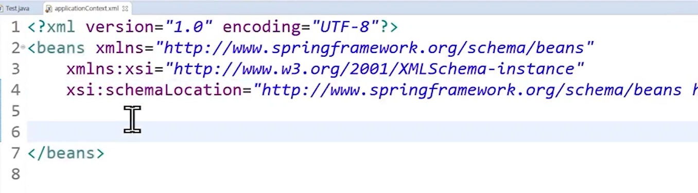
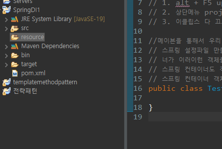
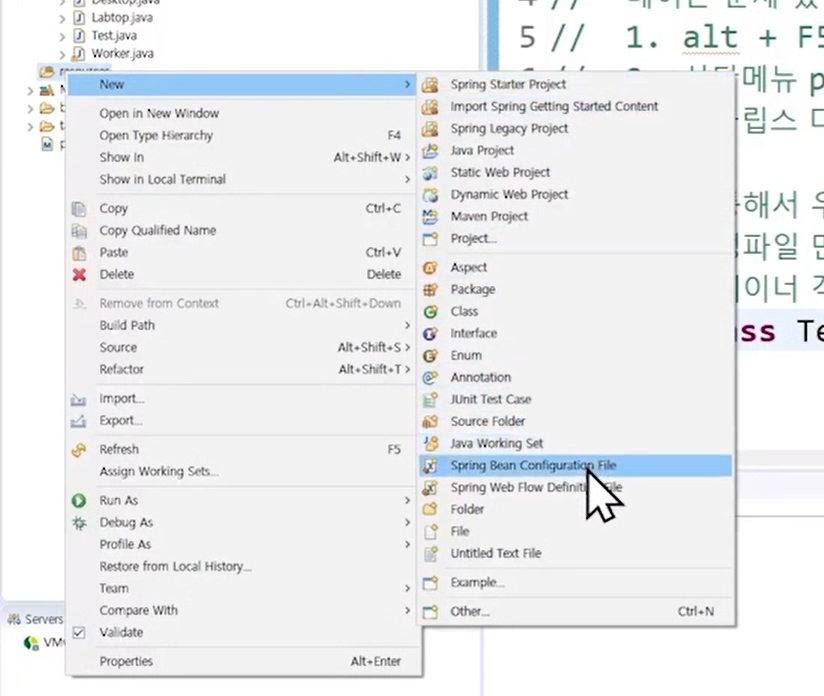
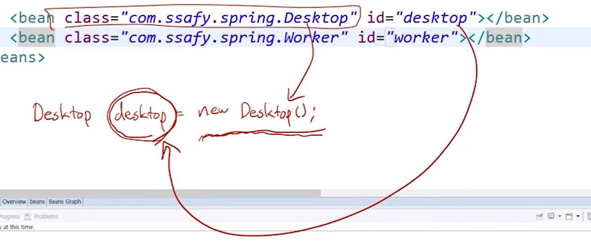

# Spring 환경설정

```java
package Example;

// 메이븐: 여러 가지 툴에서 빌드관리도구, 라이브러리세팅에 있어 도움을 준다.
// 프로젝트 우클릭 > configure > convert to Maven Project
// 메이븐 환경설정이 가능한 형태로 변함
// 메이븐에 문제 있을 때
// 1. alt + F5 update project.(플젝 우클릭 > 메이븐 > Update Project)
// 2. 상단메뉴 project > clean
// 3. 이클립스 다 끄고, 사용자 > .m2폴더 삭제

//메이븐을 통해서 우리 프로젝트에 Spring 라이브러리 세팅
// 스프링 설정파일 만들고 객체(Spring Container에 등록되는 객체는 빈(bean)이라고 표현) 등록하기
// 너가 이러이런 객체를 관리해줘라고 빈들을 컨테이너에 등록
// 스프링 컨테이너도 객체임
// 스프링 컨테이너 객체 빌드, 사용
public class Test {
	
}
```



> `applicationContext`는 관례적으로 사용된다.



> 스프링의 문법은 `schemaLocation`에서 긁어와서 사용됨. `bean`과 같은 자동완성이 만들어짐.

- `xml`, `sql` 파일은 따로 관리해서 소스코드와 섞이지 않게 조치한다.
  - New -> Source Folder 클릭하기!





> Desktop과 Worker객체를 빈으로 등록하고 테스트클래스에서 이 컨테이너를 빌드한 후에 컨테이너에 만들어져 있는 객체를 회수해 와 볼 예정

> `xml`은 임포트 기능이 없기 때문에 `class`에 풀패키지 명을 적어야한다.

```
<bean class="com.ssafy.spring.Desktop"></bean>
```

> 이 클래스로 만든 객체하나가 빈으로 등록이 된다. 대신 구별할 수 있는 식별자가 있어야한다. 그것은 `id`로 구분



> `ApplicationContext` 인터페이스가 스프링 컨테이너에 대한 규격이다. 저것을 실제화해서 구체화할 클래스는 많이 존재. 컨테이너가 `xml`로 빌드 될 수도 있고, 자바 코드로부터 빌드될 수 있는데 우리는 `xml`로 빌드해서 그것을 

```java
package com.ssafy.spring;

import org.springframework.context.ApplicationContext;
import org.springframework.context.support.GenericXmlApplicationContext;

// 메이븐: 여러 가지 툴에서 빌드관리도구, 라이브러리세팅에 있어 도움을 준다.
// 프로젝트 우클릭 > configure > convert to Maven Project
// 메이븐 환경설정이 가능한 형태로 변함
// 메이븐에 문제 있을 때
// 1. alt + F5 update project.(플젝 우클릭 > 메이븐 > Update Project)
// 2. 상단메뉴 project > clean
// 3. 이클립스 다 끄고, 사용자 > .m2폴더 삭제

//메이븐을 통해서 우리 프로젝트에 Spring 라이브러리 세팅
// 스프링 설정파일 만들고 객체(Spring Container에 등록되는 객체는 빈(bean)이라고 표현) 등록하기
// 너가 이러이런 객체를 관리해줘라고 빈들을 컨테이너에 등록
// 스프링 컨테이너도 객체임
// 스프링 컨테이너 객체 빌드, 사용
public class Test {
	public static void main(String[] args) {
		ApplicationContext
		context = new GenericXmlApplicationContext("applicationContext.xml");
		//컨테이너로부터 내가 사용할 객체를 받아온다.
		Worker worker = (Worker) context.getBean("worker");
	}
}
```

> `getBean`은 어떤 타입이 올지 모르기 때문에 `Object`타입을 반환하므로 형 변환을 해줘야한다.

```java
package com.ssafy.spring;
// 메이븐: 빌드 관리 도구, 라이브러리세팅에 도움을 줌
// 프로젝트 우클리 > Configure > convert to maven project
// 1 alt + F5 update project
// 2 상단메뉴 project > clean
// 3 이클립스 다 끄고, 사용자 > .m2 폴더 삭제
// m2에는 내가 썼던 라이브러리가 다 들어가 있음. jar파일이 들어가 있음

import org.springframework.context.ApplicationContext;
import org.springframework.context.support.GenericXmlApplicationContext;

//메이븐을 통해서 우리 프로젝트에 Spring 라이브러리 세팅
// 스프링 설정파일 만들고 객체(bean) 등록하기
// 스프링 컨테이너 객체 빌드, 사용
public class Test {
	public static void main(String[] args) {
		ApplicationContext
		context = new GenericXmlApplicationContext("applicationContext.xml");
		System.out.println("컨테이너 빌드가 완료");
		// 컨테이너로부터 내가 사용할 객체을 받아온다.
//		Worker worker = (Worker) context.getBean("worker");
		Worker worker = context.getBean("worker", Worker.class);
		Computer computer = context.getBean("desktop", Computer.class);
		System.out.println("두 개의 갯빈을 완료");
		worker.setComputer(computer);
		worker.doWork();
		// 스프링 컨테이너는, 빈 객체들을 언제 만들지
		// 1. 컨테이너가 만들어질 때 (19번 라인) -> 정답!!!
		// 2. getBean 달라고 할 때(22, 23라인)
		
	}
}
```

> 컨테이너를 불러올 때 `bean`들을 생성한다.


- 만약, 생성자 말고 메소드를 통해 생성하고 싶으면 `factory-method`를 사용한다.

```java
<?xml version="1.0" encoding="UTF-8"?>
<beans xmlns="http://www.springframework.org/schema/beans"
	xmlns:xsi="http://www.w3.org/2001/XMLSchema-instance"
	xsi:schemaLocation="http://www.springframework.org/schema/beans http://www.springframework.org/schema/beans/spring-beans.xsd">

	<bean class="com.ssafy.spring.Desktop"  id="desktop"></bean>
	<bean class="com.ssafy.spring.Worker" factory-method="getInstance" id="worker"></bean>
	
</beans>
```


- 컨테이너 만들 때부터 `bean`생성하면 너무 무거우니까 필요할 때 `initiate`하겠다.

```java
<?xml version="1.0" encoding="UTF-8"?>
<beans xmlns="http://www.springframework.org/schema/beans"
	xmlns:xsi="http://www.w3.org/2001/XMLSchema-instance"
	xsi:schemaLocation="http://www.springframework.org/schema/beans http://www.springframework.org/schema/beans/spring-beans.xsd">

	<bean class="com.ssafy.spring.Desktop"  id="desktop"></bean>
	<bean class="com.ssafy.spring.Worker" id="worker" lazy-init="true"></bean>
	
</beans>
```


- `scope`은 기본이 `singleton`이다. `prototype`은 달라고 할 때마다 새로 만든다.

```java
	<bean class="com.ssafy.spring.Desktop"  id="desktop"></bean>
	<bean class="com.ssafy.spring.Worker" id="worker" scope="singleton"></bean>
	
</beans>
```


- 객체의 생성과 관리는 스프링 컨테이너에게 맡김

- `property`를 활용해서 객체를 만들고 싶을 때

```java
package com.ssafy.spring;

public class Worker {
	private Computer computer;
	public Worker() {
		System.out.println("Worker의 생성자가 불렸습니다.");
		// worker가 desktop에 대한 객체 생성을 의존
//		computer = new Desktop();
	}
	//누군가가 객체를 넣어주는 것을 의존성 주입
	// computer에 대한 제어 역전을 가진다
	public void setComputer(Computer computer) {
		this.computer = computer;
	}
	public void doWork() {
		System.out.println(this.computer.getInfo() + " 로 일을 합니다." + this.age);
	}
	// set이고 뒤에 함수를 소문자로 인식해서 hong이 불려진다
	private int age;
	public void setHong(int value) {
		this.age = value;
	}
}

```

```java
<?xml version="1.0" encoding="UTF-8"?>
<beans xmlns="http://www.springframework.org/schema/beans"
	xmlns:xsi="http://www.w3.org/2001/XMLSchema-instance"
	xsi:schemaLocation="http://www.springframework.org/schema/beans http://www.springframework.org/schema/beans/spring-beans.xsd">

	<bean class="com.ssafy.spring.Desktop"  id="desktop"></bean>
	<bean class="com.ssafy.spring.Worker" id="worker">
		<property name="hong" value="27"></property>
		<property name="computer" ref="desktop"></property>
	</bean>
	
</beans>

```

> `property`를 활용해서 안에 새로운 객체를 만들어 줄 수 있다. `value`도 넣어줄 수 있음.
>
> 스프링 컨테이너에 있는 빈을 연결해줄 때에는 `ref`를 쓴다. 즉, 객체를 연결할 때에는 `ref`이다.
>
> 누가 들어가고 어떤 객체가 만들어질지는 컨테이너 내에서 이루어짐 .
>
> 한 곳에서 모든 제어가 이루어짐. 스프링 공장에서. 제어의 역전을 통해서 스프링 컨테이너로 모두 이사옴. 거기서는 의존성 주입으로 연결을 시켜준다.

- `property`가 아닌 생성자를 활용해서 만들어 줄 수도 있고, `xml`이 아닌 `annotation`을 활용해서 만들 수도 있다.
