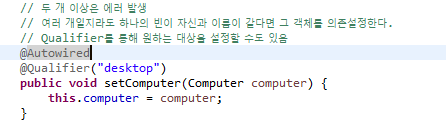

> 제어의 역전(IoC)을 통해 역전의 역전으로 스프링 컨테이너 한 곳에 모아둘 수 있고 의존 관계 또한 한 곳에서 제어할 수 있다. `property` 는 설정자 주입이라고 부른다.

```java
<?xml version="1.0" encoding="UTF-8"?>
<beans xmlns="http://www.springframework.org/schema/beans"
	xmlns:xsi="http://www.w3.org/2001/XMLSchema-instance"
	xsi:schemaLocation="http://www.springframework.org/schema/beans http://www.springframework.org/schema/beans/spring-beans.xsd">

	<bean class="com.ssafy.spring.Desktop"  id="desktop"></bean>
	<bean class="com.ssafy.spring.Labtop"  id="labtop"></bean>
	<bean class="com.ssafy.spring.Worker"  id="worker">
		<constructor-arg name="computer" ref="desktop">
		</constructor-arg>
	</bean>
	
</beans>
```

> 생성자를 설정해 줄 때에는 `constrctor-arg`를 사용한다.
>
> `safe closing`으로 태그와 태그 안에 넣을 값이 없으면 />으로 할 수 있다.

- 설정자 주입은 중간에 주입을 자바 코드 단에서 바꿔 줄 수 있고(의존 관계없이 태어날 수 있고 나중에 바뀔 수도 있음), 생성자 주입의 경우에는 의존 관계없이는 태어날 수 없음(주입을 하지 않고는 태어날 수 없음). 생성자가 좀더 강력한 의존관계인 느낌


> JDBC로 코드를 짜면 너무 길다.
>
> 1. 자원 관리(내가 직접 커넥션을 열고 닫고) -> 이것보다 조금 더 위에 있는 세션이 자원 관리를 대신해줘서 짧게 만들어 줄 수 있음
> 2. 파라미터 매핑(몇 번 째 누구 타입으로 다 정해야 함)
> 3. 결과 매핑


> `context`를 `Namespaces`에서 선택해준다.

```java
package com.ssafy.spring;

import org.springframework.stereotype.Component;

// 클래스 첫글자를 소문자로 바꾼 이름 bean의 이름이 된다.
@Component
public class Worker {
	private Computer computer;
	public Worker(Computer computer) {
		System.out.println("Worker의 생성자가 불렸습니다.");
		this.computer = computer;
	}
	public void doWork() {
		System.out.println(this.computer.getInfo() + " 로 일을 합니다." + this.age);
	}
	private int age;
	public void setHong(int value) {
		this.age = value;
	}
}

```

```java
<?xml version="1.0" encoding="UTF-8"?>
<beans xmlns="http://www.springframework.org/schema/beans"
	xmlns:xsi="http://www.w3.org/2001/XMLSchema-instance"
	xmlns:context="http://www.springframework.org/schema/context"
	xsi:schemaLocation="http://www.springframework.org/schema/beans http://www.springframework.org/schema/beans/spring-beans.xsd
		http://www.springframework.org/schema/context http://www.springframework.org/schema/context/spring-context-4.3.xsd">
	<!-- 저 패키지 안에 있는 자바 클래스를 검사하면서  annotation이 찍혀 있으면 그거에 따라 처리하겠다. 
	component-scan: 지정된 패키지에서 낙인이 찍힌 클래스를 모두 bean으로 등록한다.
	-->
	<context:component-scan base-package="com.ssafy.spring"/>
<!-- 설정파일에서 bean 등록과 의존관계를 설정하는 것이 아니라,
자바 코드의 annotation을 읽음으로써 설정 처리
-->	
</beans>
```

```java
package com.ssafy.spring;

import org.springframework.stereotype.Component;

// component를 붙이면 파일에 S라는 낙인이 찍힘, 빈으로 하나 등록됨
@Component
public class Desktop implements Computer{

	@Override
	public String getInfo() {
		return "데스크탑";
	}

}
```


- `Autowired`는 자동으로 타입이 일치하는 bean을 넣어준다.

```java
package com.ssafy.spring;

import org.springframework.beans.factory.annotation.Autowired;
import org.springframework.stereotype.Component;

// 클래스 첫글자를 소문자로 바꾼 이름 bean의 이름이 된다.
@Component
public class Worker {
	private Computer computer;
	public Worker(Computer computer) {
		System.out.println("Worker의 생성자가 불렸습니다.");
		this.computer = computer;
	}
	// 자동으로 타입이 일치하는 bean을 찾아다가 여기에 넣어줌
	@Autowired
	public void doWork() {
		System.out.println(this.computer.getInfo() + " 로 일을 합니다." + this.age);
	}
	
	private int age;
	public void setHong(int value) {
		this.age = value;
	}
}
```


> `Autowired`는 자동으로 타입이 일치하는 bean을 찾아서 넣어주는데, `desktop`과 `labtop`이 둘 다 같은 타입이어서 충돌이 발생

- 의존 관계가 확실히 파악이 될 때 `Annotation`을 선호한다.
  - `xml`이 더 유리할 때는 `xml`선택

```java
package com.ssafy.spring;

import org.springframework.stereotype.Component;

// 낙인을 찍을 때 그냥 찍으면 클래스명 첫글자 소문자
// 이름을 정해주면 정해준 이름으로 빈이 등록된다.
@Component("computer")
public class Labtop implements Computer{

	@Override
	public String getInfo() {
		return "노트북!";
	}
}
```

```java
	// 두 개 이상은 에러 발생
	// 여러 개일지라도 하나의 빈이 자신과 이름이 같다면 그 객체를 의존설정한다.
	// Qualifier를 통해 원하는 대상을 설정할 수도 있음
	@Autowired
	@Qualifier("desktop")
	public void setComputer(Computer computer) {
		this.computer = computer;
	}
```

> `Qualifier`를 이용해서 원하는 대상을 지정해 줄 수 있다.

- 정리
  - `component-scan`으로 `annotation`을 사용할 수 있게 되었다.
  - `@Component`로 `bean`에 등록한다
  - `@Autowired`로 자동으로 연결된다
  - 두 개이상이면 에런난다
  - 이름이 일치하면 자동으로 잡을 수도 있다
  - `@Qualifier`로 직접 설정해줄 수 있다.

- `property`로 `set`함수를 지정해서 `ref`로 넣어줄 수 있고,


- `constructor-arg`를 통해 생성자로 넣어줄 수 있고,


- `annotation`을 통한 컴포넌트 스캔을 활용할 수 있다.




- 생성자에도 `Autowired`사용 가능

```java
//방법 1
    @Autowired
	public Worker(Computer desktop) {
//		System.out.println("Worker의 생성자가 불렸습니다..");
		this.computer = desktop;
	}

//방법2
	@Autowired
	public Worker(@Qualifier("desktop") Computer computer) {
//		System.out.println("Worker의 생성자가 불렸습니다..");
		this.computer = computer;
	}
```

- 필드 주입도 가능하다

```java
package com.ssafy.spring;

import org.springframework.beans.factory.annotation.Autowired;
import org.springframework.beans.factory.annotation.Qualifier;
import org.springframework.stereotype.Component;

@Component
public class Worker {
	//내부구현... reflection이라는 기술을 이용해서 저 변수가 일단 메모리상에 존재함
	//reflection기술을 이용해서 접근이 가능함
	@Autowired
	private Computer computer;
	
//	@Autowired
//	public Worker(Computer desktop) {
////		System.out.println("Worker의 생성자가 불렸습니다..");
//		this.computer = desktop;
//	}
	
//	@Autowired
//	public Worker(Computer computer) {
////		System.out.println("Worker의 생성자가 불렸습니다..");
//		this.computer = computer;
//	}
	
	// 두 개 이상은 에러 발생
	// 여러 개일지라도 하나의 빈이 자신과 이름이 같다면 그 객체를 의존설정한다.
	// Qualifier를 통해 원하는 대상을 설정할 수도 있음
//	@Autowired
//	@Qualifier("desktop")
//	public void setComputer(Computer computer) {
//		this.computer = computer;
//	}
	
	
	public void doWork() {
		System.out.println(this.computer.getInfo() + " 로 일을 합니다." + this.age);
	}
	
	private int age;
	public void setHong(int value) {
		this.age = value;
	}
}

```


- 정리

1. 필드 주입(`Field Injection`)

> 약점이 있음. 


> 순환 참조가 생기면서 교착 상태에 빠진다.


2. 생성자 주입(`Constructor Injection`) -> `Spring` 권장


3. 설정자 주입(`Property Injection`)


