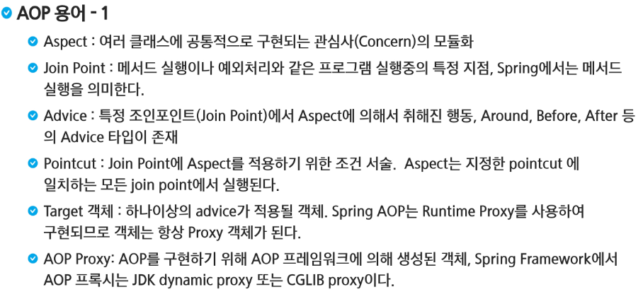
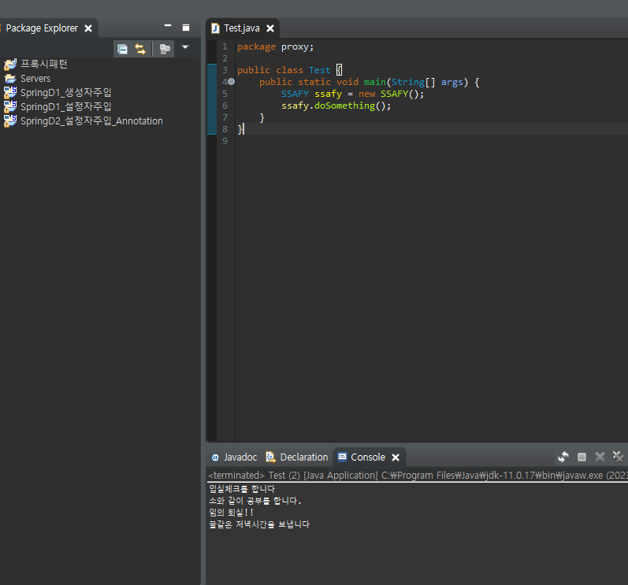

# AOP(Aspect Oriented Programming)


> 예금 인출 후 commit, 예금 송금 후 commit이 필요하다면 commit을 하나로 모듈화해서 만든 후 핵심 기능이 수행된 뒤 자동적으로 commit이 시행되도록 만드는 것




> 예금 송금과 예금 인출도 `log`가 필요하므로 따로 빼서 모듈화 시킨 것. -> 공통 관심사를 구현해 놓은 클래스
>
> 공통 관심사가 끼어들 수 있는 지점들을 `Join Point`라고 한다.
>
> 많은 `JointPoint`중에서 하나를 고르면 `Pointcut`이라고 한다.
>
> 특정 조인포인트 -> `Point cut` 에서 `Around`, `Before`, `After`정보가 다 묶인 것을 `Advice`라고 한다.
>
> `Advice`가 적용될 객체를 `Traget` 객체라고 한다
>
> `Proxy` 대행자 
>
> `Advice`와 `Target`이 합쳐진 것을 `AOP proxy`라고함
>
>  `Advice`가 `Target`에 끼어지는 과정을 `Weaving`이라고 한다


> 우리가 실행하고 싶은 `Aspect`가 `Target`의 전 후로 위치하고 있기 때문에 그 정보의 집합이 `Advice`가 되어 있음. `Target` + `Advice` = `Proxy` 
>
> `Target` 호출 시 `Proxy`가 호출됨



> 핵심기능을 템플릿 메소드패턴으로 구현할 수 있지만, 부모를 하나밖에 상속받지 못한다.


> 내가 `implements`를 먼저 하는 것, 해당 타입의 멤버 변수를 하나 소유하는 것


- SSAFY와 Worker는 Target 객체, 핵심 관심사항이다
- 각각의 공통 관심사는 `Aspect`

- 앞과 뒤에 실행되는 것들이 `advice`이고(즉 시점이 정해져있는 것)
- `proxy`가 만들어지는 과정을 `weaving`이라 부름
- `advice`와 `Target`이 합쳐진 상태를 `proxy`라고 부른다

```java
package proxy2;

public class SSAFY implements Person{

	@Override
	public void doSomething() {
		System.out.println("소와 같이 공부를 합니다.");
	}

}
package proxy2;

public class Worker implements Person{

	@Override
	public void doSomething() {
		System.out.println("소와 같이 일을 합니다.");
	}

}
package proxy2;

public interface Person {
	public void doSomething();
}
package proxy2;

import java.util.Random;

import proxy.CoronaException;

public class PersonProxy implements Person{
	private Person person;
	
	public void setPerson(Person person) {
		this.person = person;
	}

	@Override
	public void doSomething() {
		System.out.println("입실체크를 합니다");
		try {
			person.doSomething();
			if (new Random().nextBoolean())
				throw new CoronaException();
			System.out.println("퇴실체크를 합니다");			
		}
		catch (CoronaException e) {
			System.out.println("임의 퇴실!!");
		}
		finally {
			System.out.println("꿀같은 저녁시간을 보냅니다");			
		}
	}
	
}

```


> 원래 서비스 하는 서버를 숨기고 싶어서, 또는 기능을 나눠서 하고 싶을 때.(보안, 과금 등등)


> 라이브러리를 편하게 세팅하기 위해서 메이븐 프로젝트로 바꿔야 한다


> `aspectj`라이브러리 2개 모두 다운 받고, `spring context`도 다운 받는다. `spring context`안에 `aop`도 다운되어 있어서 다른 것은 받을 필요 없다.


> 만약 매개변수가 상관없으면 괄호 안에 `..` 점을 두 개 찍는다.
>
> 패키지가 여러군데 내려가고 싶으면 `..` 점을 두 개 찍는다.


```xml
<?xml version="1.0" encoding="UTF-8"?>
<beans xmlns="http://www.springframework.org/schema/beans"
	xmlns:xsi="http://www.w3.org/2001/XMLSchema-instance"
	xmlns:aop="http://www.springframework.org/schema/aop"
	xsi:schemaLocation="http://www.springframework.org/schema/beans http://www.springframework.org/schema/beans/spring-beans.xsd
		http://www.springframework.org/schema/aop http://www.springframework.org/schema/aop/spring-aop-4.3.xsd">

	<bean class="com.ssafy.aop.SSAFY" id="ssafy"></bean>
	<bean class="com.ssafy.aop.Worker" id="worker"></bean>
	<bean class="com.ssafy.aop.MyAspect" id="myAspect"></bean>
	
	<aop:config>
		<aop:aspect ref="myAspect">
			<aop:pointcut expression="execution(public void com.ssafy.aop.*.doSomething())" id="mypt"/>
			<aop:before method="before" pointcut-ref="mypt"/>
			<aop:after-returning method="AfterReturning" pointcut-ref="mypt"/>
			<aop:after-throwing method="afterThrowing" pointcut-ref="mypt"/>
			<aop:after method="after" pointcut-ref="mypt"/>		
		</aop:aspect>
	</aop:config>
</beans>
```

> `Worker`와 `SSAFY`가 둘 다 들어가야 하니까 `*`을 찍어준다.
>
> 함수명은 `doSomething`이고 매개변수는 없음
>
> `bean`을 등록하고, 어떤 규칙에 대해서 공통 관심사항 `myAspect` 모듈 중 어떤 함수를 언제 실행해라의 설정을 지정해줌.


- 핵심사항이 반환값이 생기고 예외처리도 함

```java
package com.ssafy.aop;

public interface Person {
	// 반환값 던진 것과 예외 던진 것을 공통 관심사항에서 확인해보고 싶어서
	public int doSomething() throws CoronaException;
}

package com.ssafy.aop;

import java.util.Random;

public class SSAFY implements Person{

	@Override
	public int doSomething() throws CoronaException {
		System.out.println("소와 같이 공부를 합니다.");
		if (new Random().nextBoolean())
			throw new CoronaException();
		return (int) (Math.random()*45) + 1;
	}

}

package com.ssafy.aop;

import java.util.Random;

public class Worker implements Person{

	@Override
	public int doSomething() throws CoronaException {
		System.out.println("소와 같이 일을 합니다.");
		if (new Random().nextBoolean())
			throw new CoronaException();
		return (int) (Math.random()*45) + 1;
	}

}

package com.ssafy.aop;

// Aspect는 공통 관심사를 구현한 것
public class MyAspect {
	public void before() {
		System.out.println("입실 체크");
	}
	//정상적으로 끝났을 때
	public void AfterReturning(int num) {
		System.out.println("퇴실 체크 6시 정시" + num);
	}
	//정상적으로 끝나지 못 했을 때
	public void afterThrowing(Throwable th) {
		System.out.println("임의 퇴실");
//		System.out.println(th);
		if (th instanceof CoronaException) {
			((CoronaException)th).handleException();
		}
	}
	//어쨌거나 끝난 것
	public void after() {
		System.out.println("꿀같은 저녁 시간");
	}
	
}

<?xml version="1.0" encoding="UTF-8"?>
<beans xmlns="http://www.springframework.org/schema/beans"
	xmlns:xsi="http://www.w3.org/2001/XMLSchema-instance"
	xmlns:aop="http://www.springframework.org/schema/aop"
	xsi:schemaLocation="http://www.springframework.org/schema/beans http://www.springframework.org/schema/beans/spring-beans.xsd
		http://www.springframework.org/schema/aop http://www.springframework.org/schema/aop/spring-aop-4.3.xsd">

	<bean class="com.ssafy.aop.SSAFY" id="ssafy"></bean>
	<bean class="com.ssafy.aop.Worker" id="worker"></bean>
	<bean class="com.ssafy.aop.MyAspect" id="myAspect"></bean>
	
	<aop:config>
		<aop:aspect ref="myAspect">
			<aop:pointcut expression="execution(public int com.ssafy.aop.*.doSomething())" id="mypt"/>
			<aop:before method="before" pointcut-ref="mypt"/>
			<aop:after-returning method="AfterReturning" pointcut-ref="mypt" returning="num"/>
			<aop:after-throwing method="afterThrowing" pointcut-ref="mypt" throwing="th"/>
			<aop:after method="after" pointcut-ref="mypt"/>		
		</aop:aspect>
	
	</aop:config>
	
</beans>


package com.ssafy.aop;

import org.springframework.context.ApplicationContext;
import org.springframework.context.support.GenericXmlApplicationContext;

public class Test {
	public static void main(String[] args) {
		ApplicationContext context
		= new GenericXmlApplicationContext("applicationContext.xml");
		Person ssafy = context.getBean("ssafy", Person.class);
		try {
			ssafy.doSomething();
		} catch (CoronaException e) {
//			e.printStackTrace();
		}
	}
	}

```

- AOP는 시간을 잴 때, 트랜잭션을 수행할 때, 로그를 확인할 때 사용 가능


> `SSAFY.class`로 바꿀 경우에는 `JDK dynamic proxy`를 사용하지 못한다. 즉, 인터페이스에서만 동작하는 유형이다.


> `CGLIB`는 코드 제네레이터 라이브러리라고 해서, 자바 코드가 컴파일이 되면 바이트 코드로 되는데, 바이트 코드를 조작하는 방식으로 `AOP`를 동작시켜서 인터페이스가 아니어도 동작이 가능하다. **성능면에서 `CGLIB`가 더 빠르다.**


> 설정법은 `autoproxy`의 `proxy-target-class`를 `true`로 바꿔준다.


> `pom.xml`에서 `scope`를 `runtime`으로 했기 때문에 실행 중에는 라이브러리가 올라오는데, 컴파일 시점에는 이 라이브러리가 들어와 있지 않아서 

```java
package com.ssafy.aop;

import org.aspectj.lang.ProceedingJoinPoint;
import org.aspectj.lang.annotation.After;
import org.aspectj.lang.annotation.AfterReturning;
import org.aspectj.lang.annotation.AfterThrowing;
import org.aspectj.lang.annotation.Aspect;
import org.aspectj.lang.annotation.Before;
import org.aspectj.lang.annotation.Pointcut;
import org.springframework.stereotype.Component;

// Aspect는 공통 관심사를 구현한 것
@Component
@Aspect
public class MyAspect {
	
	//Pointcut을 지정하기 위한 더미 함수 필요
	@Pointcut("execution(public int com.ssafy.aop.*.doSomething())")
	public void mypt() {
		
	}
	
	//더미 함수가 참조하기 위한 기준이 됨
	@Before("mypt()")
	public void before() {
		System.out.println("입실 체크");
	}
	//정상적으로 끝났을 때
	@AfterReturning(value = "mypt()", returning = "num")
	public void AfterReturning(int num) {
		System.out.println("퇴실 체크 6시 정시" + num);
	}
	//정상적으로 끝나지 못 했을 때
	@AfterThrowing(value = "mypt()", throwing = "th")
	public void afterThrowing(Throwable th) {
		System.out.println("임의 퇴실");
//		System.out.println(th);
		if (th instanceof CoronaException) {
			((CoronaException)th).handleException();
		}
	}
	//어쨌거나 끝난 것
	@After("mypt()")
	public void after() {
		System.out.println("꿀같은 저녁 시간");
	}
	
	//around 안에 핵심 사항을 품는다.
	// ProceedingJoinPoint는 위빙이 일어나는 동작 자체에 대한 상태를 모두 포함하고 있다
	public void around(ProceedingJoinPoint pjt) {
		//1
		this.before();
		//2
		try {
			int num = (int) pjt.proceed();
			this.AfterReturning(num);
		} catch (Throwable e) {
			this.afterThrowing(e);
//			e.printStackTrace();
		} //핵심 관심사항의 호출
		finally {
			this.after();
		}
		//3
		//4
		
	}	
}
```

