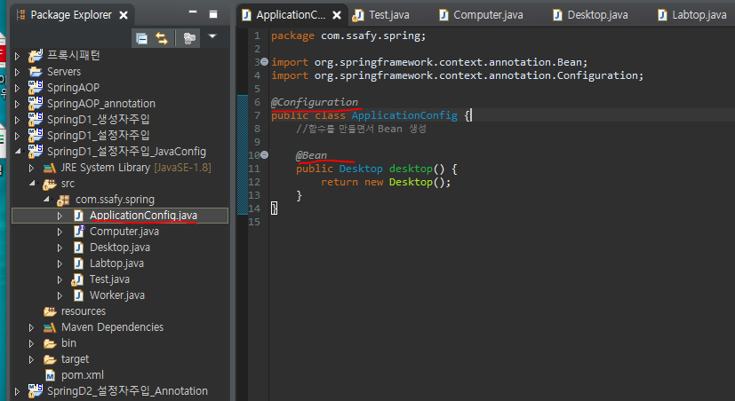
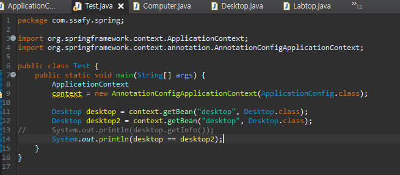
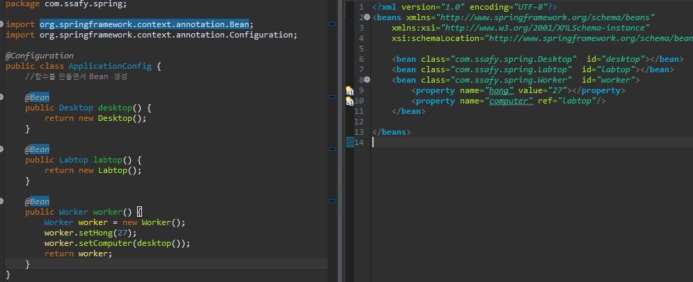
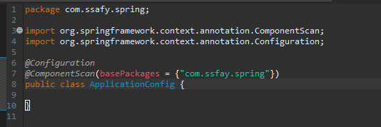
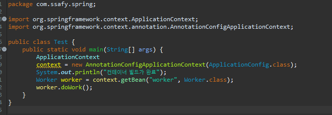

# Spring Java Config

- `Xml`과 `Annotation`이 아닌 `Java Config`로 설정파일을 구성해보자

- `ApplicationConfig` 클래스를 생성 후 `@Configuration`을 설정해주고 `Bean`을 통해 빈을 만들어 나간다.
  - 여기서 `new Desktop`이 되어 있지만 새로운 객체 생성이 아닌 `Spring Container`의 규칙에 따라 싱글턴 패턴이 적용된다.

- `xml`방식을 `java` 방식으로 바꾼 모습

- `annotation`방식을 `java` 방식으로 바꾼 모습

> 만약 내 클래스가 아닌 경우에는 `@Bean`을 통해 등록해줘야 한다.

- `Xml`방식으로 `tag`로 빈등록
- `xml`방식으로 `annotation`으로 빈등록
- `java config`에서 함수로 빈등록
- `java config`에서 컴포넌트 스캔으로 빈등록