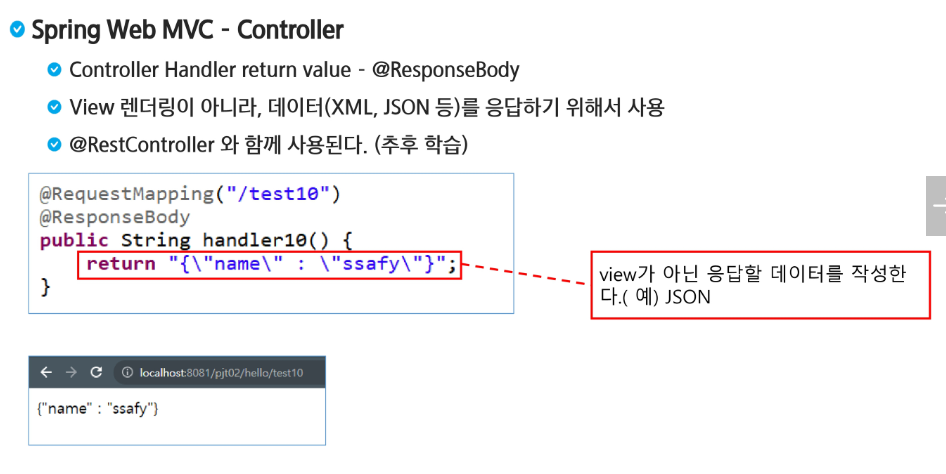

- `Context param`에 `root contatiner`위치를 넣어주지 않으면 자동으로 `WEB-INF`안에 `applicationContext`를 `root container` 사용한다.


```java
@Controller
public class MyController {
	
	private MyService myService;
	
	@Autowired
	public void setMyService(MyService myService) {
		this.myService = myService;
	}
	
	@RequestMapping("home")
	public ModelAndView handler1() {
		ModelAndView mav = new ModelAndView();
		System.out.println("제바ㅓ랄sss");
		myService.doSomething();
		mav.addObject("msg", "Hello World Welcome to SSAFY");
		//request.setAttribute와 동일한 역할을 한다.
		//request.디스패처한 것과 동일
		mav.setViewName("home");
		System.out.println("설마?!!");
		return mav;
	}
	
	@RequestMapping("whattime")
	public ModelAndView handler2() {
		ModelAndView mav = new ModelAndView();
		Date now = new Date();
		mav.addObject("time", now);
		mav.setViewName("whattime");
		
		return mav;
	}
```


- `Model`에 담아서 문자열을 반환해줄 수 있다. -> `return`값은 `view`로 보내주는 역할이다.

```java
	// get / post 각각에만 동작하는 RequestMapping
	// @GetMapping
	// @PostMapping
	
	//문자열 반환 (viewname)이 된다.
	@GetMapping("test1")
	public String test1() {
		return "test1";
	}
	
	//문자열 반환하고 싶으면 바구니를 준비해야함.
	@GetMapping("test2")
	public String test2(Model model) {
		model.addAttribute("msg", "만능 보따리 model 객체에 담아서 보내겠다.");
		return "test2";
	}
```

- `Parameter`로 보내고 싶으면 다음과 같이 넣어준다

```java
@GetMapping("test3")
	public String test3(Model model, String id, String pw) {
		model.addAttribute("myid", id);
		model.addAttribute("mypw", pw);
		return "test3";
	}
```

```jsp
<%@ page language="java" contentType="text/html; charset=UTF-8"
    pageEncoding="UTF-8"%>
<!DOCTYPE html>
<html>
<head>
<meta charset="UTF-8">
<title>Insert title here</title>
</head>
<body>
	<h1>나는 test3야</h1>
	${myid } and ${mypw }
</body>
</html>
```


- `age`가 기본 자료형인데 `null`값이 입력되어서 오류가 뜬다.

```java
	@GetMapping("test3")
	public String test3(Model model, String id, String pw, int age) {
		model.addAttribute("myid", id);
		model.addAttribute("mypw", pw);
		System.out.println(age);
		return "test3";
	}
```


- 기본값 설정이 가능

```java
	//기본값을 설정할 수 있고 / 이건 꼭 필요 없어
	@GetMapping("test3")
	public String test3(Model model, String id, String pw, @RequestParam(value = "age", defaultValue = "1") int age) {
		model.addAttribute("myid", id);
		model.addAttribute("mypw", pw);
		System.out.println(age);
		return "test3";
	}
```

- DTO를 적절하게 만들어주면 알아서 객체에 넣어줌


```java
package com.ssafy.mvc.model.dto;

public class User {
	private String id;
	private String pw;
	private int age;
	
	public String getId() {
		return id;
	}
	public void setId(String id) {
		this.id = id;
	}
	public String getPw() {
		return pw;
	}
	public void setPw(String pw) {
		this.pw = pw;
	}
	public int getAge() {
		return age;
	}
	public void setAge(int age) {
		this.age = age;
	}

	@Override
	public String toString() {
		return "User [id=" + id + ", pw=" + pw + ", age=" + age + "]";
	}
}
```


- `Srping Legacy Project` 구경하기

  - `resource`는 `JS`, `CSS`, `img` 등이 들어오니까 건드리지 마라는 설정

  


> root부터 전부 구성되어 있음


