# WEB_MVC


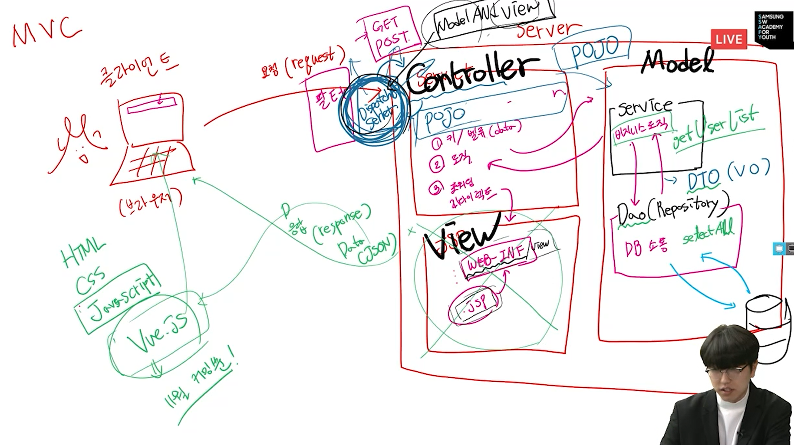

> DAO(Data Access Object): 데이터에 접근해주는 공간
>
> DTO(Data Transfer Object): 데이터를 주고 받고 할 때 바구니 역할 
>
> Dao로 바로 가는 것이 아닌 Service를 거쳐서 가야한다. -> 로직의 복잡함을 감소
>
> Dispatcher, Servlet을 모두 앞단으로 뺀다. -> 만들어진 것을 활용할 예정 -> Controller는 순수 자바로 활용할 예정이다(POJO)
>
> Model and view를 활용해서 필요한 데이터를 Model에 담고 

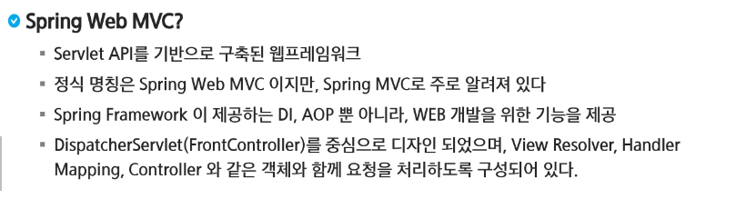

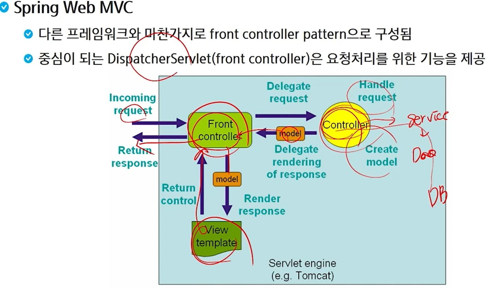

> `Front Controller`에서 받아서 각종 결과들을 처리해주고 `response`를 해줌. 이 모든 것을 `Tomcat`에서 진행

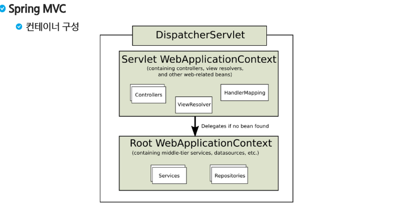

> 위쪽은 주로 웹과 관련 아래쪽은 비지니스 로직과 관련된 부분

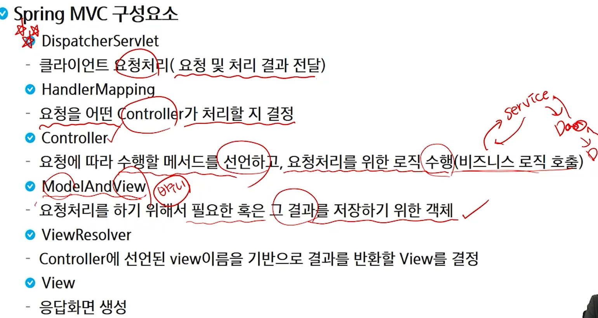

> `ModelAndView`형태로 `DispatcherServlet`에 넘겨줌. 순수한 이름으로 넘겨줘서 `ViewResolver`가 `Web INF`, `View`등 연결해서 만들고 화면을 보여준다

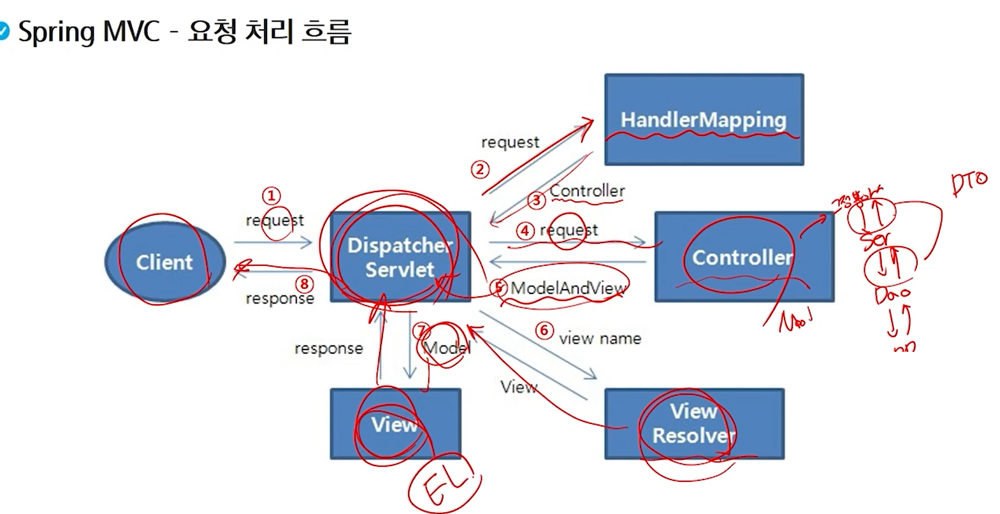

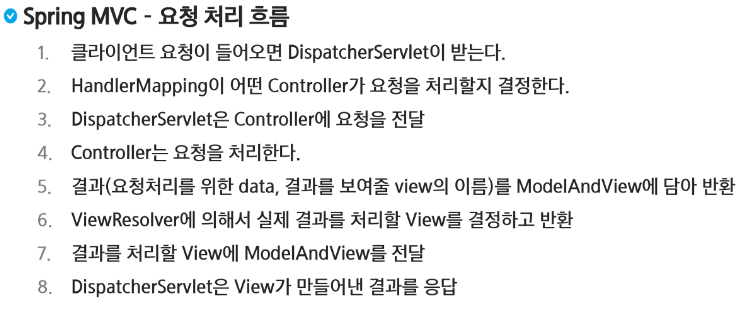

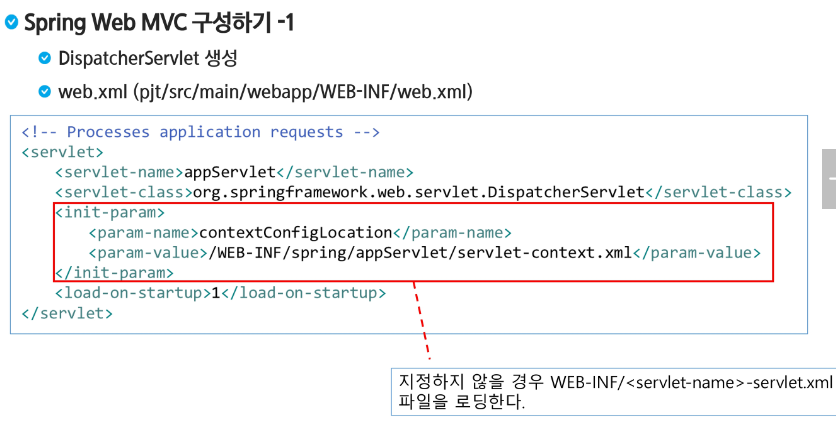

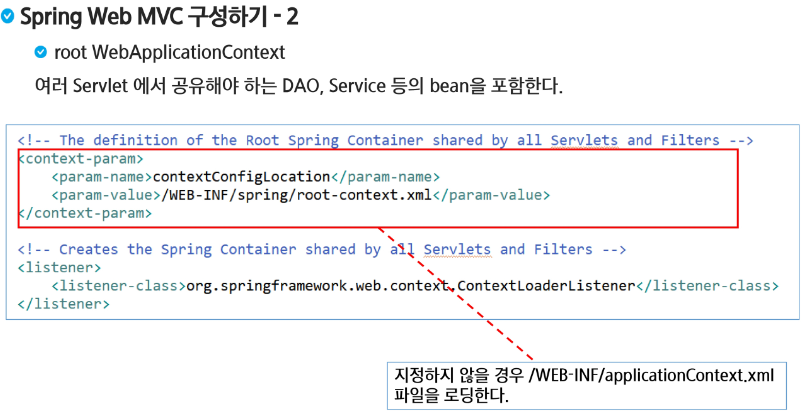

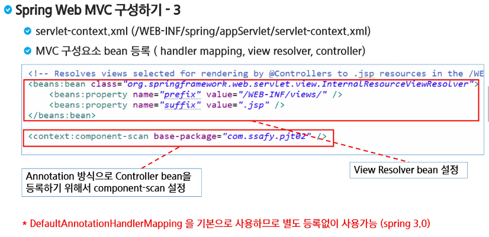

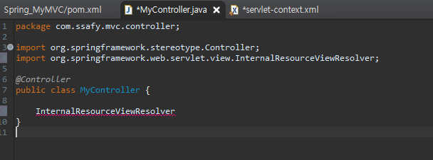

> 여기서 경로를 가져온다

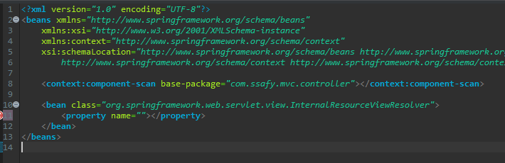

> `ViewResolver`는 `접두어`와 `접미사`가 붙는다.


### 참고

### Server가동 시 오류

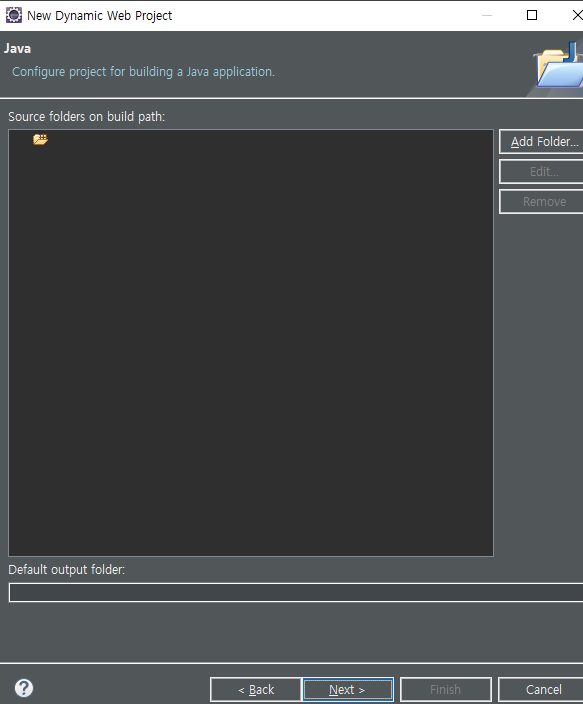

> 비어있는 부분은 src로 바꿔주고
>
> 아래에는 build\classes를 적어준다

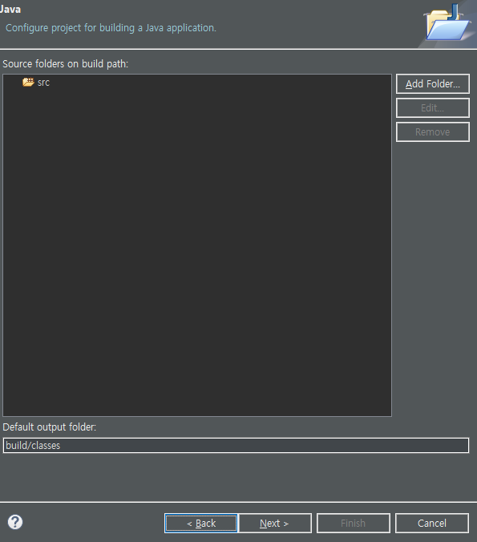


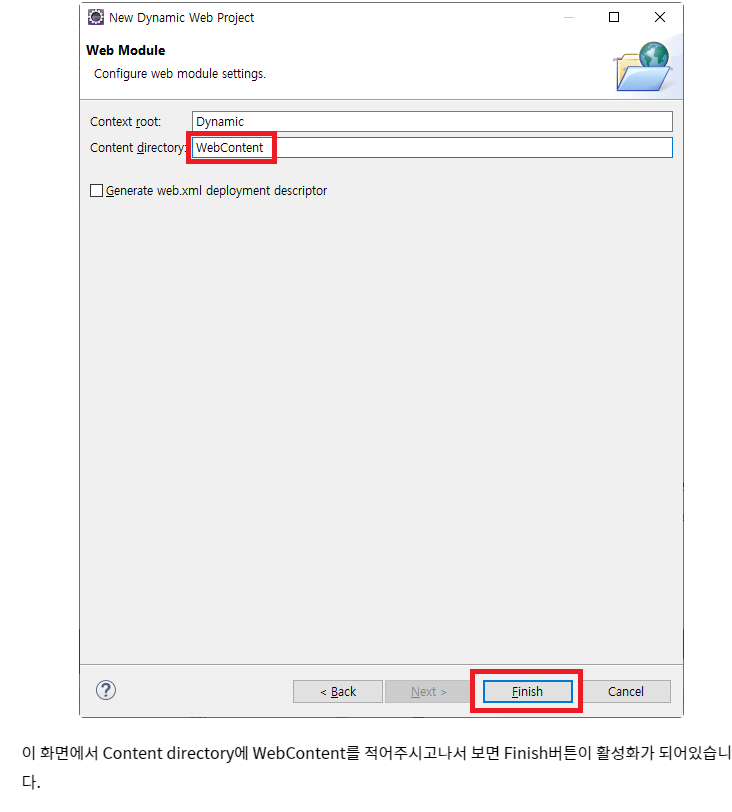

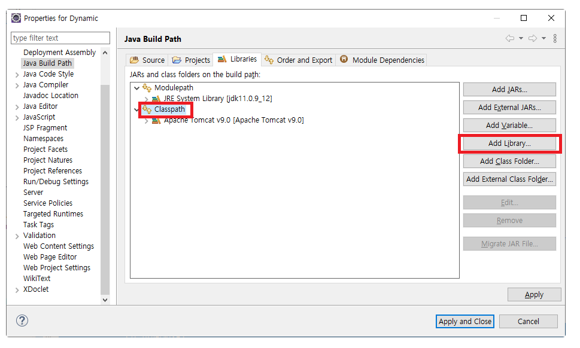

> `Classpath`에 `EAR Libraries`와 `Web App Libraries`를 추가한다.

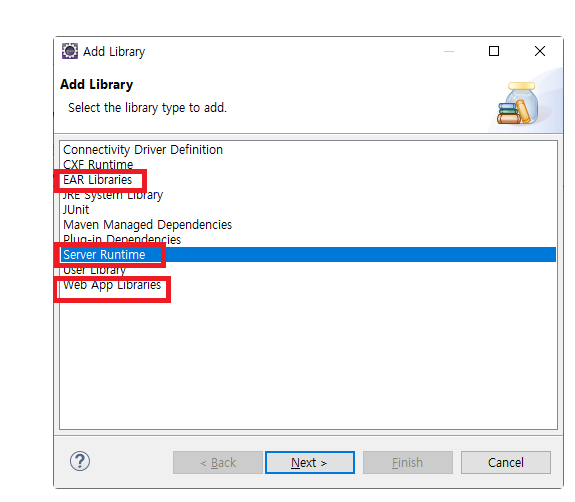

```xml	
<project xmlns="http://maven.apache.org/POM/4.0.0"
	xmlns:xsi="http://www.w3.org/2001/XMLSchema-instance"
	xsi:schemaLocation="http://maven.apache.org/POM/4.0.0 http://maven.apache.org/xsd/maven-4.0.0.xsd">
	<modelVersion>4.0.0</modelVersion>
	<groupId>Spring_MyMVC</groupId>
	<artifactId>Spring_MyMVC</artifactId>
	<version>0.0.1-SNAPSHOT</version>
	<packaging>war</packaging>
	<build>
		<sourceDirectory>src</sourceDirectory>
		<plugins>
			<plugin>
				<artifactId>maven-compiler-plugin</artifactId>
				<version>3.8.0</version>
				<configuration>
					<release>11</release>
				</configuration>
			</plugin>
			<plugin>
				<artifactId>maven-war-plugin</artifactId>
				<version>3.2.1</version>
				<configuration>
					<warSourceDirectory>WebContent</warSourceDirectory>
				</configuration>
			</plugin>
		</plugins>
	</build>
	<dependencies>
		<!-- https://mvnrepository.com/artifact/org.springframework/spring-context -->
		<dependency>
			<groupId>org.springframework</groupId>
			<artifactId>spring-context</artifactId>
			<version>5.3.18</version>
		</dependency>
		<!-- https://mvnrepository.com/artifact/org.springframework/spring-webmvc -->
		<dependency>
			<groupId>org.springframework</groupId>
			<artifactId>spring-webmvc</artifactId>
			<version>5.3.18</version>
		</dependency>

	</dependencies>
</project>
```

> `pom.xml`에는 `spring context`와 `spring webmvc`를 넣어준다

```xml
<?xml version="1.0" encoding="UTF-8"?>
<web-app xmlns:xsi="http://www.w3.org/2001/XMLSchema-instance"
	xmlns="http://xmlns.jcp.org/xml/ns/javaee"
	xsi:schemaLocation="http://xmlns.jcp.org/xml/ns/javaee http://xmlns.jcp.org/xml/ns/javaee/web-app_4_0.xsd"
	id="WebApp_ID" version="4.0">
	<display-name>Spring_MyMVC</display-name>
	<welcome-file-list>
		<welcome-file>index.html</welcome-file>
		<welcome-file>index.htm</welcome-file>
		<welcome-file>index.jsp</welcome-file>
		<welcome-file>default.html</welcome-file>
		<welcome-file>default.htm</welcome-file>
		<welcome-file>default.jsp</welcome-file>
	</welcome-file-list>


	<servlet>
		<servlet-name>springDispatcherServlet</servlet-name>
		<servlet-class>org.springframework.web.servlet.DispatcherServlet</servlet-class>
		<init-param>
			<param-name>contextConfigLocation</param-name>
			<param-value>/WEB-INF/servlet-context.xml</param-value>
		</init-param>

		<load-on-startup>1</load-on-startup>
	</servlet>

	<servlet-mapping>
		<servlet-name>springDispatcherServlet</servlet-name>
		<url-pattern>/</url-pattern>
	</servlet-mapping>

	<listener>
		<listener-class>org.springframework.web.context.ContextLoaderListener</listener-class>
	</listener>
	<filter>
		<filter-name>encodingFilter</filter-name>
		<filter-class>org.springframework.web.filter.CharacterEncodingFilter</filter-class>
		<init-param>
			<param-name>encoding</param-name>
			<param-value>UTF-8</param-value>
		</init-param>
		<init-param>
			<param-name>forceEncoding</param-name>
			<param-value>true</param-value>
		</init-param>

	</filter>
	<filter-mapping>
		<filter-name>encodingFilter</filter-name>
		<url-pattern>/*</url-pattern>
	</filter-mapping>
</web-app>
```

> `web.xml`에서 `DispatcherServlet`을 생성해주고, `filter`로 `UTF-8`로 변형시켜준다.

### Controller에 대한 설명 찾기

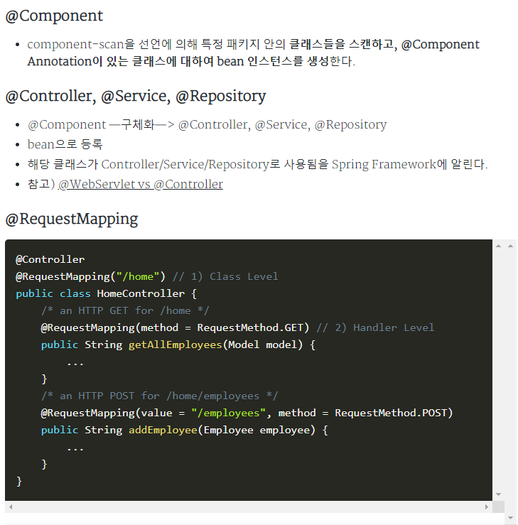

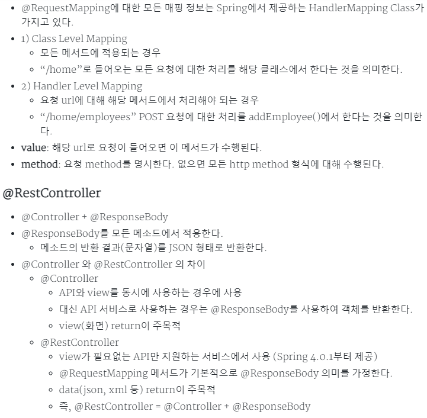

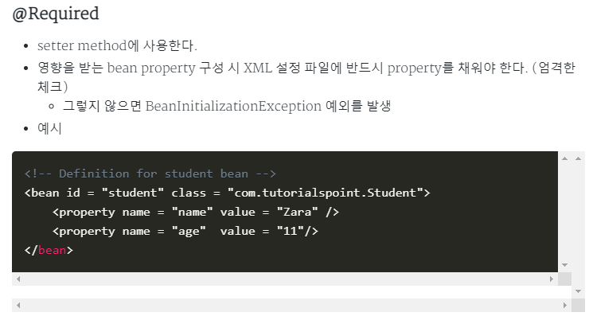

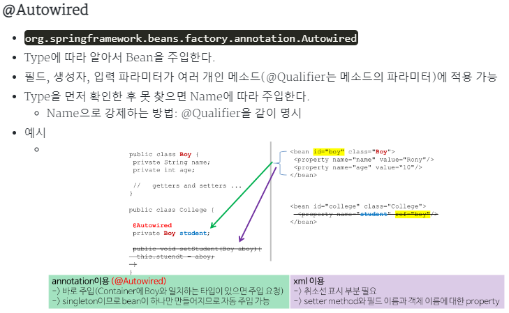
