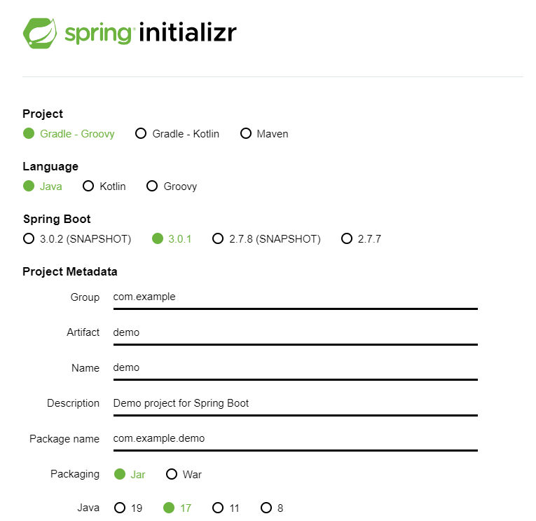
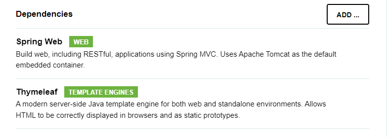
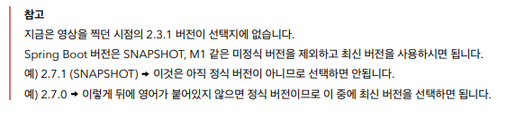
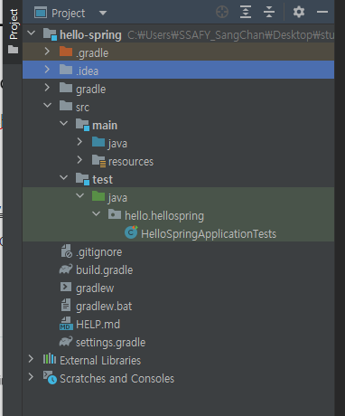
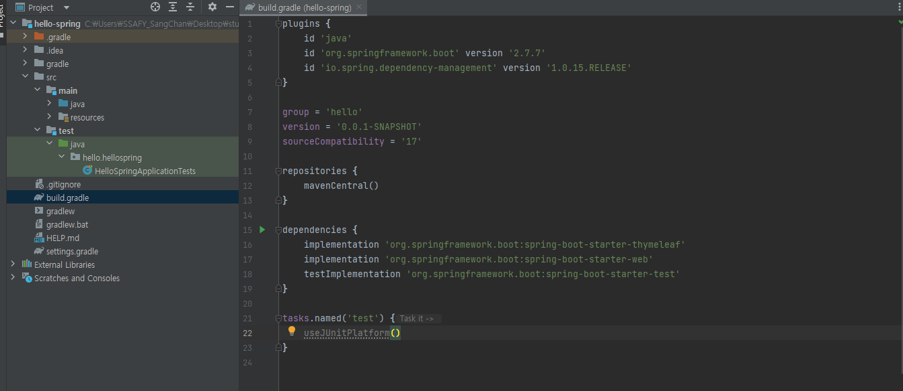
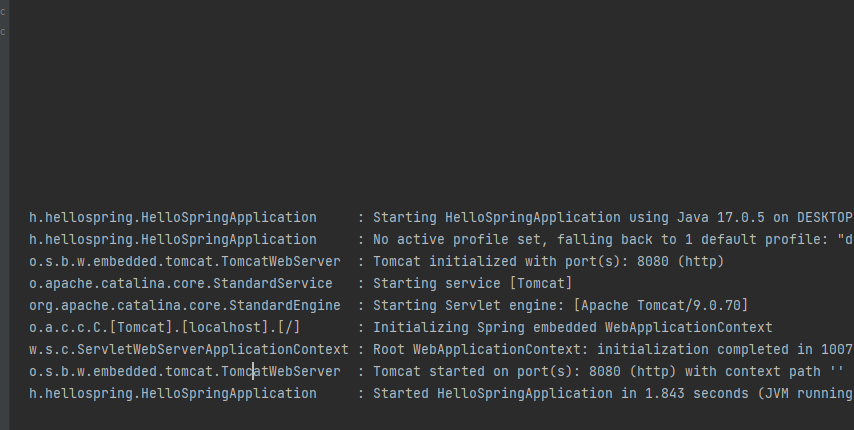
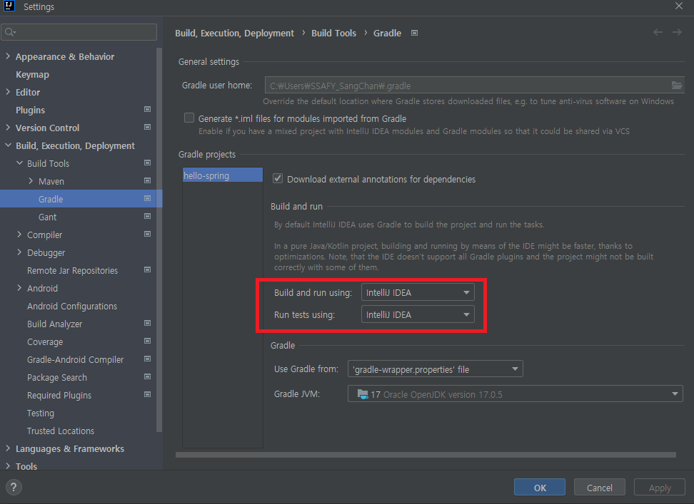

# 프로젝트 생성

- 스프링 부트 스타터 사이트로 이동해서 스프링 프로젝트 생성 

https://start.spring.io

- 필요한 라이브러리를 가지고 오고, 빌드하는 라이프사이클까지 관리해주는 툴(Gradle, Maven)
  - 최근에는 Gradle을 주로 사용
- Group에는 기업명을 주로 적음
- Artifact 빌드되어 나오는 결과물(프로젝트명 같은 것)
- 스프링부트 기반으로 프로젝트를 시작할건데 어떤 라이브러리를 쓸건지는 Dependencies를 통해 결정
  - Thymeleaf: HTML을 만드는 탬플릿 엔진

- .idea는 intellij가 설정하는 파일

- gradle에는 gradle관련 폴더들
- src에는 `main`과 `test`가 존재
  - 요즘 개발 트랜드에서는 테스트 코드가 중요해짐

- resources는 실제 자바 코드 파일을 제외한 xml, html이나 properties와 같은 설정 파일이 들어가 있다. 즉, 자바 파일을 제외한 나머지는 resources이다.

> 지금은 gradle이 버전 설정하고 라이브러리 가져온다고만 이해하기

> mavenCentral이라는 사이트에서 라이브러리를 가져오라는 의미, 필요하면 특정 사이트의 url을 넣을 수 있다.

- `.gitignore`에는 빌드의 결과물과 같은 것들은 올라가지 않게 설정

> 실행하면 Tomcat이라는 웹 서버가 내장되어 있다.

> Gradle에 들어가서 해당 부분을 Intellij로 바꾸면, Gradle을 실행하지 않고 바로 intellij에서 자바를 실행시켜서 더 빨리 실행이 가능하다.