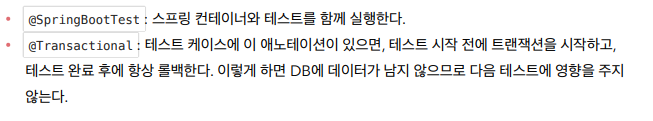

# 스프링 통합 테스트



> 순수 자바로만 테스트를 했는데 이제는 DB를 띄워서 진행한다.
>
> DB는 원래 커밋까지 해주어야 반영이 되지만, 그 전에 롤백을 하면 반영되지 않는다.
>
> 단위 테스트가 통합 테스트보다 조금 더 좋은 테스트일 확률이 높다. 그래서 단위 테스트를 구현해보도록 하는 게 좋

```java
package hello.hellospring.service;

import hello.hellospring.domain.Member;
import hello.hellospring.repository.MemberRepository;
import hello.hellospring.repository.MemoryMemberRepository;
import org.junit.jupiter.api.AfterEach;
import org.junit.jupiter.api.BeforeEach;
import org.junit.jupiter.api.Test;
import org.springframework.beans.factory.annotation.Autowired;
import org.springframework.boot.test.context.SpringBootTest;
import org.springframework.transaction.annotation.Transactional;

import static org.assertj.core.api.Assertions.assertThat;
import static org.junit.jupiter.api.Assertions.assertThrows;

@SpringBootTest
@Transactional
class MemberServiceIntegrationTest {

    @Autowired
    MemberService memberService;
    @Autowired
    MemberRepository memberRepository;

    @Test
    void 회원가입() {
        //given 무언가가 주어졌는데
        Member member = new Member();
        member.setName("spring");

        //when 이걸로 실행했을 때
        Long saveId = memberService.join(member);

        //then 결과가 이것으로 나와야 한다.(검증)
        Member findMember = memberService.findOne(saveId).get();
        assertThat(member.getName()).isEqualTo(findMember.getName());
    }

    @Test
    public void 중복_회원_예외() {
        //given
        Member member1 = new Member();
        member1.setName("spring");

        Member member2 = new Member();
        member2.setName("spring");

        //when
        memberService.join(member1);
        IllegalStateException e = assertThrows(IllegalStateException.class, () -> memberService.join(member2));

        assertThat(e.getMessage()).isEqualTo("이미 존재하는 회원입니다.");

//        try {
//            memberService.join(member2);
//            fail();
//        } catch (IllegalStateException e) {
//            assertThat(e.getMessage()).isEqualTo("이미 존재하는 회원입니다.");
//        }

        //then
    }

}
```

