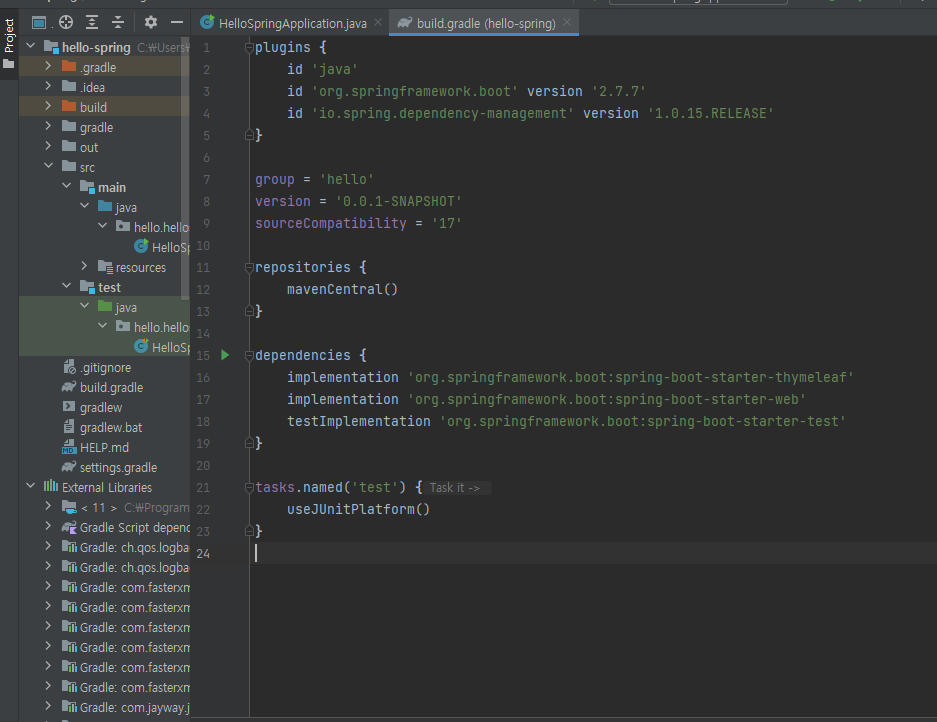
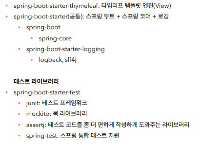
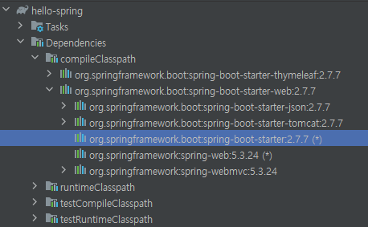
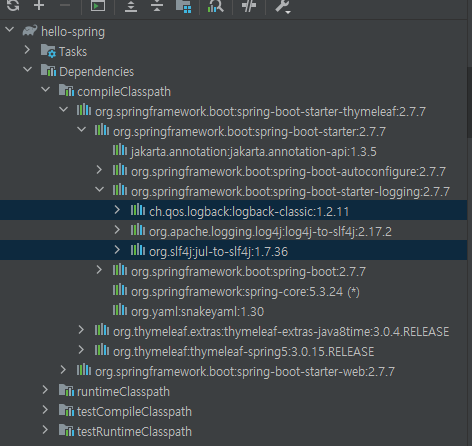
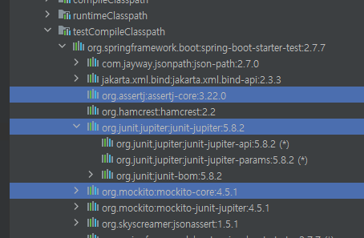
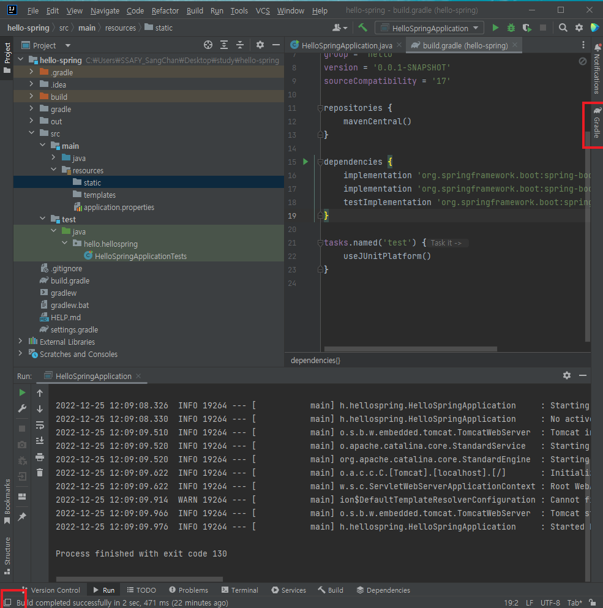

# 라이브러리 살펴보기

- Gradle은 의존관계가 있는 라이브러리를 함께 다운로드 한다.
- 라이브러리는 서로 의존 관계가 있어서 관련있는 라이브러리는 모두 불러온다.

> 이전에는 웹 서버가 완전히 분리되어 있어서 웹 서버를 따로 다운 받고 자바 코드를 밀어넣어야 했지만, 현재는 라이브러리에 모두 내장되어 있어서 편리하다.
>
> spring-test는 junit 테스트를 할 때 스프링과 통합해서 테스트할 수 있게 도와주는 라이브러리이다.

> (*) 표시는 이미 다른 곳에 중복되어 있다는 의미임. 더블 클릭하면 해당 위치로 이동
>
> springboot의 core까지 전부 당겨서 사용한다
>
> 서버에서는 System.out.println을 사용하지 않고 주로 log를 사용해서 이력을 남긴다.
>
> log와 관련해서는 slf4j와 logback이 있다. logback이 조금더 빠르다

> test라이브러리에도 위와 같은 것들이 있는데 핵심은 junit을 사용하고 최근에 5버전으로 넘어왔다. 그외의 것들을 테스트를 도와주는 것들이다.

> Gradle에 연관된 라이브러리를 보려면 왼쪽 아래 사각 표시를 눌러서 오른쪽에 Gradle탭이 보이도록 해야한다.