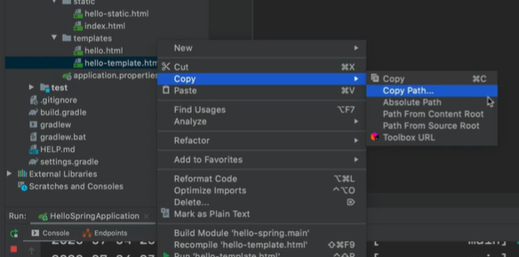
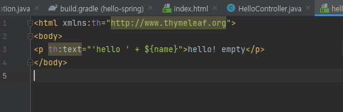
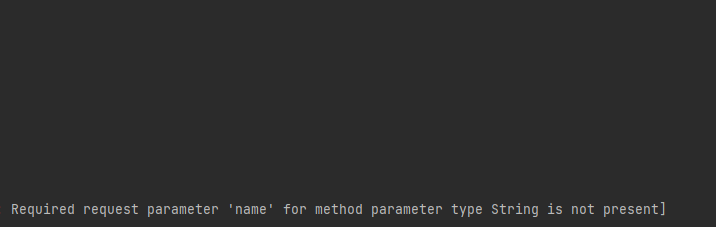
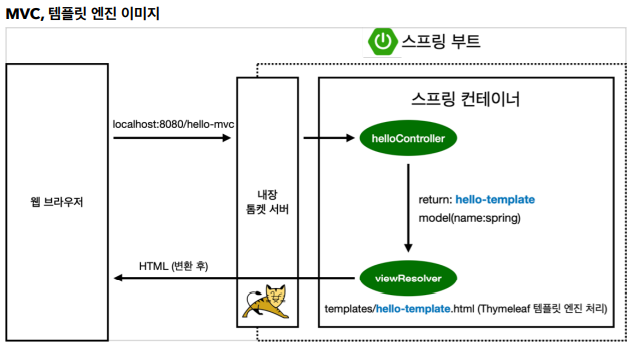

# MVC와 템플릿 엔진

- MVC: Model, View, Controller
  - 과거에는 View와 Controller가 분리되어 있지 않음
  - View는 화면 구성에 집중, Model과 Controller는 내부 로직 구동에 집중

- 타입리프의 장점은 서버를 열지 않고 파일을 그대로 열어서 껍데기를 볼 수 있음

> Copy -> Absolute Path를 URL 링크에 그대로 붙여넣어서 열어볼 수 있다.

> 엔진이 동작하면 p 태크 안의 내용이 th 뒤의 내용으로 치환이 된다.

- parameter를 입력하지 않고 URL을 치면 warn이 발생한다

- `ctrl` + `p`를 누르면 파라미터 정보를 볼 수 있다.

> 톰켓 서버가 스프링에게 URL 요청을 던지고 컨트롤러에 맵핑이 되어 있어서 호출해서 실행해주고 return값을 스프링에 넘겨주면 viewResolver가 동작하면서 view를 찾아주고 템플릿 엔진 연결시켜줌. 템플릿 엔진이 렌더링을 해서 변환을 한 HTML을 웹 브라우저에 반환