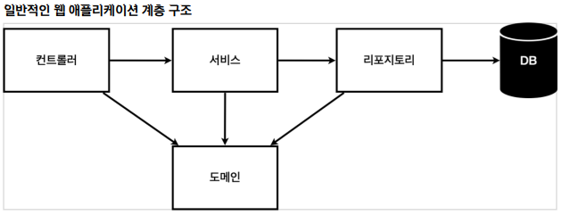

# 비즈니스 요구사항 정리

- 데이터: 회원ID, 이름

- 기능: 회원 등록, 조회

- 아직 데이터 저장소가 선정되지 않음(가상의 시나리오)

- 컨트롤러: 웹 MVC의 컨트롤러 역할

- 서비스: 핵심 비즈니스 로직 구현
  - 회원 중복 가입 불가능과 같은 기능
- 리포지토리: 데이터베이스에 접근, 도메인 객체를 DB에 저장하고 관리

- 도메인: 비즈니스 도메인 객체, 예) 회원, 주문, 쿠폰 등등 주로 데이터베이스에 저장하고 관리됨

