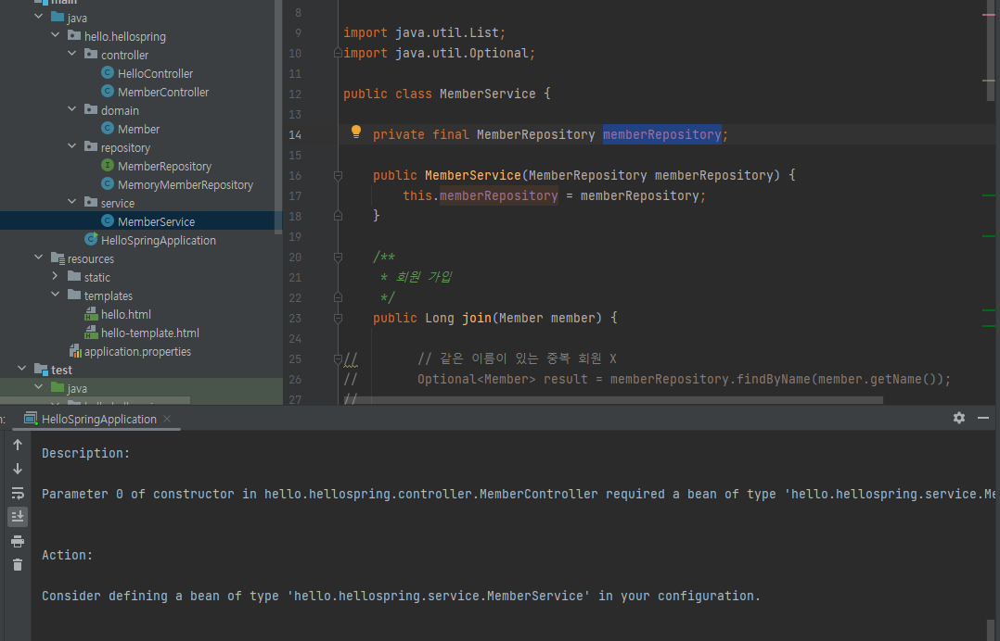
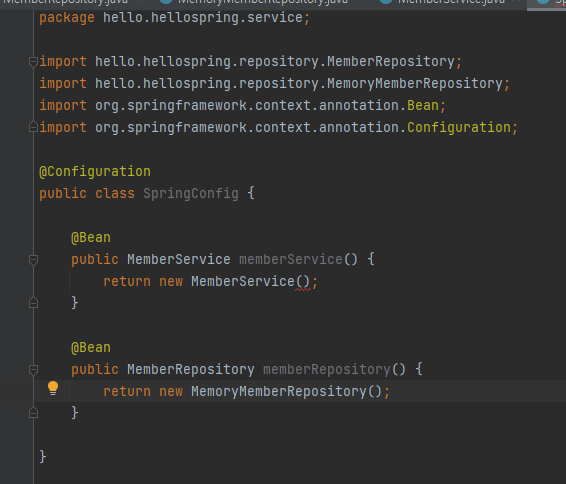
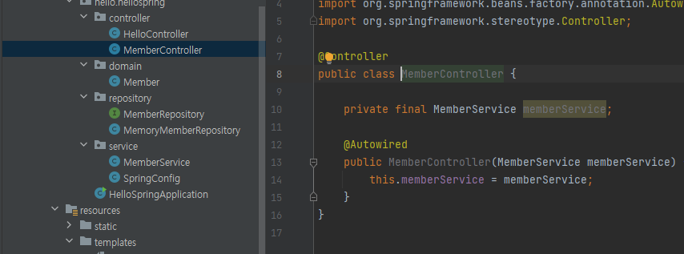
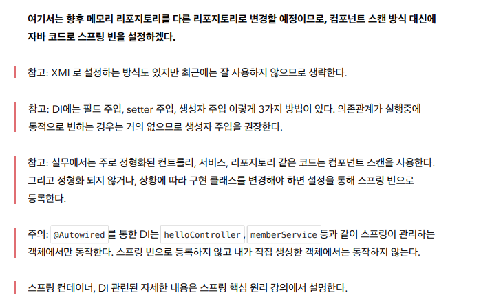
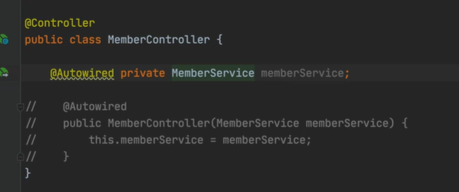
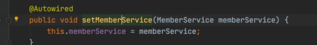
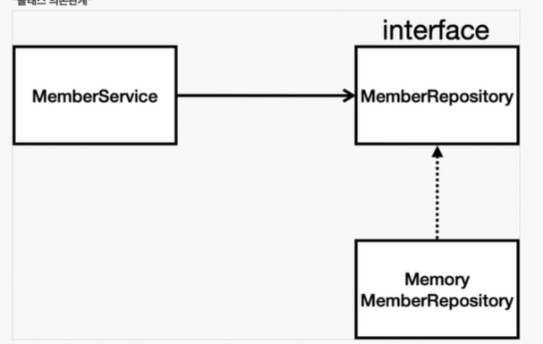
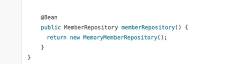

# 자바 코드로 직접 스프링 빈 등록하기

> `Component` 어노테이션을 지워주면 스프링 빈에 `MemberService`가 등록되지 않아서 오류 발생

> `Configuration`을 넣으면 `Spring`이 실행이 될 때 `Bean`에 등록시켜준다. `MemberService`같은 경우에는 파라미터가 필요해서 밑줄이 뜬다. 아래 `MemberRepository`는 인터페이스라서 구현체인 `MemoryMemberRepository`를 넣어주어야 한다.
>
> 즉 실행 순서는 `memberService`와 `memberRepository`를 스프링 빈에 등록을 하고, 스프링 빈에 등록되어 있는 `memberRepository`를  `memberService`에 넣어준다.

> `MemberController`는 어차피 스프링이 관리해야 하기 때문에 컴포넌트 스캔으로 올라가고, `Autowired`로 컴포넌트를 연결시켜 준다.

---

- 예전에는 자바 코드로 하지 않고 XML 문서로 관리함

-  DI에는 필드 주입, setter 주입, 생성자 주입 이렇게 3가지 방법이 있다. 의존관계가 실행중에 동적으로 변하는 경우는 거의 없으므로 생성자 주입을 권장한다

> 아래 주석이 생성자 주입, 위쪽은 필드 주입. 필드 주입은 바꿀 수가 없어서 비추천.

> `set`이 `public`하게 노출되어서 문제가 생긴다. 어플리케이션 로딩 시점에 조립할 때 바꾸는 것이다. 한 번 세팅이 되고 나면 바꿀 일이 없다.

- 실무에서는 주로 정형화된 컨트롤러, 서비스, 리포지토리 같은 코드는 컴포넌트 스캔을 사용한다.  그리고 정형화 되지 않거나, 상황에 따라 구현 클래스를 변경해야 하면 설정을 통해 스프링 빈으로 등록한다.

> 현재 저장소가 없어서 임시로 `MemoryMemberRepository`를 만들었는데 나중에 `DB`로 다른 코드 변경 없이 바꿔치기 할 때 사용된다. 나중에 컴포넌트 의존 관계를 변경할 필요없이 설정 코드만 변경해주면 간편

> `MemoryMemberRepository`가 `DBMemberRepository`로 바꿔치기 된다.

- `@Autowired `를 통한 DI는 `helloController` , `memberService` 등과 같이 스프링이 관리하는 객체에서만 동작한다. 스프링 빈으로 등록하지 않고 내가 직접 생성한 객체에서는 동작하지 않는다.