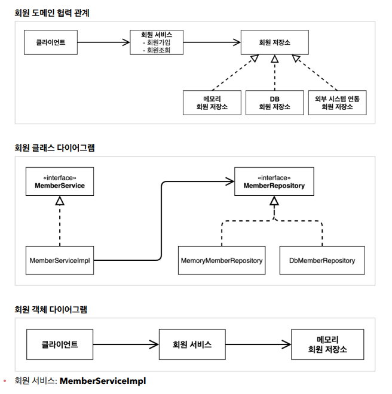
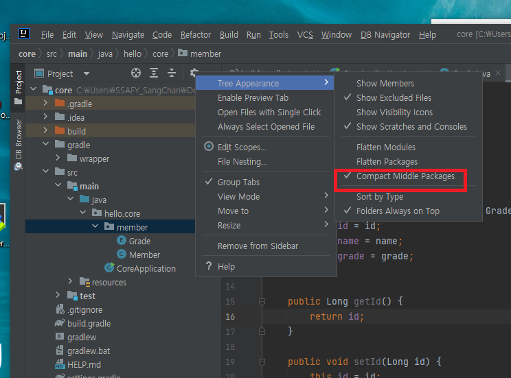
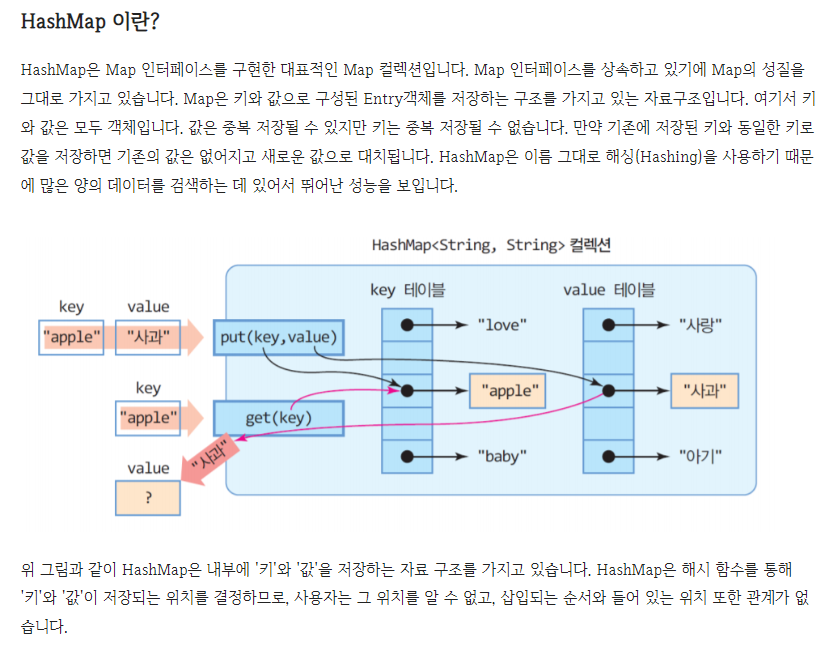
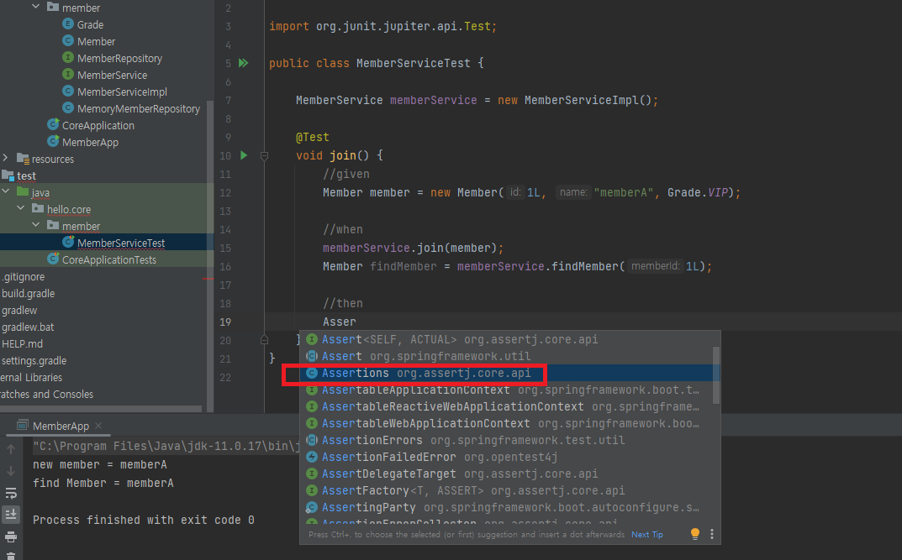

# 회원 도메인 만들기

- Gradle의 버전을 잘 맞춰주어야 에러가 발생하지 않는다
- `Enum`은 값이 고정되어 변하지 않을 경우 사용하는 것이다
- 생성자 단축키는 `alt + insert`
- 객체 다이어그램은 어떤 구현체를 쓰는지 구체적으로 나와있다





> 해당 설정을 통해 파일 보는 법을 바꿀 수 있다.



- HashMap을 사용하면 동시성 이슈가 생성된다. 컨쿼런스 해쉬맵?을 사용하면 동시성 이슈를 해결할 수 있다.



> Test는 빌드 될 때 들어가지 않고 개발 단계에서만 실행된다.
>
> 직접 Test를 돌리면 콘솔의 값을 확인하지 않고도 실패시 에러가 나기 때문에 편리하다.
>
> 기본적으로 Junit을 활용할 예정
>
> Assertion은 org.assertj.core.api를 활용하면 제공해주는 것들이 많다

- enum은 등호를 두 개만 사용해도 된다.

```java
package hello.core.discount;

import hello.core.member.Grade;
import hello.core.member.Member;

public class FixDiscountPolicy implements DiscountPolicy {

    private int discountFixAmount = 1000; //1000원 할인

    @Override
    public int discount(Member member, int price) {
        if (member.getGrade() == Grade.VIP) {
            return discountFixAmount;
        } else {
            return 0;
        }
    }
}

```

