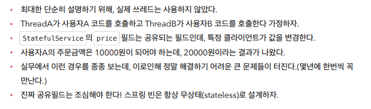

# 싱글톤 방식의 주의점


```java
package hello.core.singleton;

import org.assertj.core.api.Assertions;
import org.junit.jupiter.api.Test;
import org.springframework.context.ApplicationContext;
import org.springframework.context.annotation.AnnotationConfigApplicationContext;
import org.springframework.context.annotation.Bean;

import static org.junit.jupiter.api.Assertions.*;

class StatefulServiceTest {

    @Test
    void statefulServiceSingleton() {
        ApplicationContext ac = new AnnotationConfigApplicationContext(TestConfig.class);
        StatefulService statefulService1 = ac.getBean(StatefulService.class);
        StatefulService statefulService2 = ac.getBean(StatefulService.class);

        // ThreadA: A사용자가 10000원 주문
        statefulService1.order("userA", 10000);
        // ThreadB: B사용자가 20000원 주문
        statefulService2.order("userB", 20000);

        // ThreadA: 사용자A 주문 금액 조회
        int price = statefulService1.getPrice();
        System.out.println("price = " + price);

        Assertions.assertThat(statefulService1.getPrice()).isEqualTo(20000);
    }

    static class TestConfig {

        @Bean
        public StatefulService statefulService() {
            return new StatefulService();
        }
    }
}
```



```java
package hello.core.singleton;

import org.assertj.core.api.Assertions;
import org.junit.jupiter.api.Test;
import org.springframework.context.ApplicationContext;
import org.springframework.context.annotation.AnnotationConfigApplicationContext;
import org.springframework.context.annotation.Bean;

import static org.junit.jupiter.api.Assertions.*;

class StatefulServiceTest {

    @Test
    void statefulServiceSingleton() {
        ApplicationContext ac = new AnnotationConfigApplicationContext(TestConfig.class);
        StatefulService statefulService1 = ac.getBean(StatefulService.class);
        StatefulService statefulService2 = ac.getBean(StatefulService.class);

        // ThreadA: A사용자가 10000원 주문
        int userAPrice = statefulService1.order("userA", 10000);
        // ThreadB: B사용자가 20000원 주문
        int userBPrice = statefulService2.order("userB", 20000);

        // ThreadA: 사용자A 주문 금액 조회
//        int price = statefulService1.getPrice();
        System.out.println("price = " + userAPrice);

//        Assertions.assertThat(statefulService1.getPrice()).isEqualTo(20000);
    }

    static class TestConfig {

        @Bean
        public StatefulService statefulService() {
            return new StatefulService();
        }
    }
}
```

> 무상태로 만들어주고 지역변수로 나오게 해야한다.


```java
package hello.core.singleton;

import hello.core.AppConfig;
import hello.core.member.MemberRepository;
import hello.core.member.MemberServiceImpl;
import hello.core.order.OrderServiceImpl;
import org.assertj.core.api.Assertions;
import org.junit.jupiter.api.Test;
import org.springframework.context.ApplicationContext;
import org.springframework.context.annotation.AnnotationConfigApplicationContext;

import static org.assertj.core.api.Assertions.*;

public class ConfigurationSingletonTest {

    @Test
    void configurationTest() {
        ApplicationContext ac = new AnnotationConfigApplicationContext(AppConfig.class);
        MemberServiceImpl memberService = ac.getBean("memberService", MemberServiceImpl.class);
        OrderServiceImpl orderService = ac.getBean("orderService", OrderServiceImpl.class);
        MemberRepository memberRepository = ac.getBean("memberRepository", MemberRepository.class);

        MemberRepository memberRepository1 = memberService.getMemberRepository();
        MemberRepository memberRepository2 = orderService.getMemberRepository();


        System.out.println("memberRepository1 = " + memberRepository1);
        System.out.println("memberRepository2 = " + memberRepository2);
        System.out.println("memberRepository = " + memberRepository);

        assertThat(memberService.getMemberRepository()).isSameAs(memberRepository);
        assertThat(orderService.getMemberRepository()).isSameAs(memberRepository);
    }
}
```

