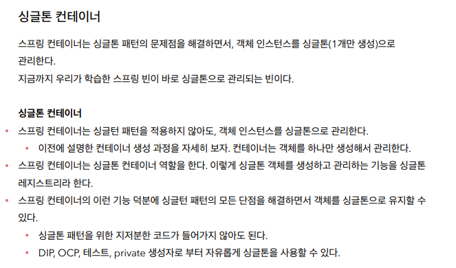

# 싱글톤 컨테이너

- 스프링을 사용하지 않고 DI컨테이너를 구현해서 사용했을 경우 계속 새로운 객체가 생성된다.


```java
package hello.core.singleton;

import hello.core.AppConfig;
import hello.core.member.MemberService;
import org.assertj.core.api.Assertions;
import org.junit.jupiter.api.DisplayName;
import org.junit.jupiter.api.Test;

import static org.assertj.core.api.Assertions.*;

public class SingletonTest {

    @Test
    @DisplayName("스프링 없는 순수한 DI 컨테이너")
    void pureContainer() {
        AppConfig appConfig = new AppConfig();
        //1. 조회: 호출할 때마다 객체를 생성
        MemberService memberService1 = appConfig.memberService();

        //2. 조회: 호출할 때마다 객체를 생성
        MemberService memberService2 = appConfig.memberService();

        //참조값이 다른 것을 확인
        System.out.println("memberService1 = " + memberService1);
        System.out.println("memberService2 = " + memberService2);

        //memberService1 != memberService2
        assertThat(memberService1).isNotSameAs(memberService2);
    }
}
```


---


### 싱글톤 패턴


```java
package hello.core.singleton;

public class SingletonService {

    private static final SingletonService instance = new SingletonService();

    public static SingletonService getInstance() {
        return instance;
    }

    private SingletonService() {
    }

    public void logic() {
        System.out.println("싱글톤 객체 로직 호출");
    }

}
```


```java
@Test
    @DisplayName("싱글톤 패턴을 적용한 객체 사용")
    void singletonServiceTest() {
        SingletonService singletonService1 = SingletonService.getInstance();
        SingletonService singletonService2 = SingletonService.getInstance();

        System.out.println("singletonService1 = " + singletonService1);
        System.out.println("singletonService2 = " + singletonService2);

        assertThat(singletonService1).isSameAs(singletonService2);
        // same == 참조를 비교
        // equal  자바의 equals와 같다
    }
```


---



