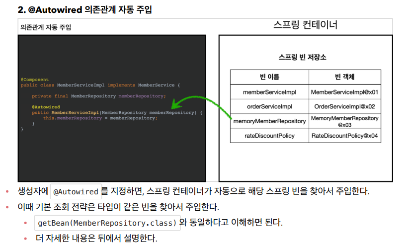

- AppConfig가 `@Configuration`을 포함하고 있는데, 해당 어노테이션은 `@Component`를 포함하고 있어서 자동으로 빈으로 등록되어 버린다. 그렇기 때문에 예외 처리를 해주고 시작한다.

```java
package hello.core;

import org.springframework.context.annotation.ComponentScan;
import org.springframework.context.annotation.Configuration;
import org.springframework.context.annotation.FilterType;

@Configuration
@ComponentScan(
        excludeFilters = @ComponentScan.Filter(type = FilterType.ANNOTATION, classes = Configuration.class)
)
public class AutoAppConfig {

}
```


- 생성자에 `@Autowired`를 붙여주면 자동으로 의존 관계 주입이 된다.

```java
package hello.core.member;

import org.springframework.beans.factory.annotation.Autowired;
import org.springframework.stereotype.Component;

@Component
public class MemberServiceImpl implements MemberService{

    private final MemberRepository memberRepository;
    
    @Autowired
    public MemberServiceImpl(MemberRepository memberRepository) {
        this.memberRepository = memberRepository;
    }

    @Override
    public void join(Member member) {
        memberRepository.save(member);
    }

    @Override
    public Member findMember(Long memberId) {
        return memberRepository.findById(memberId);
    }

    //테스트 용도
    public MemberRepository getMemberRepository() {
        return memberRepository;
    }
}
```


- 테스트 진행

```java
package hello.core.scan;

import hello.core.AutoAppConfig;
import hello.core.member.MemberService;
import org.assertj.core.api.Assertions;
import org.junit.jupiter.api.Test;
import org.springframework.context.ApplicationContext;
import org.springframework.context.annotation.AnnotationConfigApplicationContext;

public class AutoAppConfigTest {

    @Test
    void basicScan() {
        ApplicationContext ac = new AnnotationConfigApplicationContext(AutoAppConfig.class);

        MemberService memberService = ac.getBean(MemberService.class);
        Assertions.assertThat(memberService).isInstanceOf(MemberService.class);
    }
}
```




