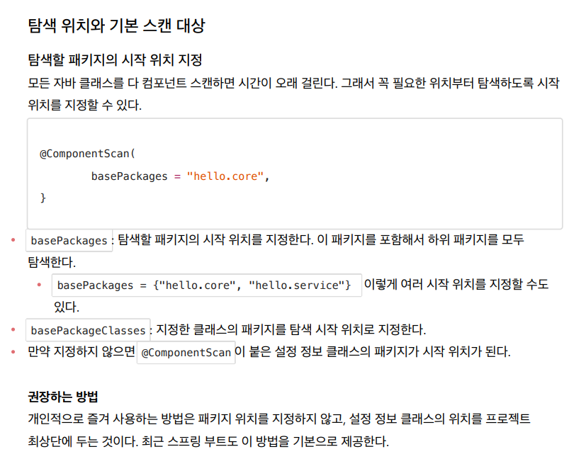

- `basePackages`를 활용해서 `ComponentScan`위치를 지정해 줄 수 있다. 만약 java 최상단에 위치한다면 라이브러리까지 모두 탐색한다.

```java
package hello.core;

import org.springframework.context.annotation.ComponentScan;
import org.springframework.context.annotation.Configuration;
import org.springframework.context.annotation.FilterType;

@Configuration
@ComponentScan(
        basePackages = "hello.core",
        excludeFilters = @ComponentScan.Filter(type = FilterType.ANNOTATION, classes = Configuration.class)
)
public class AutoAppConfig {

}
```




---

### 필터


---


### 중복 등록과 충돌


> 애매한 부분들은 명확하게 하는 것이 중요!
> 코드 리팩토링을 하려고 하지만 애매한 경우가 생긴 경우에는 그냥 하지 않는 것이 좋다!