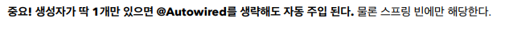
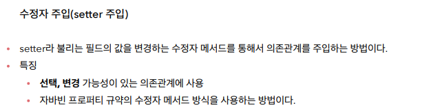
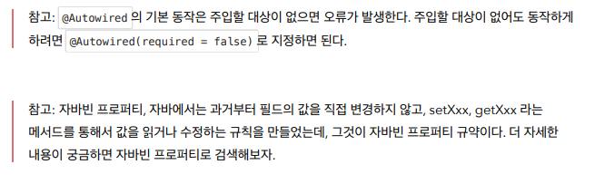
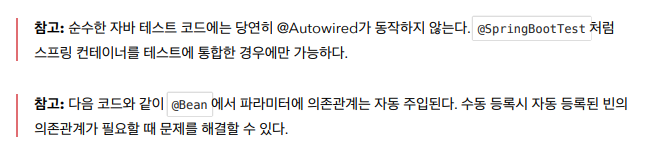
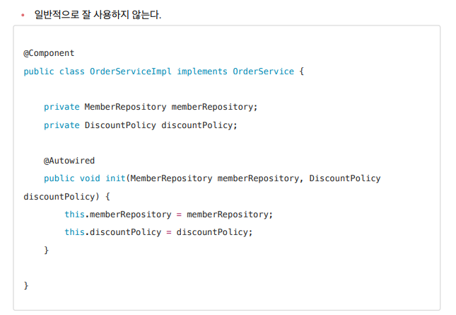

```java
@Component
public class OrderServiceImpl implements OrderService{

    private final MemberRepository memberRepository;
    private final DiscountPolicy discountPolicy;

    @Autowired
    public OrderServiceImpl(MemberRepository memberRepository, DiscountPolicy discountPolicy) {
        this.memberRepository = memberRepository;
        this.discountPolicy = discountPolicy;
    }

    @Override
    public Order createOrder(Long memberId, String itemName, int itemPrice) {
        Member member = memberRepository.findById(memberId);
        int discountPrice = discountPolicy.discount(member, itemPrice);

        return new Order(memberId, itemName, itemPrice, discountPrice);
    }

    //테스트 용도
    public MemberRepository getMemberRepository() {
        return memberRepository;
    }
}
```

> `private final`을 붙이면 필수적으로 값을 넣어주어야 한다는 의미이다.

---



- 스프링 컨테이너 생성 -> 빈 등록 -> 의존 관계 주입이 이루어진다
- 생성자 같은 경우에는 객체가 만들어질 때 자동적으로 의존관계도 주입이 된다
  - `new OrderServiceImpl`할 때 2가지 인자를 빈에서 찾아서 주입해준다.
- 수정자는 나중에 의존관계 주입이 일어나서 좀 더 늦다.

```java
@Component
public class OrderServiceImpl implements OrderService{

    private MemberRepository memberRepository;
    private DiscountPolicy discountPolicy;

    @Autowired(required = false)
    public void setMemberRepository(MemberRepository memberRepository) {
        System.out.println("memberRepository = " + memberRepository);
        this.memberRepository = memberRepository;
    }

    @Autowired
    public void setDiscountPolicy(DiscountPolicy discountPolicy) {
        System.out.println("discountPolicy = " + discountPolicy);
        this.discountPolicy = discountPolicy;
    }

    @Autowired
    public OrderServiceImpl(MemberRepository memberRepository, DiscountPolicy discountPolicy) {
        this.memberRepository = memberRepository;
        this.discountPolicy = discountPolicy;
    }
}

```



- 자바빈 프로퍼티 규약 예시

```java
class Data {
 private int age;
 public void setAge(int age) {
 this.age = age;
 }
 public int getAge() {
 return age;
 }
}
```

---


```java
@Component
public class OrderServiceImpl implements OrderService {
 @Autowired private MemberRepository memberRepository;
 @Autowired private DiscountPolicy discountPolicy;
}
```



- 아래와 같이 순수한 자바 코드로 객체를 생성하고 테스트하려고 하면, `NullPointerException` 에러가 발생한다. 즉, 우리가 원하는 객체를 넣어 줄 수가 없다. 넣어주려고 하면 다시 `setter`를 만들어줘야한다.

```java
    @Test
    void fieldInjectionTest() {
        OrderServiceImpl orderService = new OrderServiceImpl();
        orderService.createOrder(1L, "itemA", 10000);
    }
```

---




