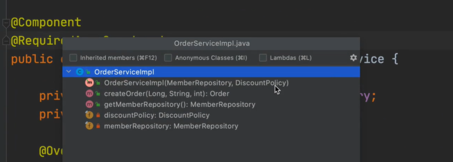

```java
//기본 코드
@Component
public class OrderServiceImpl implements OrderService {
 private final MemberRepository memberRepository;
 private final DiscountPolicy discountPolicy;
 @Autowired
 public OrderServiceImpl(MemberRepository memberRepository, DiscountPolicy 
discountPolicy) {
 this.memberRepository = memberRepository;
 this.discountPolicy = discountPolicy;
 }
}
```

- 생성자가 딱 1개만 있으면 `@Autowired` 생략 가능

```java
@Component
public class OrderServiceImpl implements OrderService {
 private final MemberRepository memberRepository;
 private final DiscountPolicy discountPolicy;
 public OrderServiceImpl(MemberRepository memberRepository, DiscountPolicy 
discountPolicy) {
 this.memberRepository = memberRepository;
 this.discountPolicy = discountPolicy;
 }
}
```


```java
@Component
@RequiredArgsConstructor
public class OrderServiceImpl implements OrderService {
    
 private final MemberRepository memberRepository;
 private final DiscountPolicy discountPolicy;
}
```

- `Ctrl` + `F12`를 누르면 내부 메소드를 볼 수 있다
- 생성자가 들어있는 것을 알 수 있다.



