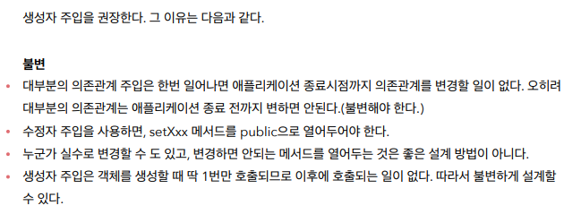

---

### ⛔ 수정자 주입을 사용하는 경우

- `Ctrl + Shift + T` 테스트 케이스 만들기
- `nullPointerException`이 발생하는데 `setter`로 객체를 더미값으로라도 지정해주어야 한다. `Test` 클래스를 보면 어떤 의존관계가 있는지 전혀 알 수가 없다.

```java
@Component
public class OrderServiceImpl implements OrderService{

    private MemberRepository memberRepository;
    private DiscountPolicy discountPolicy;

    @Autowired
    public void setMemberRepository(MemberRepository memberRepository) {
        this.memberRepository = memberRepository;
    }

    @Autowired
    public void setDiscountPolicy(DiscountPolicy discountPolicy) {
        this.discountPolicy = discountPolicy;
    }

    @Override
    public Order createOrder(Long memberId, String itemName, int itemPrice) {
        Member member = memberRepository.findById(memberId);
        int discountPrice = discountPolicy.discount(member, itemPrice);

        return new Order(memberId, itemName, itemPrice, discountPrice);
    }

}
```


```java
package hello.core.order;

import org.junit.jupiter.api.Test;

import static org.junit.jupiter.api.Assertions.*;

class OrderServiceImplTest {

    @Test
    void createOrder() {
        OrderServiceImpl orderService = new OrderServiceImpl();
        orderService.createOrder(1L, "itemA", 10000);
    }
}
```

---

### 생성자 주입 사용 시

- `OrderServiceImpl`호출 시 주입해야 할 객체들을 에러로 보여준다.
- 순수한 자바 코드로 테스트가 가능함

```java
package hello.core.order;

import hello.core.discount.FixDiscountPolicy;
import hello.core.member.Grade;
import hello.core.member.Member;
import hello.core.member.MemoryMemberRepository;
import org.junit.jupiter.api.Test;

import static org.assertj.core.api.Assertions.*;

class OrderServiceImplTest {

    @Test
    void createOrder() {
        MemoryMemberRepository memoryMemberRepository = new MemoryMemberRepository();
        memoryMemberRepository.save(new Member(1L, "name", Grade.VIP));

        OrderServiceImpl orderService = new OrderServiceImpl(memoryMemberRepository, new FixDiscountPolicy());
        Order order = orderService.createOrder(1L, "itemA", 10000);
        assertThat(order.getDiscountPrice()).isEqualTo(1000);
    }
}
```

- `final`을 통해서 생성자를 통해 혹은 직접 주입을 통해 한번만 생성이 가능함, 그 이외에는 값을 바꿀 수 없다.
- `final`을 쓰면 생성자 내부에 객체를 넣어주지 않으면 에러가 발생한다. 실행 하기 전에 바로 알 수 있다. 자바 컴파일러가 오류를 보내준다.

```java
@Component
public class OrderServiceImpl implements OrderService{

    private final MemberRepository memberRepository;
    private final DiscountPolicy discountPolicy;

```

