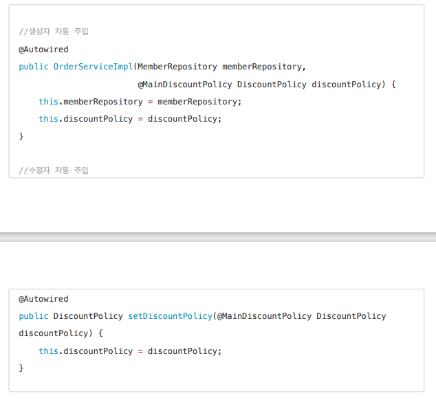
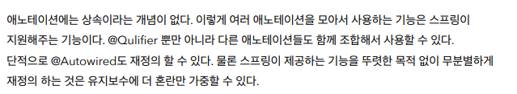

- 아래와 같이 오타가 나도, 문자열이기 때문에 컴파일이 타입을 인지할 수 없다

```java
package hello.core.discount;

import hello.core.member.Grade;
import hello.core.member.Member;
import org.springframework.beans.factory.annotation.Qualifier;
import org.springframework.context.annotation.Primary;
import org.springframework.stereotype.Component;

@Component
@Qualifier("mainnnnDiscountPolicy")
public class RateDiscountPolicy implements DiscountPolicy{

    private int discountPercent = 10;

    @Override
    public int discount(Member member, int price) {
        if (member.getGrade() == Grade.VIP) {
            return price * discountPercent / 100;
        } else {
        return 0;
        }
    }
}
```

- 다음과 같은 설정을 통해 애노테이션을 만들어주면 된다
  - `Qualifier`를 검색해서 위쪽 애노테이션을 모두 가져오자
  - 같은 곳에 애노테이션이 붙도록 설정해주는 장치

```java
package hello.core.annotation;

import org.springframework.beans.factory.annotation.Qualifier;

import java.lang.annotation.*;

@Target({ElementType.FIELD, ElementType.METHOD, ElementType.PARAMETER, ElementType.TYPE, ElementType.ANNOTATION_TYPE})

@Retention(RetentionPolicy.RUNTIME)
@Inherited
@Documented
@Qualifier("mainDiscountPolicy")
public @interface MainDiscountPolicy {
}
```

- 결과

```java
package hello.core.discount;

import hello.core.annotation.MainDiscountPolicy;
import hello.core.member.Grade;
import hello.core.member.Member;
import org.springframework.beans.factory.annotation.Qualifier;
import org.springframework.context.annotation.Primary;
import org.springframework.stereotype.Component;

@Component
@MainDiscountPolicy
public class RateDiscountPolicy implements DiscountPolicy{

    private int discountPercent = 10;

    @Override
    public int discount(Member member, int price) {
        if (member.getGrade() == Grade.VIP) {
            return price * discountPercent / 100;
        } else {
        return 0;
        }
    }
}
```






> 너무 무분별하게 애노테이션을 만들지는 말자