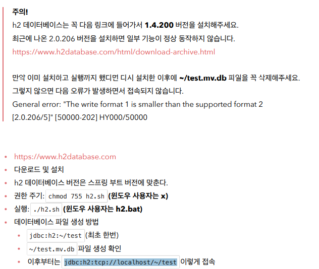
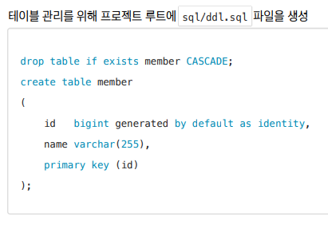
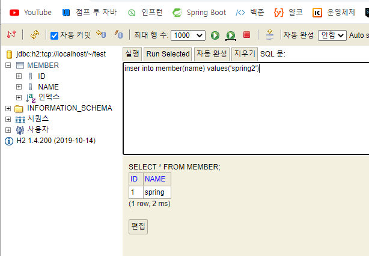
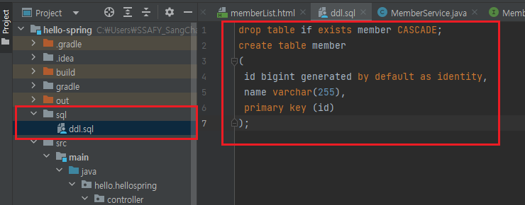

# H2 데이터베이스 설치

> 파일로 접근하면 어플리케이션과 웹 콘솔이 동시 접속이 안되고 충돌 발생할 가능이 있다. `jdbc:h2:tcp://localhost/~/test`을 활용하면 소켓을 통해 접근한다. 그렇게 해야 여러 군데에서 접근이 가능

> 자바에서는 `Long`이지만 `DB`에서는 `bigint`이다.
>
> `generated by defalult as identity`는 `DB`에 값을 세팅하지 않고 넣으면 `DB`가 자동으로 `id`값을 채워줌.

> 테이블을 채워줄 수 있음

> `sql`이라는 파일 안에 다음과 같이 변경 이력을 관리할 수 있음.