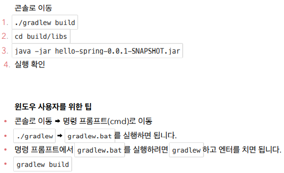

# 빌드하고 실행하기




- 서버 배포할 때에는 build/libs 안에 있는 파일만 복사해서 넣어주고 java -jar에서 실행시키면 된다.

  - 그러면 서버에서도 동작을 하게 됨

  - 과거에는 서버에 톰캣을 설치하고 특정 폴더에 여러 파일을 집어넣었어야 했었음

```
# build 폴더 없애기.
./gradlew clean
./gradlew clean build
```

