# 스프링

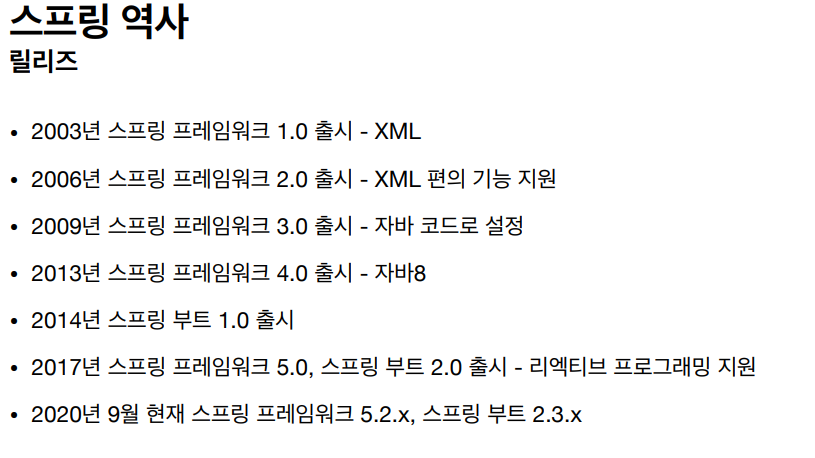

- EJB는 이론은 좋지만 너무 복잡하고, 코드가 지저분해지고, 느렸기 때문에 스프링이 탄생함.

### 스프링이란?

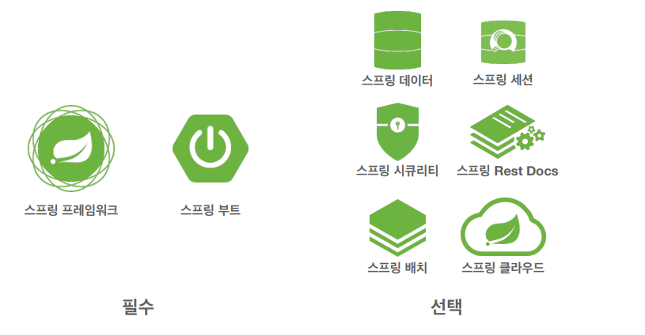

- 스프링 데이터는 JPA를 주로 사용 중임
- Rest Docs는 API를 문서와 엮어 편리하게 만들어주는 기능

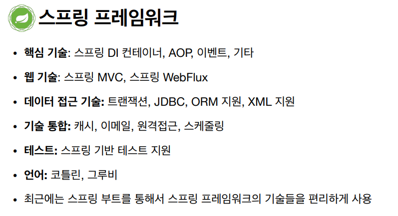

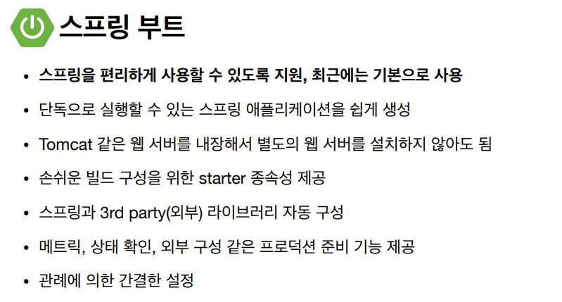

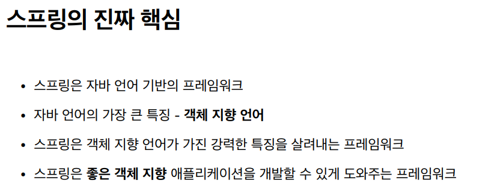

- EJB를 사용하게 되면, 해당 EJB를 상속받고 거기에 종속된 코드를 작성해야 했었다. 객체 지향을 활용할 수 없게 된다.

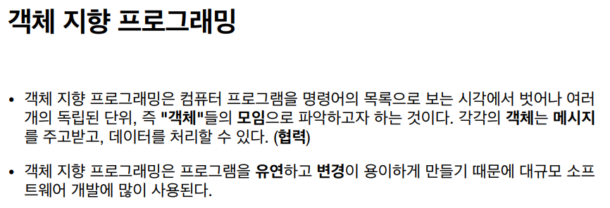

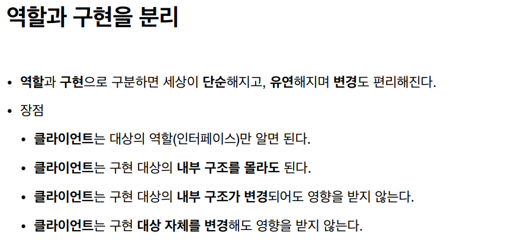

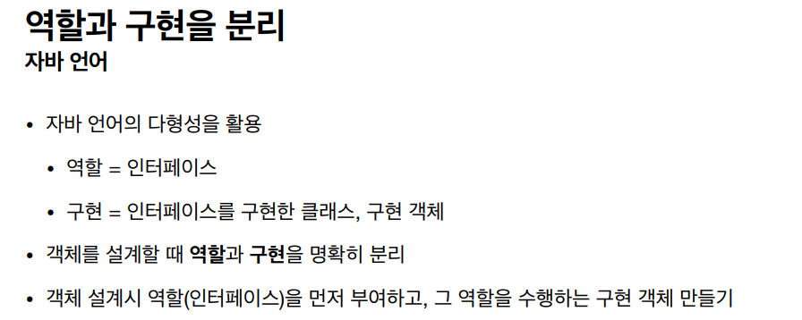

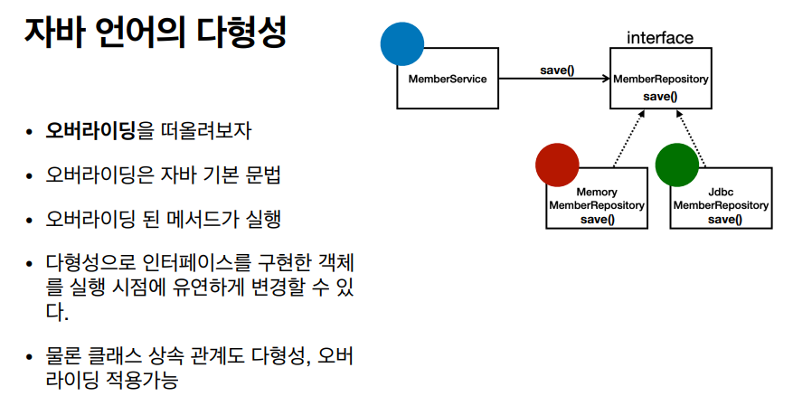

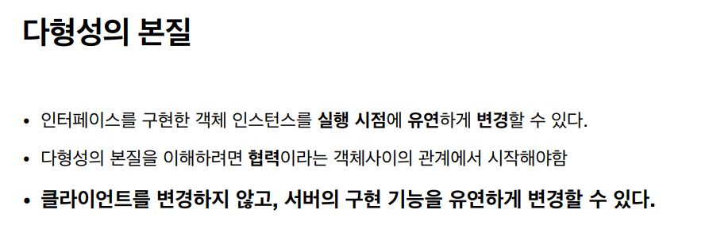

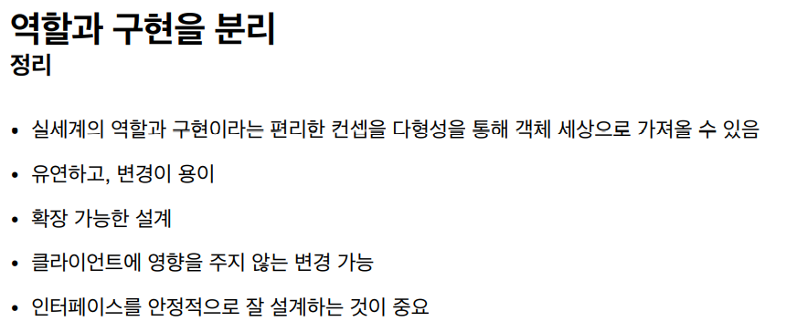

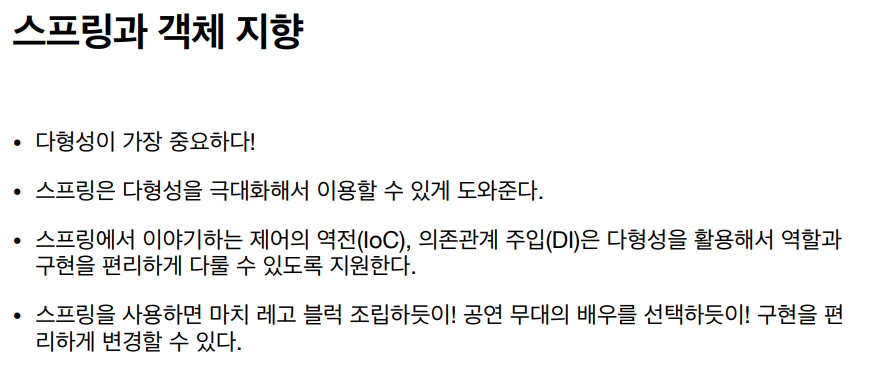

### 🛠 좋은 객체 지향 설계의 5가지 원칙(SOLID)

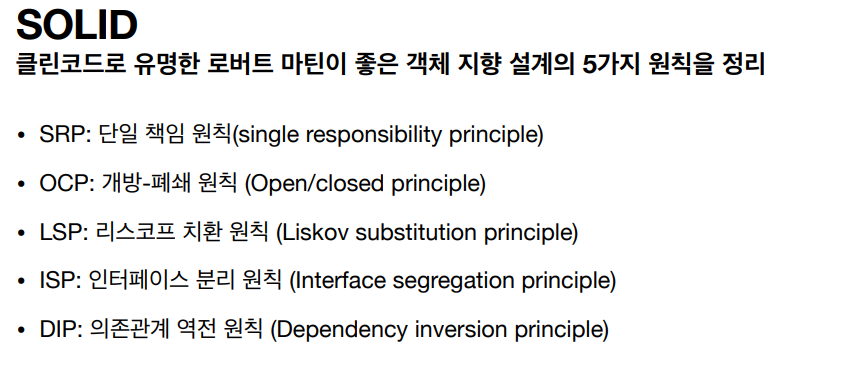

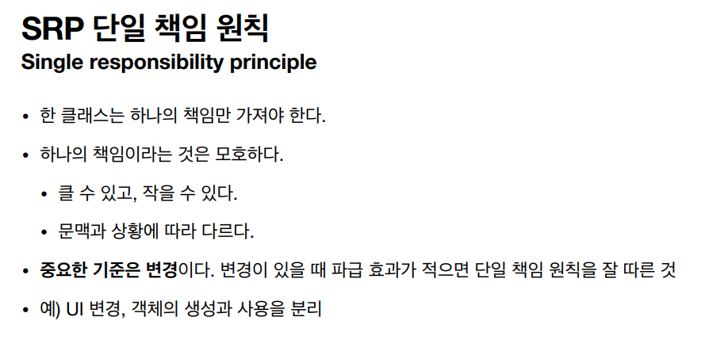

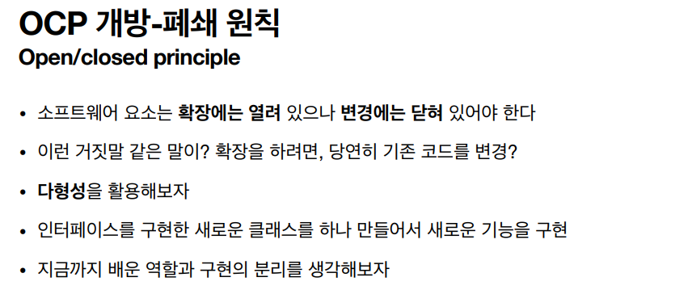

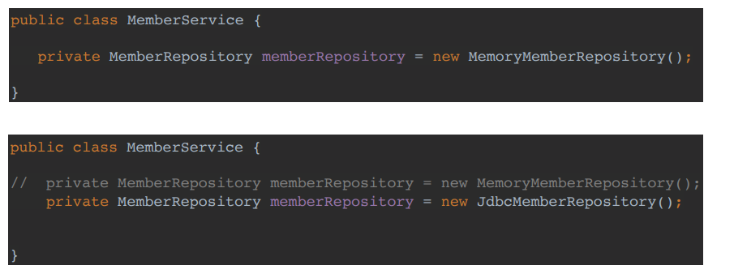

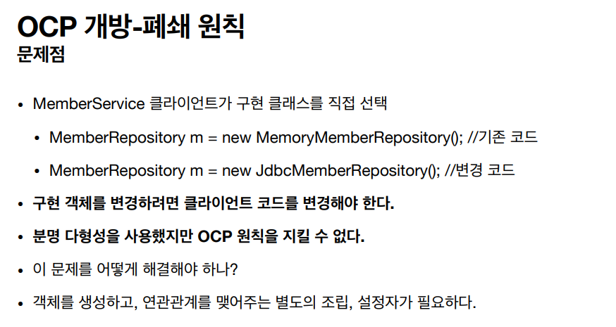

> 조립, 설정자는 스프링 컨테이너가 도와주게 된다.

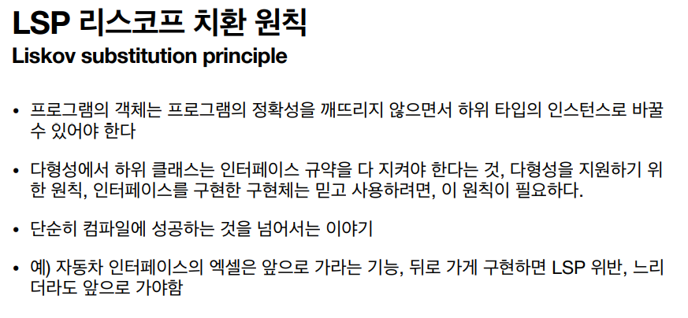

> 인터페이스에 명시된 것들은 반드시 지켜야 한다는 뜻
>
> 예시) 엑셀을 밟을 때 앞으로 가야된다면 앞으로만 가도록 구현 해야 한다.

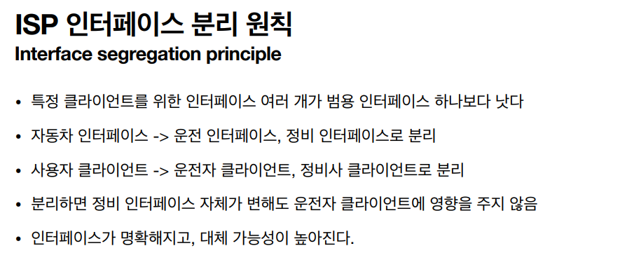

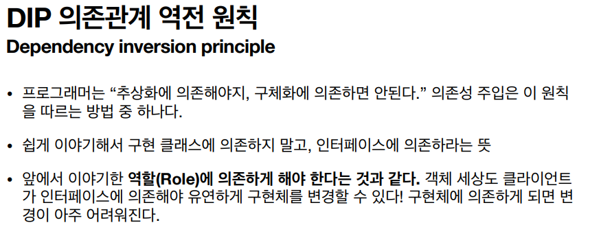

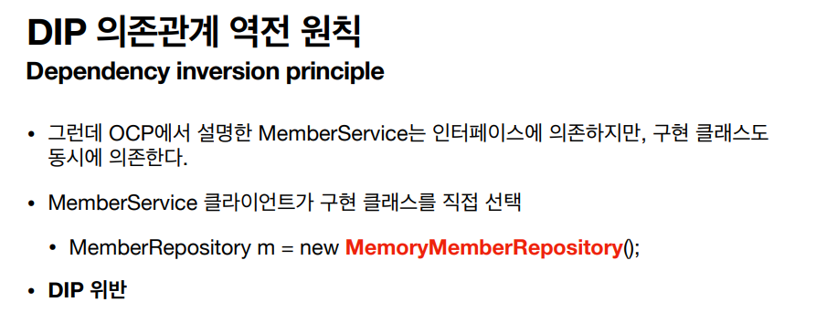

> 위에서 보이는 MemberService는 MemberRepository라는 인터페이스에도 의존하고, MemoryMemberRepository라는 구현체에도 의존하고 있어서 DIP에 위반된다.

---

### 객체 지향 설계와 스프링

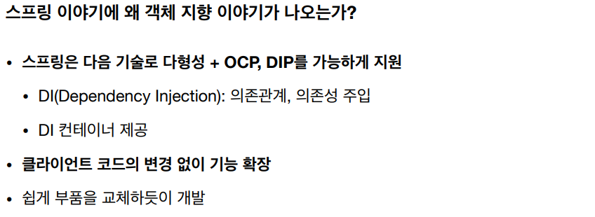

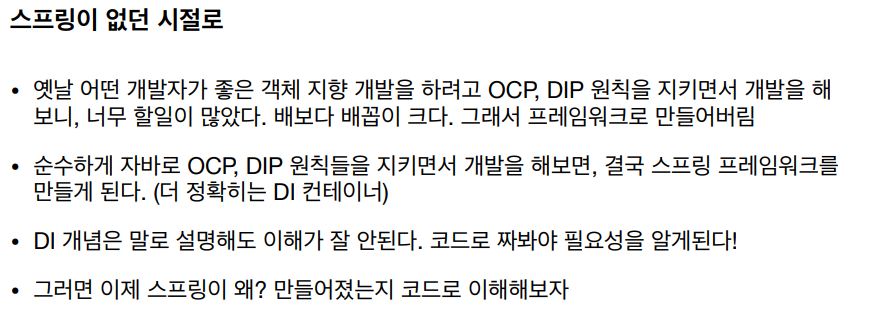

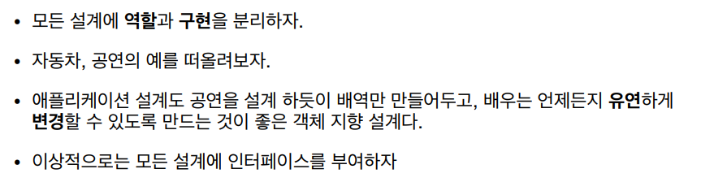

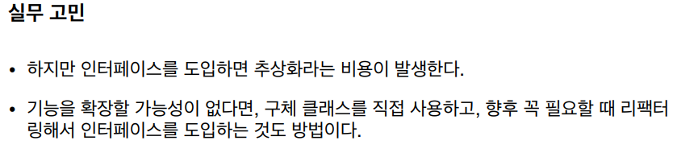