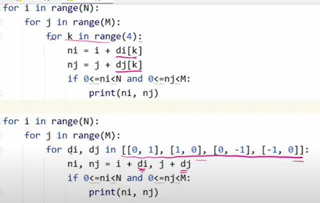

# 알고리즘 - List2

### 2차원 배열

- 행과 열로 표현
- 각각의 원소에 대해 접근이 가능

```python
N = int(input())
arr = [list(map(int, input())) for _ in range(N)]

for i in range(N):
    for j in range(N):
        print(arr[i][j], end = ' ')
    print()
```

- 배열 순회

  - n x m 배열의 n * m 개의 모든 원소를 빠짐없이 조사하는 방법

  - 행 우선 순회, 열 우선 순회, 지그재그 순회

```python
N = int(input())
arr = [list(map(int, input().split())) for _ in range(N)]

for i in range(N):             
    for j in range(N):
        print(arr[i][j + (N - 2 * j - 1) * (i % 2)], end = ' ')
    print()
```

- 델타를 이용한 2차 배열 탐색
  - 2차 배열의 한 좌표에서 4방향의 인접 배열 요소를 탐색하는 방법
    - 가장 자리의 경우 조건을 세워주어 따로 만들어야함

```python
N = int(input())
arr = [list(map(int, input().split())) for _ in range(N)]

di = [1, 0, -1, 0] # 우, 하, 좌, 상
dj = [0, 1, 0, -1]

for i in range(4):
    print(arr[1 + dj[i]][1 + di[i]], end = ' ')
```





- 전치행렬
  - 대각선을 기준으로 뒤바뀐 행렬

```python
N = int(input())
arr = [list(map(int, input().split())) for _ in range(N)]

for i in range(N):
    for j in range(N):
        if i < j:
            arr[i][j], arr[j][i] = arr[j][i], arr[i][j]
        print(arr[i][j], end = ' ')
    print()
```

### 부분집합

- 유한 개의 정수로 이루어진 집합이 있을 때, 이 집합의 부분집합 중에서 그 집합의 원소를 모두 더한 값이 0이 되는 경우가 있는지 알아보자

- 부분집합의 수는 집합의 원소가 n개일 때, 공집합을 포함한 부분집합의 수는 2^n이다.
- 

### 비트 연산자

- 1byte = 8bit


```python
print(0b1111 & (1 << 0))
```


### 검색

- 저장되어 있는 자료 중에서 원하는 항목을 찾는 작업
- 목적하는 탐색 키를 가진 항목을 찾는 것
  - 탐색 키: 자료를 구별하여 인식할 수 있는 키
- 검색의 종류
  - 순차 검색
  - 이진 검색
  - 해쉬

