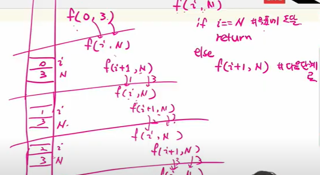

# Stack1

- 물건을 쌓아 올리듯 자료를 쌓아 올린 형태의 자료구조이다.
  - 선형구조: 자료 간의 관계가 1대1의 관계를 갖는다.
  - 비선형구조: 자료 간의 관계가 1대N의 관계를 갖는다.(예: 트리)
- 스택에 자료를 삽입하거나 스택에서 자료를 꺼낼 수 있다.
- 마지막에 삽입한 자료를 가장 먼저 꺼낸다. 후입선출(LIFO, Last-In-First-Out)이라고 부른다.
  - 스택에 1, 2, 3 순으로 자료를 삽입한 후 꺼내면 역순으로 즉 3, 2, 1순으로 꺼낼 수 있다.

- 자료구조: 자료를 선형으로 저장할 저장소
  - 배열을 사용할 수 있다.
  - 저장소 자체를 스택이라 부르기도 한다.
  - 스택에서 마지막 삽입된 원소의 위치를 top이라 부른다.(stack pointer, sp가 공식적 용어)
- 연산
  - 삽입: 저장소에 자료를 저장. push
  - 삭제: 저장소에서 자료를 꺼낸다. pop
  - 스택이 공백인지 아닌지를 확인하는 연산. isEmpty
  - 스택의 top에 있는 item(원소)을 반환하는 연산. peek

- 디버깅용
  - top이 스택의 제한 범위에 도달하면 overflow를 출력하면서 잘못된 곳을 알 수 있음

```python
stackSize = 10
stack = [0] * stackSize
top = -1

top += 1            # push(1)
stack[top] = 1

top += 1            # push(2)
stack[top] = 2

top -= 1            # pop 1
temp = stack[top + 1]
print(temp)

temp = stack[top]   # pop 2
top -= 1        

print(temp)

stack2 = []
stack2.append(10)
stack2.append(20)
print(stack2.pop())
print(stack2.pop())
```

# 재귀함수

- 함수를 호출하면 사용하는 메모리 영역이 달라짐

- 자기 자신을 호출하여 순환 수행되는 것(호출할 때마다 다른 메모리 영역이 생긴다)
- 재귀 `depth`에는 1000번이라는 제한이 있다.

```python
def pibo(n):
    if n < 2:
        return n
    else:
        return pibo(n - 1) + pibo(n - 2)
```

- `f(i: 현재 단계, n: 목표)`
  - `f(0, 3)`을 예로들면 함수가 호출되면서 계속 메모리 할당이 생김
  - `return`하게 되면 할당되었던 메모리가 사라짐



```python
def f(i, N):    # i 현재 단계, N: 목표 단계
    if i == N:
        print(i)
        return
    else:
        print(i)
        f(i + 1, N)
f(0, 3)
============================================================================
# 크기가 N인 배열의 모든 원소에 접근하는 재귀함수
def f(i, N):
    if i == N:  # 배열을 벗어남
        return
    else:       # 남은 원소가 있는 경우
        B[i] = A[i]
        print(A[i])
        f(i + 1, N)

N = 3
A = [1, 2, 3]
B = [0] * N
f(0, N)
print(B)
```

# 메모이제이션(memoization)

- 프로그램을 실행할 때 이전의 계산한 값을 메모리에 저장해서 매번 다시 계산하지 않도록 하는 것이다. 동적 계획법의 핵심이 되는 기술이다.
- 'memoization'은 글자 그대로 해석하면 '메모리에 넣기(to put in memory)'라는 의미이며 '기억되어야 할 것'이라는 뜻의 라틴어 memorandum에서 파생되었다.

```python
# 방법1
def fibo1(n):
    if n >= 2 and len(memo) <= n:
        memo.append(fibo1(n - 1) + fibo1(n - 2))
    return memo[n]

memo = [0, 1]

# 방법2
def fibo(n):
    if memo[n] == -1:
        memo[n] = fibo(n - 1) + fibo(n - 2) 
    return memo[n]

memo = [-1] * 201
memo[0] = 0
memo[1] = 1
for i in range(1, 201):
    print(i, fibo(i))
```

# DP(Dynamic Programming)

- 동적 계획 알고리즘은 그리디 알고리즘과 같이 최적화 문제를 해결하는 알고리즘이다.
- 먼저 입력 크기가 작은 부분 문제들을 모두 해결한 후에 그 해들을 이용하여 보다 큰 크기의 부분 문제들을 해결하여, 최종적으로 원래 주어진 입력의 문제를 해결하는 알고리즘이다.

```python
# 방법 1
def fibo(n):
    f = [0, 1]
    for i in range(2, n + 1):
        f.append(f[i - 1] + f[i - 2])
    return f[n]

print(fibo(100))

# 방법 2
def fibo_dp(n):
    table[0] = 0
    table[1] = 1
    for i in range(2, n + 1):
        table[i] = table[i - 1] + table[i - 2]
    return

table = [0] * 101
fibo_dp(100)
print(table[100])
```

- recursive 방식: 재귀, memoization, 하향식
- iterative 방식: DP 상향식

- memoization을 재귀적 구조에 사용하는 것보다 반복적 구조로 DP를 구현하는 것이 성능 면에서 보다 효율적이다.
- 재귀적 구조는 내부에 시스템 호출 스택을 사용하는 오버헤드가 발생하기 때문이다.
  - 함수를 호출하면 불러오는 데 시간이 많이 걸림. 최대한 함수를 안 쓰는 게 좋다
  - 상황에 따라 맞춰서 사용 필요

# DFS(Depth First Search, 깊이 우선 탐색)

- 비선형구조인 그래프 구조는 그래프로 표현된 모든 자료를 빠짐없이 검색하는 것이 중요함.
  - 깊이 우선 탐색(Depth First Search, DFS)
  - 너비 우선 탐색(Breadth First Search, BFS)
- 시작 정점(출발점)의 한 방향으로 갈 수 있는 경로가 있는 곳가지 깊이 탐색해 가다가 더 이상 갈 곳이 없게 되면, 가장 마지막에 만났던 갈림길 간선이 있는 정점으로 되돌아와서 다른 방향의 정점으로 탐색을 계속 반복하여 결국 모든 정점을 방문하는 순회방법
- 가장 마지막에 만났던 갈림길의 정점으로 되돌아가서 다시 깊이 우선 탐색을 반복해야 하므로 후입선출 구조의 스택 사용

- 인접행렬, 인접 리스트로 그래프 구현이 가능
  - 인접 리스트에서 옆에 가중치를 넣어서 탐색하기도 함
- 차례대로 모든 노드들을 한 번씩 방문해서, 많은 양의 데이터 중에서 원하는 데이터를 찾는 것