# 🎇Tree

- 트리의 개념
  - 비선형 구조
  - 원소들 간에 1:n 관계를 가지는 자료구조
  - 원소들 간에 계층관계를 가지는 계층형 자료구조
  - 상위 원소에서 하위 원소로 내려가면서 확장되는 트리모양의 구조
- 한 개 이상의 노드로 이루어진 유한 집합
  - 노드 중 최상위 노드를 루트라 한다.
- 트리의 일부분을 잘라내면 루트의 부 트리라 한다.

- 노드(node) - 트리의 원소
- 간선(edge) - 노드를 연결하는 선. 부모 노드와 자식 노드를 연결
- 루트 노드(root node) - 트리의 시작 노드

- 형제 노드(sibling node) - 같은 부모 노드의 자식 노드들
- 조상 노드 - 간선을 따라 루트 노드까지 이르는 경로에 있는 모든 노드들
- 서브 트리(subtree) - 부모 노드와 연결된 간선을 끊었을 때 생성되는 트리
- 자손 노드 - 서브 트리에 있는 하위 레벨의 노드들

- 차수(degree)
  - 노드의 차수: 노드에 연결된 자식 노드의 수
    - B의 차수 = 2, C의 차수 = 1
  - 트리의 차수: 트리에 있는 노드의 차수 중에서 가장 큰 값
    - 하기 트리의 차수는 3
  - 단말 노드(리프 노드): 차수가 0인 노드. 자식 노드가 없는 노드

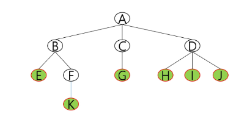

- 높이
  - 노드의 높이: 루트에서 노드에 이르는 간선 수. 노드의 레벨
  - 트리의 높이: 트리에 있는 노드의 높이 중에서 가장 큰 값. 최대 레벨

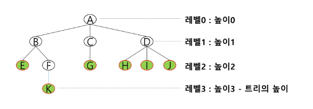

### ✨이진트리

- 모든 노드들이 2개의 서브트리를 갖는 특별한 형태의 트리
- 각 노드가 자식 노드를 최대한 2개까지만 가질 수 있는 트리
  - 왼쪽 자식 노드
  - 오른쪽 자식 노드

- 레벨 i에서의 노드의 최대 개수는 2^i 개
- 높이가 h인 이진 트리가 가질 수 있는 노드의 최소 개수는 (h + 1)개가 되며, 최대 개수는 2^(h + 1) - 1개가 된다.

- **포화 이진 트리(Full Binary Tree)**
  - 모든 레벨에 노드가 포화상태로 차 있는 이진 트리
  - 높이가 h일 때, 최대의 노드 개수인( 2^(h + 1) - 1)의 노드를 가진 이진 트리
  - 루트를 1번으로 하여  2^(h + 1) - 1까지 정해진 위치에 대한 노드 번호를 가짐

- **완전 이진 트리(Complete Binary Tree)**
  - 높이가 h이고 노드 수가 n개일 때(단, h + 1 <= n <=  2^(h + 1) - 1), 포화 이진 트리의 노드 번호 1번부터 n번까지 빈 자리가 없는 이진 트리

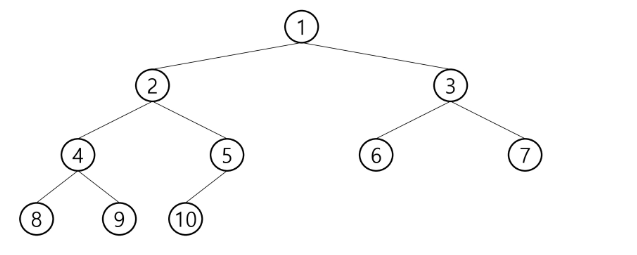

- **편향 이진 트리(Skewed Binary Tree)**
  - 높이 h에 대한 최소 개수의 노드를 가지면서 한쪽 방향의 자식 노드만을 가진 이진 트리
    - 왼쪽 편향 이진 트리
    - 오른쪽 편향 이진 트리

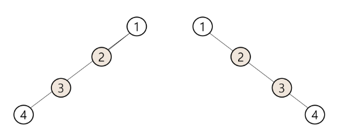

### ✨순회(traversal)

- 순회(traversal)란 트리의 각 노드를 중복되지 않게 전부 방문(visit)하는 것을 말하는데 트리는 비 선형 구조이기 때문에 선형구조에서와 같이 선후 연결 관계를 알 수 없다.

- 순회: 트리의 노드들을 체계적으로 방문하는 것
- 3가지의 기본적인 순회방법
  - 전위순회(preorder traversal): VLR
    - 부모 노드 방문 후, 자식노드를 좌, 우 순서로 방문한다.
  - 중위순회(inorder traversal): LVR
    - 왼쪽 자식노드, 부모 노드, 오른쪽 자식노드 순으로 방문한다.
  - 후위순회(postorder traversal): LRV
    - 자식노드를 좌우 순서로 방문한 후, 부모 노드로 방문한다.

- **전위 순회(preorder traversal)**
  - 수행 방법
    - 현재 노드 n을 방문하여 처리한다. -> V
    - 현재 노드 n의 왼쪽 서브트리로 이동한다. -> L
    - 현재 노드 n의 오른쪽 서브트리로 이동한다. -> R

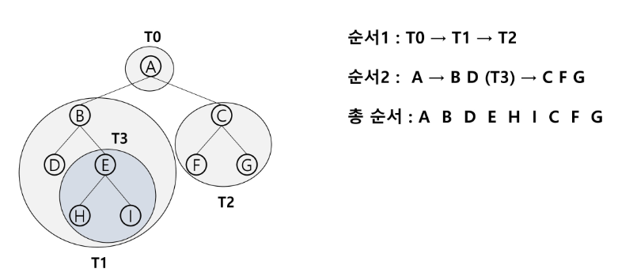

- **중위 순회(inorder traversal)**

- 수행 방법
  - 현재 노드 n의 왼쪽 서브트리로 이동한다.: L
  - 현재 노드 n을 방문하여 처리한다.: V
  - 현재 노드 n의 오른쪽 서브트리로 이동한다.: R

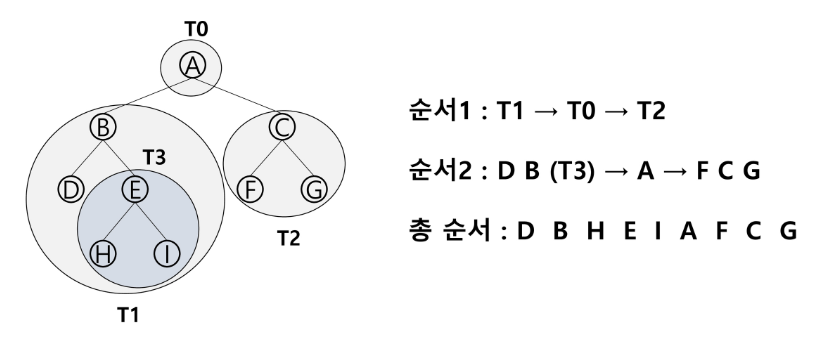

- **후위 순회(postorder traversal)**

- 수행 방법
  - 현재 노드 n의 왼쪽 서브트리로 이동한다.: L
  - 현재 노드 n의 오른쪽 서브트리로 이동한다.: R
  - 현재 노드 n을 방문하여 처리한다.: V

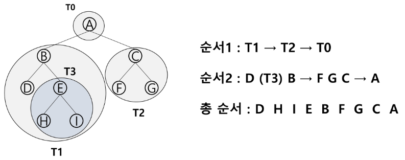

- 배열을 이용한 이진 트리의 표현
  - 이진 트리에 각 노드 번호를 다음과 같이 부여
  - 루트의 번호를 1로 함
  - 레벨 n에 있는 노드에 대하여 왼쪽부터 오른쪽으로 2^n 부터 2^(n + 1) - 1까지 번호를 차례로 부여
- 완전 이진 트리, 포화 이진 트리인 경우 배열을 통해 표현이 가능

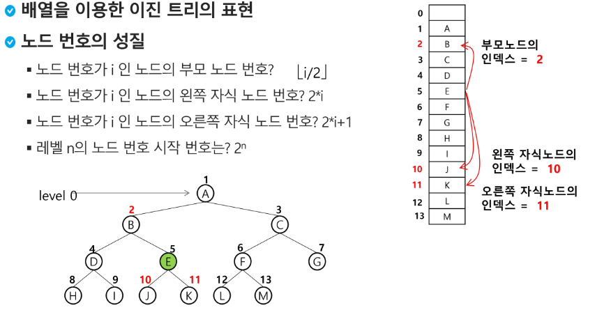

- 간선수 + 1 = 정점의 수
- 순회를 할 때

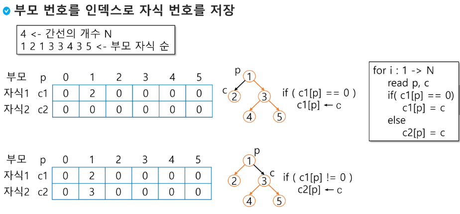

```python
'''
정점 번호 V: 1 ~ (E + 1)
간선 수: E
부모 - 자식 순
4
1 2 1 3 3 4 3 5
'''
def preorder(n):        # 전위순회
    if n:
        print(n)        # visit(n)
        preorder(ch1[n])
        preorder(ch2[n])

def inorder(n):        # 중위순회
    if n:
        inorder(ch1[n])
        print(n)        # visit(n)
        inorder(ch2[n])

def postorder(n):        # 후위순회
    if n:
        postorder(ch1[n])
        postorder(ch2[n])
        print(n)        # visit(n)

E = int(input())
arr = list(map(int, input().split()))
V = E + 1
root = 1
# 부모를 인덱스로 자식 번호 저장
ch1 = [0] * (V + 1)
ch2 = [0] * (V + 1)
for i in range(E):
    p, c = arr[i * 2], arr[i * 2 + 1]
    if ch1[p] == 0:
        ch1[p] = c
    else:
        ch2[p] = c

preorder(root)
inorder(root)
postorder(root)
```


- 조상을 찾거나 루트를 찾을 때 사용

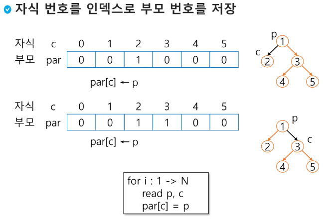

```python
def find_root(V):
    for i in range(1, V + 1):
        if par[i] == 0:
            return i

E = int(input())
arr = list(map(int, input().split()))
V = E + 1
# 자식을 인덱스로 부모 번호 저장
par = [0] * (V + 1)
for i in range(E):
    p, c = arr[i * 2], arr[i * 2 + 1]
    par[c] = p
```


- 배열을 이용한 이진 트리의 표현 단점
  - 편향 이진 트리의 경우에 사용하지 않는 배열 원소에 대한 메모리 공간 낭비 발생
  - 트리의 중간에 새로운 노드를 삽입하거나 기존의 노드를 삭제할 경우 배열의 크기 변경이 어려워 비효율적

- 완전 이진 트리 탐색

```python
def pre(n):
    if n <= size:
        print(tree[n])
        pre(2 * n)
        pre(2 * n + 1)

tree = [0, 'A', 'B', 'C', 'D', 'E', 'F']    # 완전이진트리
size = len(tree) - 1                        # 마지막 정점 번호
pre(1)
```

❓ 서브 트리에 있는 정점의 총 개수는? cnt 활용

❓ 어떤 정점의 자손 노드의 개수는? cnt - 1

❓ 주어진 트리를 root부터 전위/중위/후위 순회하는 경우 각각 마지막 정점은? find = n을 통해 마지막 변경만 확인

❓ global cnt 없이 순회한 정점 수를 출력하는 함수

```python
def f(n):       # global cnt 없이 순회한 정점 수를 출력하는 함수
    if n == 0:  # 서브트리가 비어있으면
        return 0
    else:
        L = f(ch1[n])
        R = f(ch2[n])
        return L + R + 1
```

### 수식 트리

- 수식을 표현하는 이진 트리
- 수식 이진 트리(Expression Binary Tree)라고 부르기도 함
- 연산자는 루트 노드이거나 가지 노드
- 피연산자는 모두 잎 노드

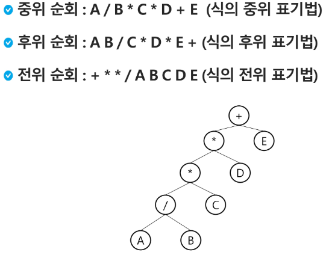

### 이진 탐색 트리

- 탐색 작업을 효율적으로 하기 위한 자료구조
- 모든 원소는 서로 다른 유일한 키를 갖는다.
- key(왼쪽 서브트리) < key(루트 노드) < key(오른쪽 서브트리)
- 왼쪽 서브트리와 오른쪽 서브트리도 이진 탐색 트리다.
- 중위 순회하면 오름차순으로 정렬된 값을 얻을 수 있다.

- 탐색연산
  - 루트에서 시작한다
  - 탐색할 키 값 x를 루트 노드의 키 값과 비교한다.
  - (키 값 x = 루트노드의 키 값)인 경우: 원하는 원소를 찾았으므로 탐색연산 성공
  - (키 값 x < 루트노드의 키 값)인 경우: 루트노드의 왼쪽 서브트리에 대해서 탐색연산 수행
  - (키 값 x > 루트노드의 키 값)인 경우: 루트노드의 오른쪽 서브트리에 대해서 탐색연산 수행

- 성능
  - 탐색, 삽입, 삭제 시간은 트리의 높이 만큼 시간이 걸린다
    - O(h), h: BST의 깊이(height)
  - 평균의 경우
    - 이진 트리가 균형적으로 생성되어 있는 경우
    - O(log n)
  - 최악의 경우
    - 한쪽으로 치우친 경사 이진트리의 경우
    - O(n)
    - 순차 탐색과 시간 복잡도가 같다.

> 트리에서의 탐색이 반드시 재귀일 필요는 없다. 반복 구조로도 충분히 구현된다

- 검색 알고리즘의 비교
  - 배열에서의 순차 검색: O(N)
  - 정렬된 배열에서의 순차 검색: O(N)
  - 정렬된 배열에서의 이진탐색: O(logN)
    - 고정 배열 크기와 삽입, 삭제 시 추가 연산 필요
  - 이진 탐색트리에서의 평균:O(logN)
    - 최악의 경우: O(N)
    - 완전 이진 트리 또는 균형트리로 바꿀 수 있다면 최악의 경우를 없앨 수 있다.
      - 새로운 원소를 삽입할 때 삽입 시간을 줄인다.
      - 평균과 최악의 시간이 같다. O(logn)
    - 해쉬 검색: O(1)
      - 추가 저장 공간이 필요

❓ 상용에서 검색을 위해 어떤 알고리즘을 사용할까?

- 삭제 연산
  - 자식 노드가 2개 인 경우
  - 왼쪽의 서브 트리를 중위 순회의 마지막 원소를 출력해 삭제할 곳에 투입

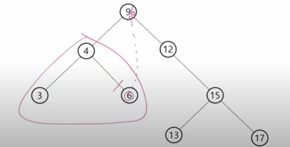

### 힙(heap)

- **완전 이진 트리**에 있는 노드 중에서 키값이 가장 큰 노드나 키값이 가장 작은 노드를 찾기 위해서 만든 자료구조
- 최대 힙(max heap)
  - 키값이 가장 큰 노드를 찾기 위한 완전 이진 트리
  - 부모 노드의 키값 > 자식 노드의 키값
  - 루트 노드: 키값이 가장 큰 노드
- 최소 힙(min heap)
  - 키값이 가장 작은 노드를 찾기 위한 완전 이진 트리
  - 부모 노드의 키값 < 자식 노드의 키값
  - 루트 노드: 키 값이 가장 작은 노드

- 힙 연산 - 삽입

  - 완전 이진 트리 구현
  - 부모 > 자식
    - c = last, p = c // 2

  - 자식이 큰 경우 자리 바꿈을 진행, 부모가 없을 때까지

```python
# 최대힙

def enq(n):
    global last
    last += 1       # 마지막 정점 추가
    heap[last] = n  # 마지막 정점에 key 추가
    # 부모가 있고, 부모 < 자식인 경우 자리 교환
    c = last
    p = c // 2      # 완전이진트리에서 부모 정점 번호
    while p and heap[p] < heap[c]:
        heap[p], heap[c] = heap[c], heap[p]
        c = p
        p = c // 2

heap = [0] * 100
last = 0

enq(2)
enq(5)
enq(7)
enq(3)
enq(4)
enq(6)
print(heap)
```

- 힙 연산 - 삭제
  - 힙에서는 루트 노드의 원소만을 삭제할 수 있다.
  - 루트 노드의 원소를 삭제하여 반환한다.
  - 힙의 종류에 따라 최대값 또는 최소값을 구할 수 있다.
    - 완전이진트리
    - 최대힙, 최소힙

```python
def deq():
	global last
    tmp = heap[1]           # 루트 백업
    heap[1] = heap[last]    # 삭제할 노드의 키를 루트에 복사
    last -= 1               # 마지막 노드 삭제
    p = 1                   # 루트에 옮긴 값을 자식과 비교
    c = p * 2               # 왼쪽 자식
    while c <= last:        # 자식이 하나라도 있으면
        if c + 1 <= last and heap[c] < heap[c + 1]:    # 오른쪽 자식도 있고, 오른쪽 자식이 더 크면
            c += 1          # 비교 대상을 오른쪽 자식으로 정함
        if heap[p] < heap[c]:
            heap[p], heap[c] = heap[c], heap[p] # 자식이 더 크면 최대힙 규칙에 어긋나므로
            p = c           # 자식을 새로운 부모로
            c = p * 2       # 왼쪽 자식 번호를 계산
        else:               # 부모가 더 크면
            break           # 비교 중단
    return tmp
```

- 힙의 키를 우선순위로 활용하여 우선순위 큐를 구현할 수 있다.