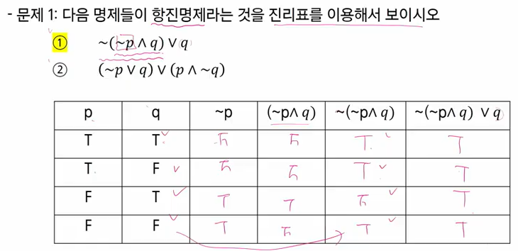

# 컴퓨팅 사고력

- 논리적으로 코딩을 구현해 내는 연습

- 정확하게 확인하는 과정을 수많은 세월 동안 정리해 둔 것이 '증명' 기법이다.
- 증명 기법은 딱딱한 것이 아닌 기발한 아이디어들의 집합이고 '이해하면 재미있는 그림'들과 같다
- 명제
  - 참이나 거짓을 알 수 있는 식이나 문장
- 진릿값
  - 참이나 거짓을 표현
  - T, F 또는 1, 0
- 연산(결합)
  - 부정 NOT
    - p가 명제일 때, 명제의 진릿값이 반대
    - ~p(not p 또는 p의 부정으로 읽음)

| p    | ~p   |
| ---- | ---- |
| T    | F    |
| F    | T    |

- 논리곱 AND
  - p, q가 명제일 때, p, q 모두 참일 때만 참이 되는 명제
  - p ^ q (p and q, p그리고 q)

| p    | q    | p ^ q |
| ---- | ---- | ----- |
| T    | T    | T     |
| T    | F    | F     |
| F    | T    | F     |
| F    | F    | F     |

- 논리합 OR
  - p, q가 명제일 때, p, q 모두 거짓일 때만 거짓이 되는 명제
  - p V q (p or q, p 또는 q)

| p    | q    | p V q |
| ---- | ---- | ----- |
| T    | T    | T     |
| T    | F    | T     |
| F    | T    | T     |
| F    | F    | F     |

- 배타적 논리합 XOR
  - p, q가 명제일 때, p, q 중 하나만 참일 때 참이 되는 명제
- 연산자 우선 순위
  - (not)  >  (and, or)  >  (->, <->)
- 항진 명제: 진릿값이 항상 참
- 모순 명제: 진릿값이 항상 거짓
- 사건 명제: 항진명제도 모순명제도 아닌 명제
- **조건 명제**
  - p, q가 명제일 때, 명제 p가 조건(또는 원인), q가 결론(또는 결과)로 제시되는 명제.
  - p -> q (p이면 q이다.)

| p    | q    | p -> q |
| ---- | ---- | ------ |
| T    | T    | T      |
| T    | F    | F      |
| F    | T    | T      |
| F    | F    | T      |

- 쌍방조건명제
  - p, q가 명제일 때, 명제 p와 q가 모두 조건이면서 결론인 명제
  - p <-> q (p면 q고, q면 p다.)

| p    | q    | p <-> q |
| ---- | ---- | ------- |
| T    | T    | T       |
| T    | F    | F       |
| F    | T    | F       |
| F    | F    | T       |

- 조건명제의 역, 이, 대우
  - 역: q -> p
  - 이: ~p -> ~q
  - 대우: ~q -> ~p

| p    | q    | p -> q | q -> p | ~p -> ~q | ~q -> ~p |
| ---- | ---- | ------ | ------ | -------- | -------- |
| T    | T    | T      | T      | T        | T        |
| T    | F    | F      | T      | T        | F        |
| F    | T    | T      | F      | F        | T        |
| F    | F    | T      | T      | T        | T        |

- 증명
  - 증명은 정확한 명제식으로 표현할 수 있는 것이라야 함
  - 보통은 정확한 명제식까지 쓰지는 않으나 근본적으로는 명제식으로 바꿀 수 있음
  - 증명에 대한 수많은 오해가 p->q를 p<->q와 혼동하는 것에서 일어남
- 예제

