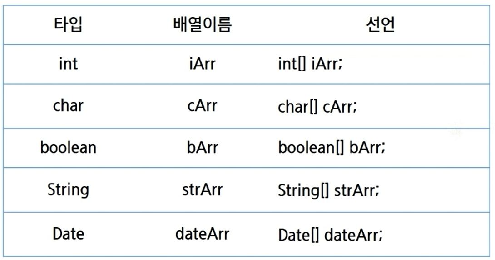
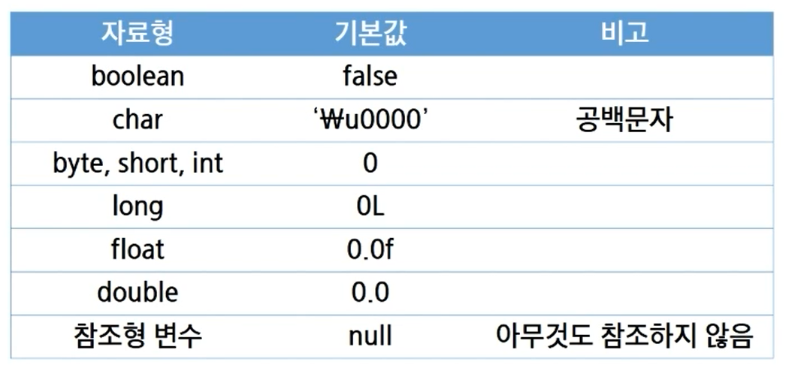
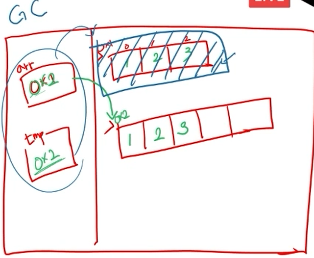
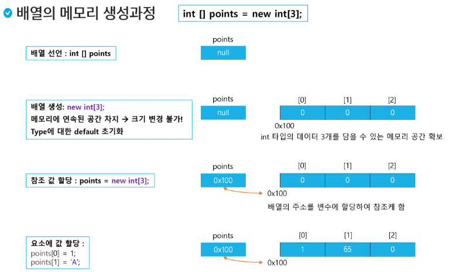

# ✨ 배열

### 배열의 선언

1. ⭐ **추천!!** 타입[ ] 변수 -> int[ ] arr
2.  ❌ 타입 변수 [ ] -> int arr[ ]



> 기초 자료형(int, char, boolean)과 참조 자료형(String, Date)의 예시


### 배열의 생성과 초기화

- **자료형[] 배열이름 = {값1, 값2, 값3, 값4};**          //선언과 동시에 초기화
  - {}는 new의 역할을 자동적으로 해준다.
  - 📌단, 선언과 동시에 쓸 때만 사용가능

- **배열이름 = new 자료형[] {값1, 값2, 값3, 값4};** // 배열 생성 및 값 초기화
  - 배열 이름만 써져 있으니 앞 어딘가에 선언이 이미 된 것을 의미
  - heap 어딘가에 할당이 된다.

- **배열이름 = new 자료형[길이];**                           // 배열 생성(자료형의 초기값으로 초기화)
  - 아래 테이블의 기본값으로 데이터가 채워져 있다.
  - `\u0000`은 유니코드의 공백문자를 의미
  - ⛔기초 자료형 8가지를 제외하고는 전부 참조 자료형이므로 모두 **null**이다
    - String, Date 등 모두 null값으로 초기값이 설정되어져 있다.




### 배열의 사용

- index 번호를 가지고 각 요소에 접근
- index 번호는 <span style="color:blue">**0 **</span>부터 시작
- `배열이름.length`를 통해 배열의 길이 조회 가능
- 배열의 길이는 임의로 변경 불가함
- 길이 변경 필요시 새로운 배열을 생성 후 내용을 옮긴다.

```java
// 배열이라는 공간 안에 연속적으로 할당이 되어 있기 때문에 index를 이용해서 접근 가능
for (int i = 0; i < arr.length; i++ ) {
    arr[i]
}
```



```java
//ex) 더 큰 배열로 옮길 시
int[] tmp = new int[5]
//반복문을 통해 모든 값을 옮긴 후
arr = tmp
//arr의 주소는 ox2를 가리키게 된다.
//추후에 GC(Garbage Collection)이 동작하면서 불필요한 메모리를 정리해준다.
//C언어와 달리 java는 사용자가 직접 메모리 관리를 하지 못한다.
//억지로 GC를 실행하는 것을 비추천!!!
```



> 배열의 시작 주소가 0x100으로 지정
>
> 문자 같은 경우 ASCII 코드 값이 담긴다. char는 2byte 공간이 int(4byte) 공간의 더 넓은 곳으로 올 때 자동 형변환이 된다.

```java
package java05.array;

public class Array01 {
	public static void main(String[] args) {
		
		// 1차원 배열을 선언하는 방법
		int[] score1; //앞으로 사용할 예정
		int score2[]; // 미사용
		
//		score1 = {1, 2, 3, 4, 5}; // 선언과 동시에 할당해야 중괄호 사용 가능
		score1 = new int[] {1, 2, 3, 4, 5};
		
		int[] score3 = {1, 2, 3, 4, 5};
		
		int[] score4 = new int[5];
		
		score4[0] = 10;
		score4[1] = 20;
		score4[2] = 30;
		score4[3] = 40;
		
		for(int i = 0; i < score4.length; i++) {
			System.out.println(score4[i]);
		}
	}
}
```

