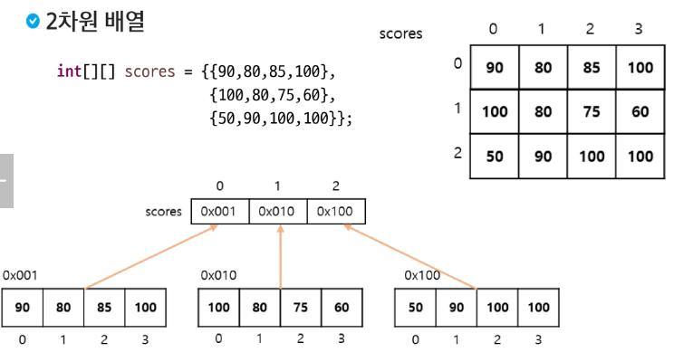

# 다차원 배열

### 다차원 배열이란?

- 2차원 이상의 배열을 의미
- 배열 요소로 또 다른 배열을 가지는 배열
- 2차원 배열은 배열 요소로 1차원 배열의 참조를 가지는 배열
- 3차원 배열은 배열 요소로 2차원 배열의 참조를 가지는 배열


### 2차원 배열 선언

- `int[][] iArr`
- `int iArr[][]`

- `int[] iArr[]`


### 2차원 배열 생성

- `배열의 이름 = new 배열유형[1차원 배열개수][1차원 배열의 크기];`

- `배열의 이름 = new 배열유형[1차원 배열개수][];`




### 2차원 배열 탐색 - 실습

```java
// 모든 2차원 배열의 원소 중 3의 배수의 개수와 그들의 합 출력

package java05.array;

public class Array02_foreach {
	public static void main(String[] args) {
		int[][] grid = { { 2, 3, 1, 4, 7 }, { 8, 13, 3, 33, 1 }, { 7, 4, 5, 80, 12 }, { 17, 9, 11, 5, 4 },
				{ 4, 5, 91, 27, 7 } };

		int cnt = 0;
		int sum = 0;
		for (int[] row : grid) {
			for (int num : row) {
				if (num % 3 == 0) {
					cnt++;
					sum += num;
				}
			}
		}
		System.out.printf("%d, %d", cnt, sum);

	}
}
```

