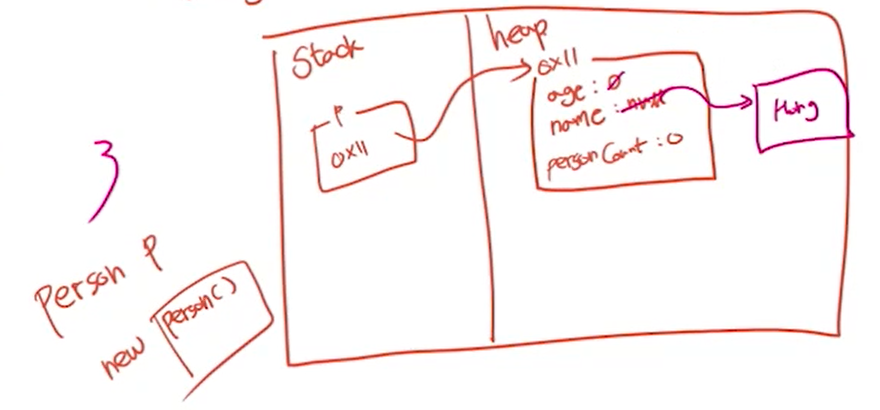
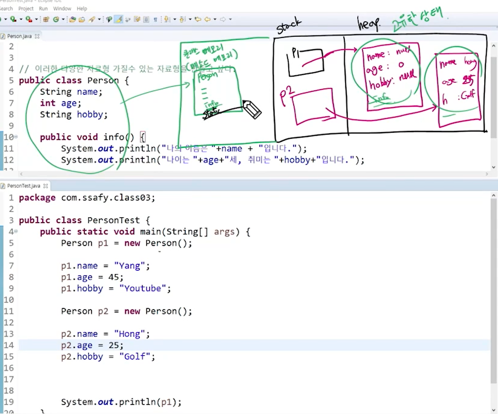

# 변수

### 클래스 변수(class variable)

- 클래스 영역 선언(static 키워드)
- 생성시기: 클래스가 메모리에 올라 갔을 때
- 모든 인스턴스가 공유함

```java
public class Person {
    static int personCount;
    // 해당 클래스 변수는 0을 초기값으로 가진다
    // 소멸 시기는 프로그램 종료시
    // 객체 생성과 무관하게 접근이 가능하다. (클래스명.클래스변수)
    // 모든 인스턴스가 공유
}
```


### 인스턴스 변수(Instance variable)

- 클래스 영역 선언

- 생성시기: 인스턴스가 생성되었을 때 (new)
- 인스턴스 별로 생성됨.

```java
public class Person {
    int age;
    String name;
    // 인스턴스 변수는 내가 만든 인스턴스마다 다른 값을 가짐
    // 초기화가 자동으로 진행
    // 소멸 시기: 다른 변수가 해당 데이터를 참조하지 않을 때 GC가 삭제
}
```


### 지역 변수(local variable)

- 클래스 영역 이외 (메서드, 생성자 등)
  - 사용하기 전 초기화 꼭 필요
  - main 메서드 안에 사용되는 변수들은 모두 지역 변수이고 초기화가 필요
  - 메소드 내부에 있으므로 외부 접근이 불가능하다.
- 생성시기: 선언되었을 때
- 소멸시기: 중괄호를 벗어나면 소멸



> Person p로 선언만 해주었을 때는 null을 가지는데 new로 인스턴스를 생성하면 heap 영역 내에 메모리 공간이 마련이 된다. personCount같은 경우 클래스 변수명으로 그림 속 내부가 아니라 다른 메모리에 저장된다.(그림은 교육을 위해 삽입)



> 클래스를 사용하겠다고 하면 클래스 메모리(메소드 메모리) 에 클래스 관련 정보들이 모두 기록된다. info 메소드는 인스턴스 생성시 계속 만들어주는 게 아니라 필요할 때에만 가져다 사용한다.

```java
package com.ssafy.class03;

public class Person {
	static int personCount;
	String name;
	int age;
	String hobby;
	
	// 선언된 변수들이 함수 내부에 있으므로 굳이 인자에 값을 기입하지 않아도 된다.
	public void info() {
		System.out.println("My name is " + name);
		System.out.println("My age is " + age);
		System.out.println("My hobby is " + hobby);
	}
}

/////////////////////////////////////////////////////////////

package com.ssafy.class03;

public class PersonTest {
	public static void main(String[] args) {
		Person p1 = new Person();
		
		p1.name = "Yang";
		p1.age = 45;
		p1.hobby = "Youtube";
		
		Person p2 = new Person();
		
		p2.name = "Hong";
		p2.age = 25;
		p2.hobby = "Golf";
		
		// 클래스 변수인 personCount를 출력(인스턴스에 상관없이 메모리에 올라가 있음)
		System.out.println(Person.personCount);
		// 인스턴스를 통해 클래스 변수에 접근할 수 있지만, 올바르지 않다고 노란줄 발생
		System.out.println(p1.personCount++);
		System.out.println(p2.personCount);
		System.out.println(Person.personCount);
	}
}
```

