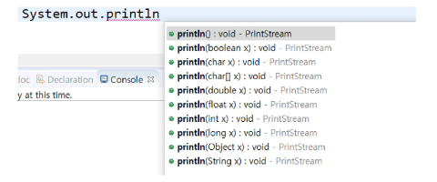

# 메소드

### 메소드(Method)

- 객체가 할 수 있는 행동을 정의
- 어떤 작업을 수행하는 명령문의 집합에 이름을 붙여 놓은 것
- 메소드의 이름은 소문자로 시작하는 것이 관례
  - 메소드: camelCase, 클래스: PascalCase
- 코드의 중복과 양을 줄일 수 있음, 유지/관리에 용이

```java
// 접근 제한자: public / protected / default /private
// default: 아무것도 쓰지 않으면 default적용
// 활용 제한자: static / final / abstract / synchronized
// 매개변수는 없으면 안 써도 되지만, 반환값은 생략 불가능 -> void를 써야함
[접근 제한자] [활용 제한자] 반환값 메소드 이름([매개변수들]) {
    행위 기술...
}

public static void main(String[] args) {}
```


### 메소드 선언

- 선언시 {} 안에 메소드가 해야 할 일을 정의


### 메소드 호출

- 호출한 메소드가 선언되어 있는 클래스를 접근한다.
- **인스턴스.메소드 이름**으로 호출
- static이 메소드에 선언되어 있을 때는 **클래스이름.메소드 이름**으로 호출

```java
public class Person {
	public void info() {
		// 메서드 내용 정의
	}
    
    public static void hello() {
        // 메서드 내용 정의
    }
}

// 인스턴스.메소드
Person p = new Person();
p.info();

// 클래스.메소드
Person.hello();
```


### 매개변수(Parameter)

- 메소드에서 사용하는 것
- 매개변수 생략 가능

```java
public void study(int time) {
    // int time = ?
    // 파라미터는 해당 위치에 선언한 지역변수
    System.out.println(time+"시간 공부");
}
```


### 인자(Argument)

- 호출하는 쪽에서 전달하는 것
- 파라미터 전달 시 묵시적 형 변환

```java
Person p = new Person();
p.study(10)

p.study((byte) 10);		// o
p.study((short) 10);	// o
p.study(10);			// o
p.study(10L);			// x
p.study(10.0f);			// x
p.study(10.0);			// x
p.study(10, 10);		// x
```


### 리턴타입

- 리턴 타입은 메소드를 선언할 때 지정, 없다면 `void`(return 문 생략 가능)

- 리턴 타입을 작성했다면 반드시 해당 타입의 값을 리턴
- 리턴 타입은 하나만 적용 가능

```java
public int getAge() {
    return age;
}

Person p = new Person();
p.name = "Yang";
p.age = 45;
p.hobby = "유튜브";

int age = p.getAge();
```


### 메소드 오버로딩(Overloading)

- 이름이 같고 매개변수가 다른 메소드를 여러 개 정의하는 것
- 중복 코드에 대한 효율적 관리 가능
- 파라미터의 개수 또는 순서, 타입이 달라야 할 것 (파라미터 이름만 다른 것은 X)
- 리턴 타입이 다른 것은 의미X



### 📋 정리

- 클래스: 관련 있는 변수와 함수를 묶어 만든 사용자 정의 자료형
- 객체: 하나의 역할을 수행하는 '메소드와 변수(데이터)'의 묶음
- 객체지향 프로그래밍: 프로그램을 단순히 데이터와 처리 방법으로 나눈 것이 아니라, 프로그램을 수많은 '객체(object)'라는 기본 단위로 나누고 이들의 상호작용으로 서술하는 방식