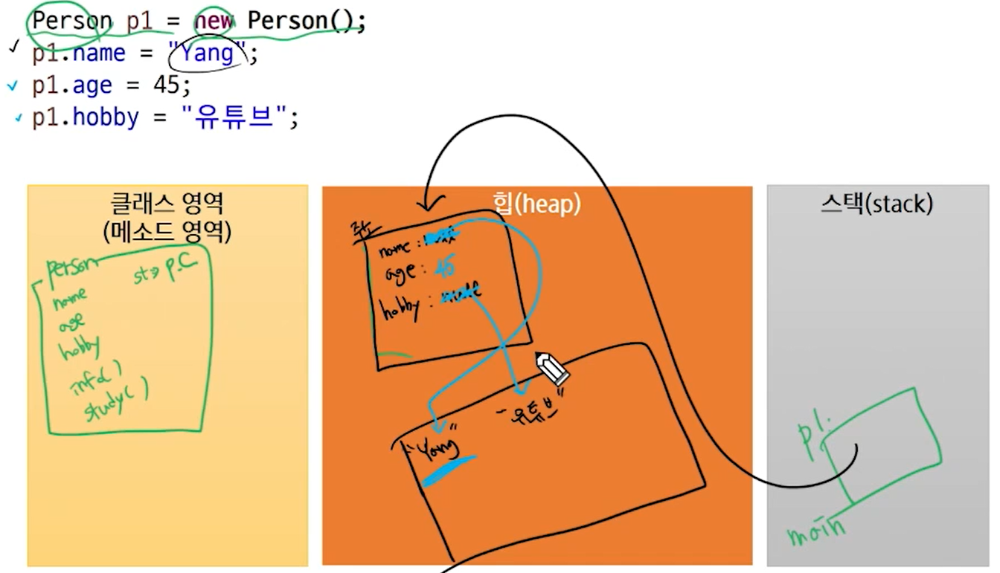

# JVM 메모리 구조

> `.java`파일을 직접 읽을 수 없기에 class가 실행되면 Class Loader가 `JVM` 내 클래스 영역에 클래스의 정보를 읽어둔다. `블럭` 내부에 생성된 지역 변수도 스택이라는 영역에 생성된다.

- 초기 상태(객체 생성)

- 객체의 변수에 데이터 할당

> String은 `String pool` 영역 내에 데이터가 저장됨.

### static 특징

1. **로딩 시점**

- static: 클래스 로딩 시
- non-static: 객체 생성 시

2. **메모리상의 차이**

- static: 클래스당 하나의 메모리 공간만 할당
- non-static: 인스턴스 당 메모리가 별도로 할당

3. **문법적 특징**

- static: 클래스 이름으로 접근
- non-static: 객체 생성 후 접근

4. **static 영역에서는 non-static 영역을 직접 접근이 불가능**

> `str`변수는 클래스 영역 내에 작성된 변수이므로 `인스턴스 변수`이다. `static`은 미리 메모리에 올라가서 사용할 수 있지만, 인스턴스 변수는 객체가 생성이 되어야 접근이 가능하다. 그래서 위와 같은 코드는 사용할 수 없음.

5. **non-static 영역에서는 static 영역에 대한 접근이 가능**

> `static` 은 이미 메모리에 올라가 있기 때문에, 메서드에서 접근이 가능하다.