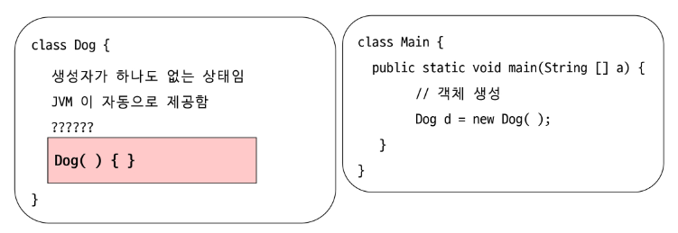
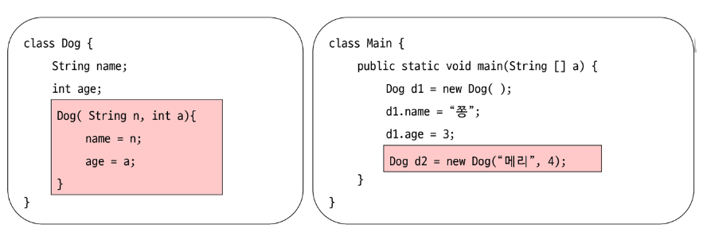
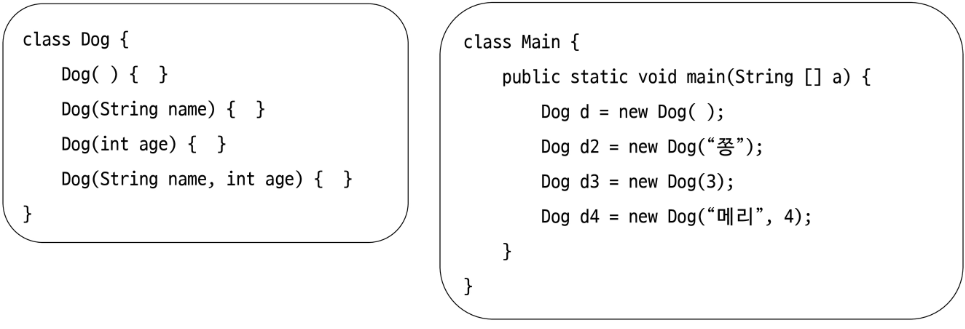
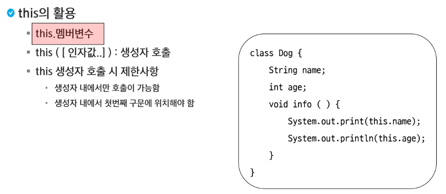

# 생성자

### 인스턴스가 생성될 때 최초 한번 수행되는 함수

- new 키워드와 함께 호출
- 클래스를 생성할 때 반드시 하나의 생성자 호출
- 성공적으로 실행되면 힙 영역에 객체 생성 후 객체의 주소가 리턴
- 필드의 초기화, 객체 생성 시 실행되어야 할 작업 작성
- PascalCase로 작성하는 것이 관례
  - 클래스 이름과 생성자의 이름은 동일해야 한다.


### 클래스 명과 이름이 동일(대,소문자)


### 반환 타입이 없다.(void 작성 x)

```java
public class Dog {
    public Dog() {
        System.out.println("기본 생성자!");
        System.out.println("클래스 이름과 동일하고 반환타입 x");
    }
}
```


### 기본(디폴트) 생성자

- 클래스 내에 생성자가 하나도 정의되어 있지 않을 경우 JVM이 자동으로 제공하는 생성자
- 형태 : 매개변수가 없는 형태, 클래스 명() {}




### 파라미터가 있는 생성자

- 생성자의 목적이 필드 초기화
- 생성자 호출 시 값을 넘겨주어야 함
- 해당 생성자를 작성하면 JVM에서 기본 생성자를 추가하지 않음



> 분홍색 영역의 코드가 없어도 코드가 동작한다. 하지만 해당 코드가 삽입되면 Dog d1은 기본 생성자가 추가되지 않아서 실행될 수 없다.


### 생성자 오버로딩을 지원한다.

- 클래스 내에 메소드 이름이 같고 매개변수의 타입 또는 개수가 다른 것



> Dog(string name, int age)에서 단순히 변수명만 바꾸면 오버로딩이 지원되지 않는다.


### this

- 참조 변수로써 객체 자신을 가리킴
- this를 이용하여 자신의 멤버 접근 가능
- 지역변수와 필드의 이름이 동일할 경우 필드임을 식별할 수 있게 함
- 객체에 대한 참조이므로 static 영역에서 this 사용 불가



```java
class Dog {
    String name;
    int age;
    Dog () {
        Dog("쫑"); // 오류 발생
        this("쫑"); // 해당 타입을 가지는 생성자를 찾아서 호출!!
    }
    Dog (String name) {
        this.name = name
    }
}
```

```java
package java05.array;

public class Dog {
	String name;
	int age;
	
	Dog() {
		this("choco");
	}
	
	Dog(String n, int a) {
		name = n;
		age = a;
	}
	
	Dog(int age) {
		this.age = age;
	}
	
	Dog(String name) {
		this.name = name;
	}
	
	void info() {
		System.out.println(this.name);
	}
}
```

```java
package java05.array;

public class DogTest {
	public static void main(String[] args) {
		Dog d1 = new Dog();
		System.out.println(d1.name);
        d1.info();
		
		Dog d2 = new Dog("maro", 3);
		System.out.println(d2.name);
		System.out.println(d2.age);
        d2.info();
	}
}

/*
choco
maro
3
*/
```