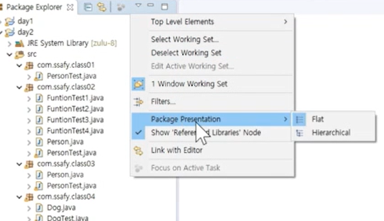

# 패키지

### 패키지(Package)

- PC의 많은 파일을 관리하기 위해서 폴더를 이용한다.
- <u>프로그램의 많은 클래스를 관리하기 위해서</u> 패키지를 이용한다.
  - 패키지도 하나의 폴더라고 생각
- 패키지는 클래스와 관련있는 인터페이스들을 모아두기 위한 이름 공간
- 패키지의 구분은 .(dot)연산자를 이용한다.
- 패키지의 이름은 시중에 나와 있는 패키지들과 구분되게 지어야 한다.
- 일반적으로 소속이나 회사의 도메인을 사용한다.
  - 도메인을 뒤집어서 사용하는 것이 관례

```java
com.ssafy.project_이름.module_이름
```

- 패키지 보는 방법을 바꿀 수 있음


