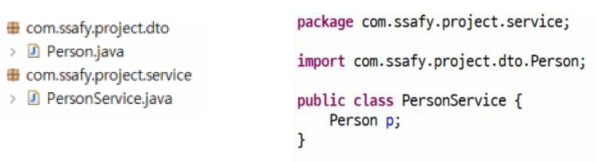
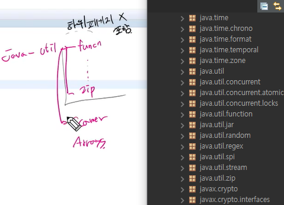
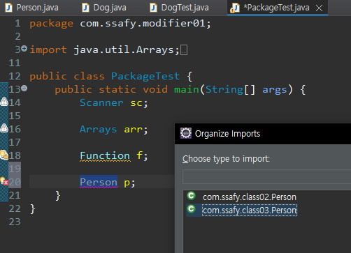

# 임포트

### 임포트(import)

- 다른 패키지에 있는 클래스를 사용하기 위해서는 `import` 과정이 필요하다.
  - 다른 패키지 공간에 있으면 이름이 같아도 다른 것으로 인식!!!



- PersonService.java에서 Person 클래스를 사용하기 위해서는 import 해야 한다.
- `import`를 선언 할 때에는 import 키워드 뒤에 `package 이름`과 `클래스 이름`을 모두 입력하거나, 해당 패키지의 모든 클래스를 포함할 때는 `'*'`를 사용하기도 한다.

```java
import package_name.class_name;
import package_name.*;
```

- `package`는 항상 상단에 위치(내가 어디에 있는지)
  - `package`이름을 정하지 않고 class를 만들면 `default package`가 만들어진다.
  - `java.lang.*`이라는 패키지는 사용하지 않아도 자동적으로 입력되어 있음.
    - `System.out.println();`을 그래서 사용할 수 있음.

- `import`는 `package`다음에 작성된다.
  - `import`는 여러 개일 수 있지만, `package`는 하나.
- ✔`ctrl`+`shift`+`o`를 누르면 자동으로 임포트해준다.
- ✔`shift`+`enter`는 바로 다음 줄로 이동시켜준다.(문장 구조를 부수지 않음)

```java
import java.util.Scanner;
import java.util.Arrays;

import java.util.function.*;

// 아래 import는 util의 하위 패키지를 포함하지 않아서 java.util.function은 호출되지 않는다!!!
// 패키지는 클래스를 구분하기 위한 이름 공간
// 패키지가 더 깊이 들어간다면 * 만으로 해결이 안될수도 있다.
// java.util.function이 이름 공간이 된다.
import java.util.*;


package com.ssafy.modifier01;

import java.util.Arrays;
// Scanner를 사용하기 위해서 import 해서 가져온다.
// 풀패키지명 사용
import java.util.Scanner;

//import java.util.*; util 안의 클래스 하나가 아닌 전체를 불러올 때 사용
import java.util.function.Function;

import com.ssafy.class03.Person;

public class PackageTest {
	public static void main(String[] args) {
		Scanner sc;
		
		Arrays arr;
		
		Function f;
		
		Person p; // class03에 있는 Person 이라는 것을 가지고 왔어요.
		
		// 풀패키지 명을 적어서 사용할 수도 있다.
		// import를 하지 않고 작성가능.
		com.ssafy.class02.Person p2;
	}
}
```




