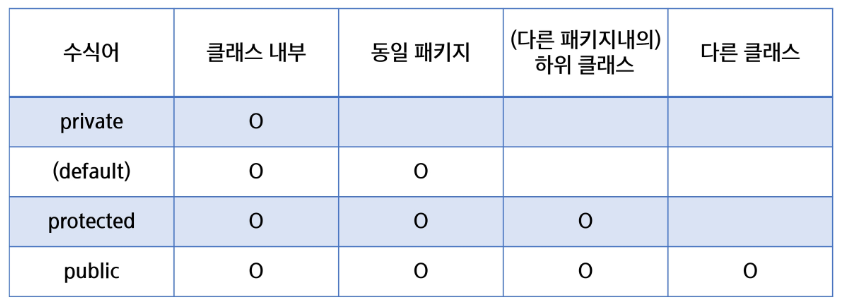

# 접근 제한자(access modifier)

### 접근 제한자의 개념과 종류

- **클래스, 멤버 변수(필드), 멤버 메서드 등의 선언부에서 접근 허용 범위를 지정하는 역할의 키워드**
- **접근 제한자의 종류**
  - public
  - protected
  - (default)
  - private
- **그 외 제한자**
  - static: 클래스 레벨의 요소 설정
  - final: 요소를 더 이상 수정할 수 없게 함
  - abstract: 추상 메서드 및 추상 클래스 작성
  - ...

### 접근 제한자의 종류

- **public**: 모든 위치에서 접근이 가능
- **protected**: 같은 패키지에서 접근이 가능, 다른 패키지 접근 불가능
  - ✔ 단, 다른 패키지의 클래스와 상속관계가 있을 경우 접근 가능
- **default**: 같은 패키지에서만 접근이 허용, 다른 패키지 접근 불가능
  - 접근 제한자가 선언이 안 되었을 경우 기본 적용
- **private**: 자신 클래스에서만 접근이 허용

> public
>
> > protected
> >
> > > default
> > >
> > > > private

- **클래스(외부) 사용가능**: public, default
- **내부클래스, 멤버변수(필드), 메소드 사용가능**: 4가지 모두 가능

### 접근자(getter) / 설정자(setter)

- 클래스에서 선언된 변수 중 접근 제한에 의해 접근할 수 없는 변수의 경우 다른 클래스에서 접근할 수 없기 때문에, 접근하기 위한 메서드(설정자와 접근자)를 public으로 선언하여 사용

