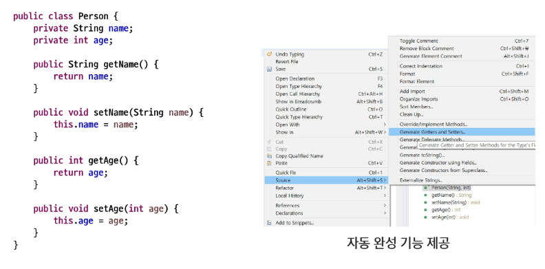

# 접근 제한자

### public과 default

- public
  - 모든 패키지에서 접근이 가능하다
- default
  - 동일 패키지 내에서만 접근이 가능하다


### 접근자(getter) / 설정자(setter)

- 클래스에서 선언된 변수 중 접근제한에 의해 접근할 수 없는 변수의 경우 다른 클래스에서 접근할 수 없기 때문에, 접근하기 위한 메서드(설정자와 접근자)를 public으로 선언하여 사용



```java
package com.ssafy.modifier01;

public class Car {
	// color와 speed는 default이다. 클래스, 멤버 변수, 멤버 메소드 등에 적용된다.
	String color;
//	int speed; //속도는 최소0, 최대 250까지 가질 수 있다.
	// 위 스피드를 외부에서 접근할 수 없게 만들고 싶다.
	private int speed;
	
	// 메서드를 이용해 접근할 수 있게 만든다.
	// 메서드 내부에 여러 장치들을 마련할 수 있다.
	// 조금더 안전하고 신뢰성 있는 코드를 얻게 된다.
	public void setSpeed(int speed) {
		// int speed = ?
		// 매개변수가 곧 내부에 지역 변수를 선언한 것과 똑같은데 객체의 변수와 구분이 안되므로
		// 객체의 speed는 this를 붙여서 구분해준다.
		if(speed <= 250 && speed >= 0) {
			this.speed = speed;
		} else {
			System.out.println("Please input velocity 0 to from 250");
		}
	}
	
	public int getSpeed() {
		// 내부에 또 다른 가공이 가능하다.
		// ex) km/h를 다른 단위로 바꿀 수 있음.
		return this.speed;
	}
	// 접근 제어자 + getter + setter 를 적절히 활용하면 여러 방법으로 사용 된다
	// getter만 있으면 읽기 전용
	// setter만 있으면 쓰기 전용
}
```

```java
package com.ssafy.modifier01;

public class CarTest {
	public static void main(String[] args) {
		//자동차 하나 생성
		Car c = new Car();
		// Car의 클래스가 public이어서 쓸 수 있는 게 아니라 각각의 변수사 default여서 가능
		c.color = "Red";
//		c.speed = 100;
		
//		c.speed = 300; 
		//이렇게 작성한 것을 막을 수 있나? 
		// Car의 speed요소에 접근할 수 있어서 못 막는다
		// speed를 private 접근제한자로 만들면 접근할 수 없다.
		// 물론 읽을 수도 없다.
//		System.out.println(c.speed);
		
		c.setSpeed(400);
		System.out.println(c.getSpeed());
	}
}
```

- 접근자와 설정자를 단축키를 이용해서 자동 완성시킬 수 있다.


```java
package com.ssafy.modifier02;

public class Student {
	private String name;
	private int age;
	private String major; //전공
	
	// getter & setter 를 만들거에요.
	// getter는 매개변수가 없고 public 타입 getName() {return this.name}
	// setter는 반환 타입이 필요 없음. public void setName(매개변수) {this.name = name;}
	
	public String getName() {
		return this.name;
	}
	
	public int getAge() {
		return age;
	}

	public void setAge(int age) {
		this.age = age;
	}

	public String getMajor() {
		return major;
	}

	public void setMajor(String major) {
		this.major = major;
	}

	public void setName(String name) {
		this.name = name;
	}
	
}

```

