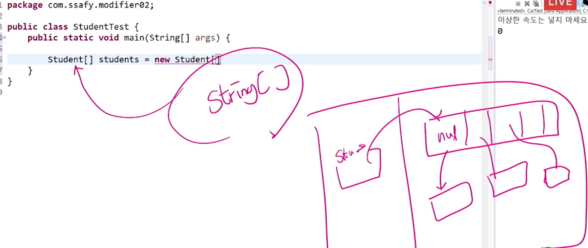
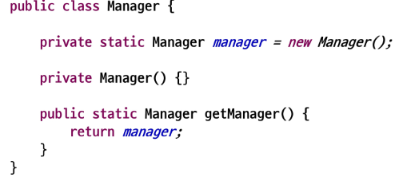

# 접근 제한자

### boolean 타입의 접근자

- boolean 타입의 접근자를 생성할 때에는 메서드명이 get이 아닌 is로 사용된다

```java
	private boolean hungry;
	
	// boolean일 때는 get형식이 is로 붙는다
	public boolean isHungry() {
		return hungry;
	}
	
	public void setHungry(boolean hungry) {
		this.hungry = hungry;
	}
```


### 기본 생성자

- JVM 컴파일러가 기본 생성자를 알아서 만들어준다.
- 전체와 관련된 생성자도 자동 완성으로 만들어 줄 수 있다.

```java
	// JVM 컴파일러가 알아서 만들어 주는 것은 기본 생성자!!!
	public Student() {
		// TODO Auto-generated constructor stub
	}

	// 전체와 관련된 생성자도 만들어준다.
	public Student(String name, int age, String major) {
	this.name = name;
	this.age = age;
	this.major = major;
}
```


### 클래스도 배열을 만들 수 있다.

- 메모리 영역도 아래와 같이 생각해주면 된다.




### 직접 프로그램 만들어 보기

- 학생 생성, 조회, 전공 수정 코드 작성
  - 일부 기능들은 따로 class를 만들어서 관리하는 게 좋다.

```java
package com.ssafy.modifier02;

import java.util.Scanner;

public class StudentTest {
	// static을 사용하지 않으면 인스턴스 변수이므로 아래의 다른 메소드에서 접근할 수 없다.
	// 인스턴스를 만들지 않아도 클래스 변수를 활용하면 된다.
	// 클래스도 배열을 만들 수 있다.
	static Student[] students = new Student[10];
	// 현재 차 있는 학생 수
	static int size = 0;
	
	public static void main(String[] args) {
		
		Scanner sc = new Scanner(System.in);
		int sel;
		
		do {
			System.out.println("Please input number~!!");
			System.out.println("1. Add student");
			System.out.println("2. Get student by name");
			System.out.println("3. Change major");
			System.out.println("0. Exit");
			sel = sc.nextInt();
			if(sel == 1) {
				//학생 추가
				System.out.println("Add Student");
				System.out.print("name :");
				String name = sc.next();
				System.out.print("age :");
				int age = sc.nextInt();
				System.out.print("major :");
				String major = sc.next();
				
				// 1. 직접 빈껍데기를 만들고 하나하나 입력
//				Student st = new Student();
//				st.setName(name);
//				st.setAge(age);
//				st.setMajor(major);
				
				// 2. 생성자 활용, ctrl + space 누르기
				Student st = new Student(name, age, major);
//				students[size] = st;
//				size++;
				students[size++] = st;
				
			}else if(sel == 2) {
				//학생 조회
				System.out.println("Get Student");
				System.out.println("name: ");
				// sel == 1에 있는 name과는 다르다.
				// 지역 변수는 중괄호 안에서 사용되고 사라진다.
				String name = sc.next();
				// 만약 getStudent를 static으로 선언하지 않으면 아래와 같이 작성
//				Student st = new StudentTest().getStudent(name);
				Student st = getStudent(name);
				if (st == null) {
					System.out.println("There is no student");
				} else {
					System.out.println("Student");
					System.out.println(st.getName());
					System.out.println(st.getAge());
					System.out.println(st.getMajor());
					
				}
				
				
			}else if(sel == 3) {
				//전공 변경
				System.out.println("Change Major");
				System.out.println("Name: ");
				String name = sc.next();
				System.out.println("Major: ");
				String major = sc.next();
				changeMajor(name, major);
			}
		}while(sel!=0);
	}//main
	
	static void changeMajor(String name, String major) {
		Student s = getStudent(name);
		if(s!=null) {
			s.setMajor(major);
		}
	}

	static Student getStudent(String name) {
		// size를 불러오는 방법은
		// 1. static을 활용해서 미리 메모리에 올려둠
		// 2. 파라미터로 넘겨주기
		for(int i = 0; i <size; i++) {
			if(name.equals(students[i].getName())) {
				// 찾았어? 그러면 바로 리턴
				return students[i];
			}
		}
		// return값이 없을수도 있기 때문에 null을 리턴
		return null;
	}
}
```


- StudentManager class를 만들어서 따로 기능 관리

```java
package com.ssafy.modifier03;

public class StudentManager {
	Student[] students = new Student[100];
	int size = 0;
	
	public void addStudent(Student s) {
		students[size++] = s;
	}
	
	void changeMajor(String name, String major) {
		Student s = getStudent(name);
		if(s!=null) {
			s.setMajor(major);
		}
	}

	Student getStudent(String name) {
		// size를 불러오는 방법은
		// 1. static을 활용해서 미리 메모리에 올려둠
		// 2. 파라미터로 넘겨주기
		for(int i = 0; i <size; i++) {
			if(name.equals(students[i].getName())) {
				// 찾았어? 그러면 바로 리턴
				return students[i];
			}
		}
		// return값이 없을수도 있기 때문에 null을 리턴
		return null;
	}
}
```


### 싱글턴 패턴(Singleton Pattern)

- 소프트웨어 디자인 패턴에서 싱글턴 패턴을 따르는 클래스는, 생성자가 여러 차례 호출되더라도 실제로 객체는 하나이고 최초 생성 이후에 호출된 생성자는 최초의 생성자가 생성한 객체를 리턴



```java
package com.ssafy.modifier04;

public class StudentManager {
	private Student[] students = new Student[100];
	private int size = 0;
	
	private static StudentManager manager = new StudentManager();
	
    // 기본 생성자 앞에 private이 있으면 외부에서 접근할 수 없다.
	private StudentManager() {
	}

	public static StudentManager getManager() {
		return manager;
	}
	
	public void addStudent(Student s) {
		students[size++] = s;
	}
	
	void changeMajor(String name, String major) {
		Student s = getStudent(name);
		if(s!=null) {
			s.setMajor(major);
		}
	}

	Student getStudent(String name) {
		// size를 불러오는 방법은
		// 1. static을 활용해서 미리 메모리에 올려둠
		// 2. 파라미터로 넘겨주기
		for(int i = 0; i <size; i++) {
			if(name.equals(students[i].getName())) {
				// 찾았어? 그러면 바로 리턴
				return students[i];
			}
		}
		// return값이 없을수도 있기 때문에 null을 리턴
		return null;
	}
}
```

