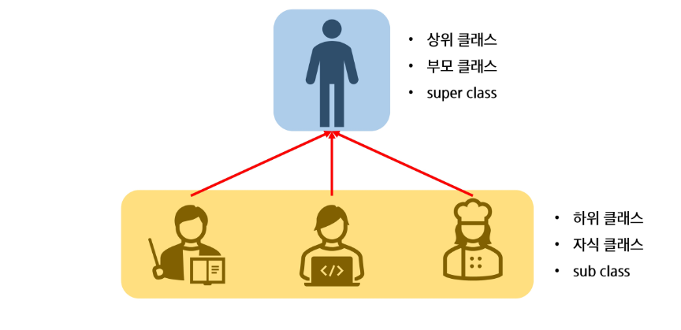
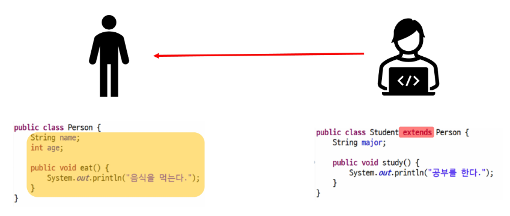

# 상속

### 상속의 정의

- 어떤 클래스의 특성을 그대로 갖는 새로운 클래스를 정의한 것

### 상속의 특징

1. 확장성, 재사용성
   - 부모의 생성자와 초기화 블록은 상속 x

2. 클래스 선언 시 extends 키워드를 명시
   - 자바는 다중 상속 허용X, 단일 상속 지원
3. 관계
   - 부모 (상위, Super) 클래스: Person
   - 자식 (하위, Sub) 클래스: Student
4. 자식 클래스는 부모 클래스의 멤버변수, 메소드를 자신의 것처럼 사용할 수 있다.