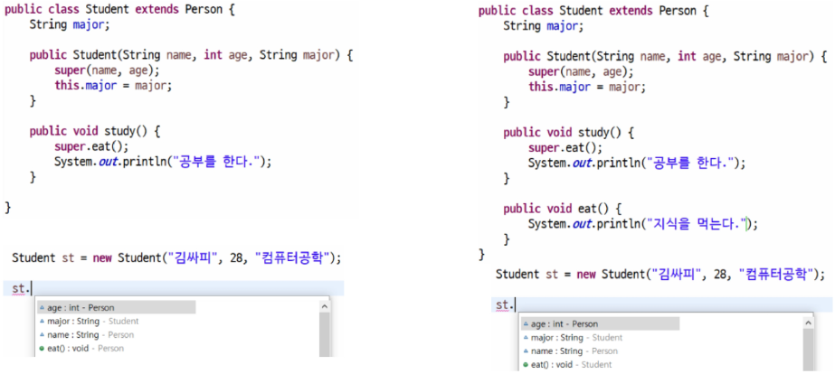

# 상속

### 상속의 정의

- 어떤 클래스의 특성을 그대로 갖는 새로운 클래스를 정의한 것


### 상속의 특징

1. **확장성, 재사용성**
   - 부모의 생성자와 초기화 블록은 상속 x

2. **클래스 선언 시 extends 키워드를 명시**
   - 자바는 다중 상속 허용X, 단일 상속 지원
3. **관계**
   - 부모 (상위, Super) 클래스: Person
   - 자식 (하위, Sub) 클래스: Student
4. **자식 클래스는 부모 클래스의 멤버변수, 메소드를 자신의 것처럼 사용할 수 있다.**
   - 단, 접근 제한자에 따라 사용 여부가 달라진다
5. **Object 클래스는 모든 클래스의 조상 클래스**
   - 별도의 extends 선언이 없는 클래스는 extends Object가 생략
   - 즉, extends를 쓰지 않으면 Object를 상속 받는다.


> 이미 Object를 상속받고 있었다.

```java
///////////////Person/////////////////
package com.ssafy.inheritance01;

public class Person {
	String name;
	int age;
	
	public Person() {
		System.out.println("Person's basic producer");
	}
	
	public void eat() {
		System.out.println("eat food");
	}
}

///////////////Student///////////////////
package com.ssafy.inheritance01;

public class Student extends Person {
	String major;
	
	public Student() {
		System.out.println("Student's basic producer");
	}
	
	
	public void study() {
		System.out.println("Study hard");
	}
}

/////////////Main////////////////////
package com.ssafy.inheritance01;

public class MainTest {
	public static void main(String[] args) {
//		Person p = new Person();
		Student st = new Student();
	}
}
```

> 각각의 기본 생성자에는 부모 생성자를 호출하는 super()가 존재한다. 따라서 Student 객체가 생성될 때에는 가장 윗단인 Object의 기본 생성자가 실행되고 그 다음 Person, 마지막에는 Student의 기본 생성자가 실행이 되게 된다.

```java
// 기본 생성자 없이 매개변수를 넣어야하는 생성자가 있을 경우에는 자식 클래스에서 super()내부에 매개변수를 똑같이 넣어주어야한다. 만약 기본생성자를 실행시켜주고 싶으면 부모 클래스에 기본 생성자를 명시해주어야 한다.
```


### super를 통해 조상 클래스의 메서드 호출


### 오버라이딩(재정의, overriding)

> 메서드 오버로딩은 매개변수의 순서와 타입 등을 바꿔주는 것

- 상위 클래스에 선언된 메서드를 자식 클래스에서 재정의 하는 것
- 메서드의 이름, 반환형, 매개변수(타입, 개수, 순서) 동일 해야 한다.
- 하위 클래스의 접근 제어자 범위가 상위 클래스보다 크거나 같아야 한다.
  - 부모가 오픈했는데 자식이 숨길 수 없다.


- 조상보다 더 큰 예외를 던질 수 없다.
- 메서드 오버로딩(overloading)과 혼동하지 말 것!!!



- @ : `Annotation`이라고 하며 컴파일러가 보는 주석이다. 해당 메서드는 재작성 되었다고 알려줌. 썼을 때의 장점은 


```java
// 메서드 오버라이딩
	@Override
	public void eat() {
		System.out.println("I eat knowledge");
	}

// Annotation을 작성하지 않으면, 단순히 오버로딩으로 인식하고 끝난다.
	public void eat(String food) {
        System.out.println("I eat knowledge")
    }
```

> Override라는 Annotaion을 적으면서 하나의 안전장치를 마련한 것과 같다.


### Object 클래스

- 가장 최상위 클래스로 모든 클래스의 조상
- Object의 멤버는 모든 클래스의 멤버


> super. 을 이용해서 부모 클래스의 필드와 함수를 실행할 수 있다.


> String의 equals의 경우에는 주소값이 아닌 문자열이 같은지 확인하도록 재정의 되어 있다.
>
> 기존의 equals는 주소를 비교한다


> 객체의 내용을 비교할 수 있도록 재정의했지만 코드 이해 불가!


> final 뒤에는 전부 대문자를 사용한다. ex)MY_COMPUTER