# 다형성(Polymorphism)

### 다형성의 정의

- 하나의 객체를 여러 가지 타입으로 참조할 수 있다.
- 상속관계에 있을 때 조상 클래스의 타입으로 자식 클래스 객체를 참조할 수 있다.

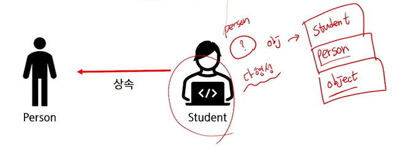

```java
package com.ssafy.polymorphism1;

public class Student {
	String major;

	public Student() {
	}

	public Student(String major) {
		// 부모 생성자의 기본을 만들고, String major를 이용해 내가 가지고 있는 major 바꾼다
		super();
		this.major = major;
	}
}
```

> 필드는 주로 private을 통해 외부에서 접근하지 못하도록 하는 것이 좋다.

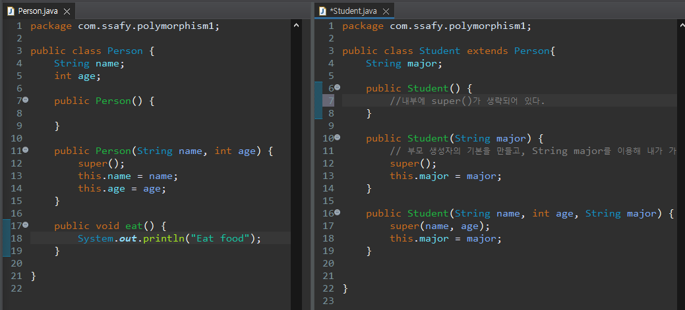

```java
package com.ssafy.polymorphism1;

public class MainTest {
	public static void main(String[] args) {
		Student st = new Student("ssafy", 20, "math");
		Person p = new Student("ssafy", 20, "math");
		Object obj = new Student("ssafy", 20, "math");
		
		// 불가능
//		Student st2 = new Person();
	}
}
```


### 다형성의 활용

1. **다른 타입의 객체를 다루는 배열**

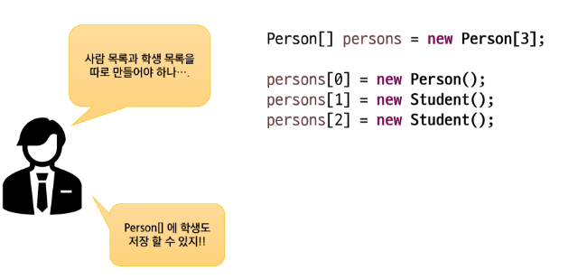

```java
package com.ssafy.polymorphism1;

public class ArrayTest {
	public static void main(String[] args) {
		Person[] persons = new Person[3];
		
		persons[0] = new Person();
		persons[1] = new Student();
//		persons[2] = new Object();
	}
}
```


2. **매개변수의 다형성**

- 메서드가 호출되기 위해서는 메서드 이름과 파라미터가 맞아야 한다.

- 조상을 파라미터로 처리한다면 객체의 타입에 따라 메서드를 만들 필요가 없다.

```java
public void println(Object x) {
        String s = String.valueOf(x);
            synchronized (this) {
                print(s);
                newLine();
        }
    }
```

> println의 매개변수로 아무 타입이나 들어와도 된다.

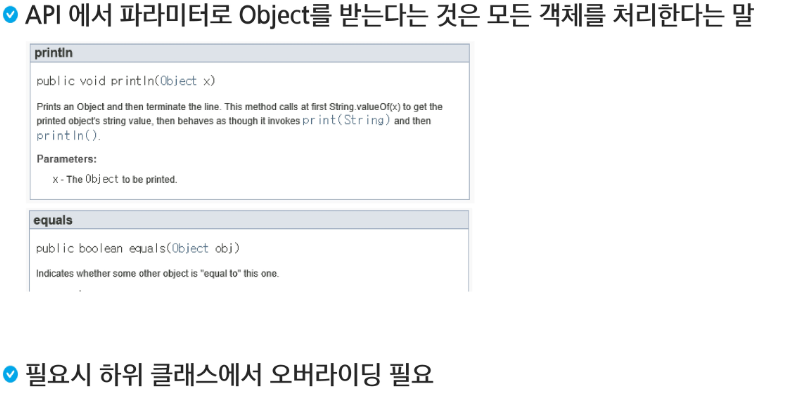

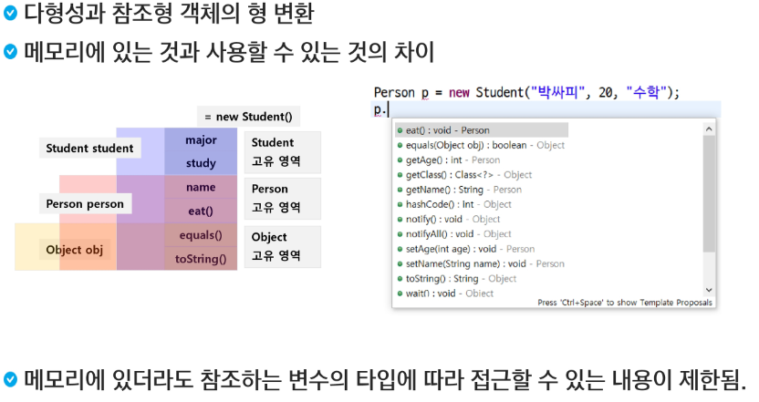

> 메모리에 만들어진 것은 Student 객체인데 참조해서 쓸 수 있는 것은 Person으로 받아버려서 p라는 친구로 접근할 수가 없다.

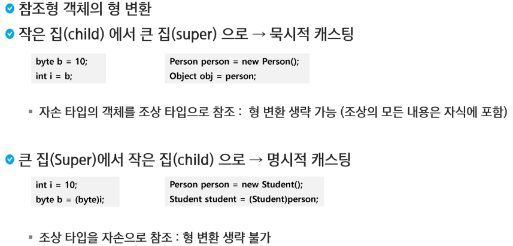

```java
package com.ssafy.polymorphism1;

public class TypeCastingTest {
	public static void main(String[] args) {
		byte b = 10;
		int i = b; // 문제없음(작은 집 -> 큰 집)
		
		Person person = new Person();
		Object obj = person; //문제없음(자손타입 객체를 조상 타입으로 형변환 할 수 있음, 이때 생략 가능)
		
		// 형 변환 메시지를 작성해주어야 한다.
		int a = 10;
		// 명시적으로 작성한다는 것은 내가 허락했다. 이후에 나올 에러는 내 잘못이다.
		byte c = (byte) a;
		
		Person p = new Student();
		Student st = (Student) p;
		// 1. 형 변환 하던지 2. Student->Person 3. Person -> Student
		// 조상타입을 자손으로 참조하기 위해서는 형변환 생략 불가능
	}
}
```

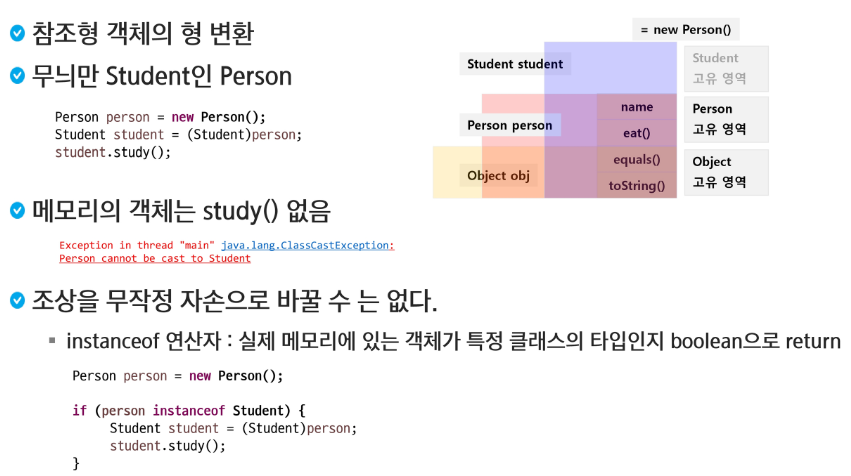

```java
		Person p = new Student();
		
		if(p instanceof Student) {
			Student st = (Student) p;
			st.study();
		}
		
		Person p2 = new Person();
		if (p2 instanceof Student) {
			Student st2 = (Student) p2;
			st2.study();
		}
		
		Student st3 = (Student) p2;
		st3.study();
		// 바로 위 Student는 Student라는 클래스 설계도를 가리키고 있기 때문에 study를 가리킬 수 있음
		// 껍데기만 사용하는 것이다.
		// 조상을 무작정 자손으로 바꿀 수는 없다.
```


### 참조 변수의 레벨에 따른 객체의 멤버 연결

- 자바 파일 하나에 여러 개의 클래스를 만들어도 상관없음
  - bin에서 Class마다 .class파일을 만들어준다.

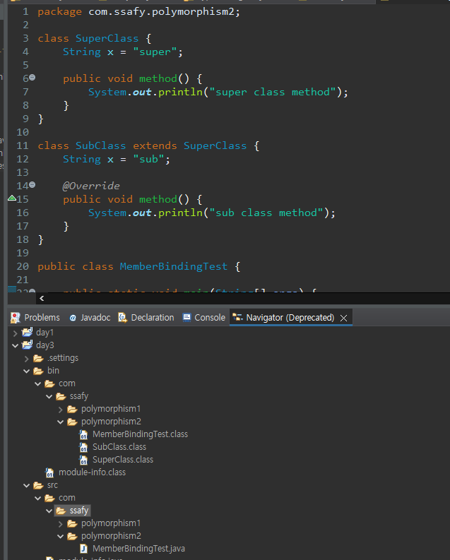

```java
package com.ssafy.polymorphism2;

class SuperClass {
	String x = "super";
	
	public void method() {
		System.out.println("super class method");
	}
}

class SubClass extends SuperClass {
	String x = "sub";
	
	@Override
	public void method() {
		System.out.println("sub class method");
	}
}

public class MemberBindingTest {
	public static void main(String[] args) {
		SubClass subClass = new SubClass();
//		System.out.println(subClass.x);
//		subClass.method();
		
		SuperClass superClass = subClass;
		System.out.println(superClass.x);
		superClass.method();
		
//		super
//		sub class method
	}
}
```

> SubClass가 SuperClass로 타입변환이 되었기 때문에 변수는 SuperClass의 x가 출력되고, 메서드인 경우에는 override된 메서드가 출력이 된다.

- **참조 변수의 레벨에 따른 객체의 멤버 연결**
- **상속 관계에서 객체의 멤버 변수가 중복 될 때**
  - <u>참조 변수의 타입</u>에 따라 연결이 달라짐
- **상속 관계에서 객체의 메서드가 중복될 때(메서드가 override 되었을 때)**
  - 동적 바인딩 된다 라고 말함
  - 무조건 자식 클래스의 메서드가 호출됨 -> virtual method invocation
  - 최대한 메모리에 생성된 실제 객체에 최적화된 메서드가 동작한다.

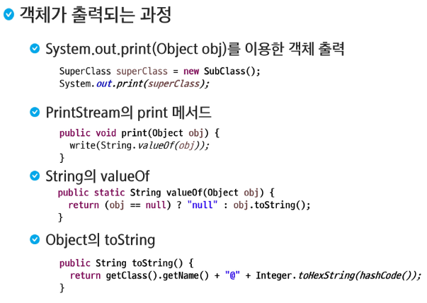

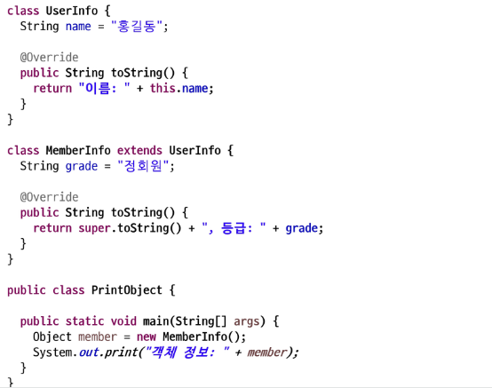

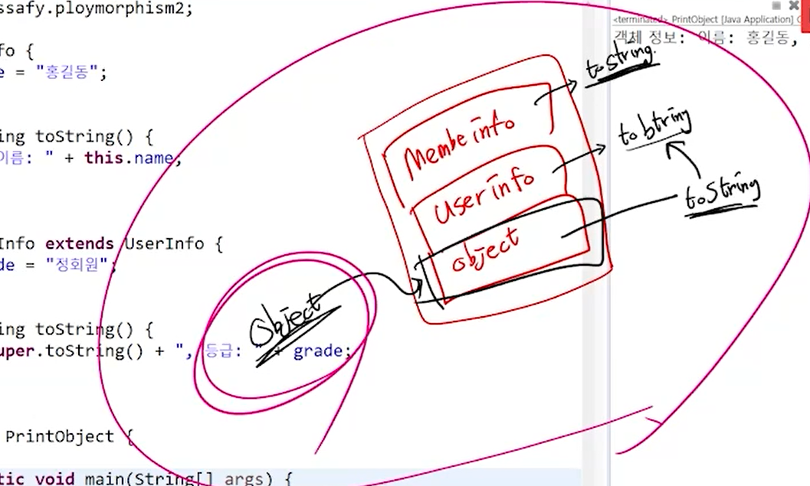

```java
package com.ssafy.polymorphism1;

class UserInfo {
	String name = "ssafy";
	
	@Override
	public String toString() {
		return "name: " + this.name;
	}
}


class MemberInfo extends UserInfo {
	String grade = "Regular member";
	
	@Override
	public String toString() {
		return super.toString() + ", Grade: " + grade;
	}
}

public class PrintObject {
	
	public static void main(String[] args) {
		Object member = new MemberInfo();
		System.out.print("User info: " + member);
	}
}
```

