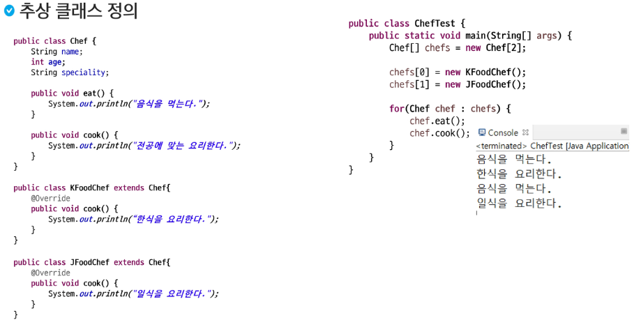
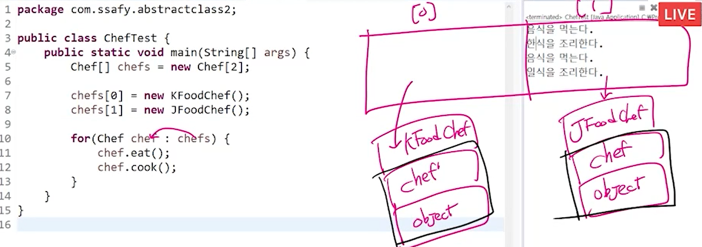
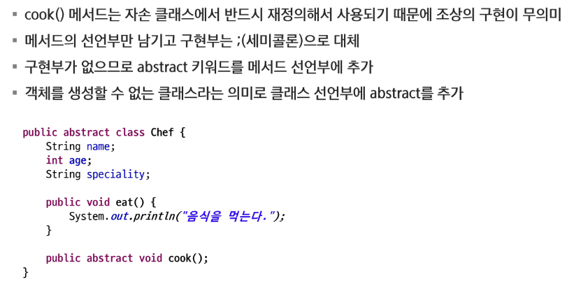

# 추상 클래스





> 동적바인딩이라는 성질 때문에 Chef의 타입을 가져도 메서드는 Override된 것을 실행한다.

```java
package com.ssafy.abstractClass3;

public class ChefTest {
	public static void main(String[] args) {
		Chef[] chefs = new Chef[2];

		chefs[0] = new KFoodChef();
		chefs[1] = new JFoodChef();

		// chefs의 원소를 하나하나 복사해서 가져온다.
		for (Chef chef : chefs) {
			chef.eat();

			if (chef instanceof KFoodChef) {
				// k에 담아서 처리할 필요가 없다
				// cook부르고 k변수는 사용하지 않기 때문에
//				KFoodChef k = (KFoodChef) chef;
//				k.cook();

				// (KFoodChef)chef.cook();
				// 위 명령어는 실행될 수 없음
				// chef.cook()을 먼저 실행하고 형 변환을 하기 때문에 에러

				((KFoodChef) chef).cook();
			} else if (chef instanceof JFoodChef) {
				((JFoodChef) chef).cook();
			}

			// 조상 클래스가 자식 클래스의 메소드를 참조할 수 없음.
//			chef.cook();
		}
	}
}
```



```java
package com.ssafy.abstractClass4;

public class ChefTest {
	// 추상 메서드를 활용하면 좋은 점은?????
	
	// 부모가 구현하고 싶은 내용이 없다고 해서 구현을 빼버리면
	// 동적바인딩에 의해 자식의 오버라이딩된 함수가 실행되는 기회를 없애게 된다.
	
	// 빈 껍데기만 만들어놓으면 자식이 구현하던 말던 신경 쓰지 않는다.
    // 즉, public void cook() {};만 부모에 만들면 자식은 신경도 안 쓴다.
	// 하지만, abstract으로 만들어 놓으면 자식 클래스는 해당 클래스를 무조건 구현해야하는 의무를 가진다.
	// 실수가 줄어든다.
	
	public static void main(String[] args) {
		Chef c = new KFoodChef();
		c.cook();
		
		// 추상 클래스는 객체를 만들 수 없다.
		// Chef 타입을 생성하고 싶으면 중괄호를 걸어서 새로 정의를 한다.
		// 추상 클래스는 미완성 설계도이니까, 인스턴스를 생성할 수 없다.
		// 미완성 된 부분을 만들어 주면 된다.
		// 익명 클래스(Anonymous Class) 문법으로 1회 한정으로 구현하고 인스턴스를 만들 수 있게 해준다.
		Chef c2 = new Chef() {

			@Override
			public void cook() {
				System.out.println("Cook");
			}
		};
		
		c2.cook();
	}
}
```


### 추상 클래스 특징

- abstract 클래스는 상속 전용의 클래스
- 클래스에 구현부가 없는 메서드가 있으므로 객체를 생성할 수 없음
- 상위 클래스 타입으로 자식을 참조할 수는 있음

```java
//생성할 수 없음
Chef chef1 = new Chef();
//참조는 문제 없음
Chef chef2 = new KFoodChef();
```

- 조상 클래스에서 상속 받은 abstract 메서드를 재정의하지 않은 경우 클래스 내부에 abstract 메서드가 있으므로 자식 클래스는 abstract 클래스가 되어야함.


### 추상 클래스 사용하는 이유

- abstract 클래스는 구현의 강제를 통해 프로그램의 안정성 향상