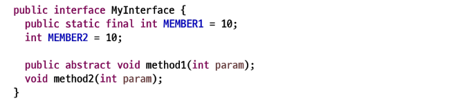
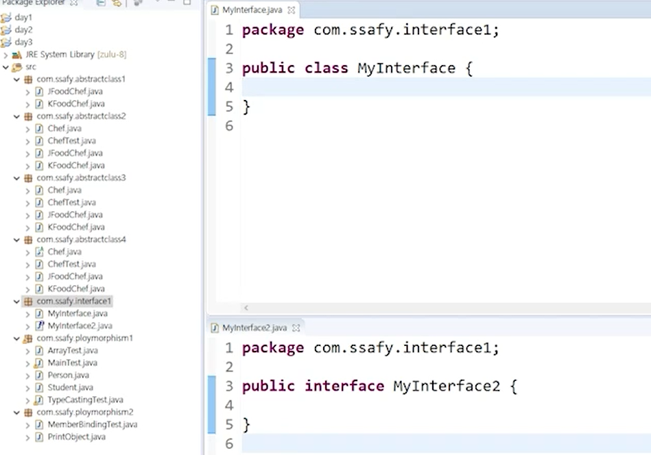
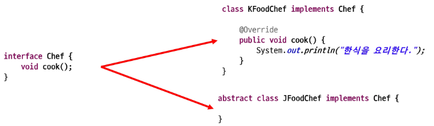
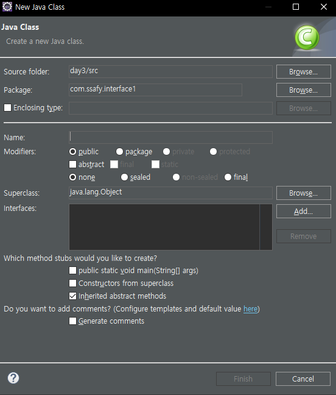

# 인터페이스(Interface)


### 인터페이스의 정의

- 완벽한 추상화된 객체: 모든 메서드가 abstract 형태
- 반쯤 완성된 객체
- 설계도



> interface가 선언된 상태라서 제한자를 쓰지 않아도 알아서 모두 들어가 있음. MEBER2의 int 앞에도 위에거와 같은 제한자가 들어가 있다.




> class로 만들어서 키워드만 다시 interface로 만들어주면 바뀐다.

### 인터페이스의 특징

1. Interface 키워드를 이용하여 선언

```java
public interface MyInterface {}
```

2. 선언되는 변수는 모두 상수로 적용

```java
public static final int MEMBER1 = 10;
int MEMBER2 = 10; 
```

3. 선언되는 메소드는 모두 추상 메소드로 적용

```java
public abstract void method1(int param);
void method2(int param);
```

4. 인터페이스 extends를 이용하여 상속 가능(다중 상속가능,  구현부가 없음)
   - 구현부가 없어서 충돌나거나 모호한 부분이 없음
   - 클래스는 다중 상속이 안 된다.

```java
// 인터페이스는 메소드들이 구현부가 없어서 헷갈릴 메소드가 없다
// 다중 상속이 가능하다.
interface MyInterface4 extends MyInterface2, MyInterface3 {
	
}
```

5. 객체 생성이 불가능(추상 클래스 동일한 특성)

```java
interface MyInterface {}

public class Main {
    // 생성 불가능
    MyInterface m = new MyInterface();
}

package com.ssafy.interface1;

interface MyInterface3 {
	
}

public class MainTest {
	public static void main(String[] args) {
		MyInterface3 m = new MyInterface3(); // 인터페이스는 인스턴스를 생성할 수 없다.
	}
}
```

6. 클래스가 인터페이스를 상속할 경우에는 extends 키워드가 아니라 implements 키워드를 이용

```java
interface Shape {}

// 상속 불가
class Circle extends Shape {}

class Circle implements Shape {}

package com.ssafy.interface1;

interface Shape {
	
}

// extends로 인터페이스 상속 불가능
//class Circle extends Shape {
//	
//}

// 여러 개를 가져다 사용할 수 있다.
// My Interface2에 abstract 메서드가 있어서 반드시 Override해줘야 한다.
class Circle implements Shape, MyInterface2, MyInterface3 {

	@Override
	public void method1(int param) {
		// TODO Auto-generated method stub
		
	}

	@Override
	public void method2(int param) {
		// TODO Auto-generated method stub
		
	}
	
}

public class CircleTest {

}
```

7. 인터페이스를 상속받는 하위클래스는 추상 메소드를 반드시 오버라이딩(재정의) 해야 한다.
   - 구현하지 않을 경우 abstract 클래스로 표시해야 함



8. 인터페이스 다형성 적용

```java
package com.ssafy.interface2;

public class ChefTest {
	public static void main(String[] args) {
		// 인터페이스는 객체를 생성할 수 없다.
		// Chef chef1 = new Chef();
		
		// KFoodChef라는 인스턴스를 Chef라는 자료형으로 참조가 되었다.
		// 다형성의 성질을 가지고 있다.
		Chef chef2 = new KFoodChef();
		
		// 추상 클래스는 객체를 생성할 수 없다.
		// Chef chef3 = new JFoodChef();
	}
}
```


### 인터페이스의 필요성

- 구현의 강제로 표준화 처리 (abstract 메서드 사용)
- 인터페이스를 통한 간접적인 클래스 사용으로 손쉬운 모듈 교체 지원
- 서로 상속의 관계가 없는 클래스들에게 인터페이스를 통한 관계 부여로 다형성 확장
- 모듈 간 독립적 프로그래밍 가능 -> 개발 기간 단축

```java
// 인터페이스라는 설계도를 토대로 독립적으로 개발이 가능
package com.ssafy.interface3;

public interface IStudentManager {
	
	void add(Student s);
	Student[] getList();
	Student searchByName(String name);
	boolean remove(String name);
}

// 단순히 클래스를 변경하면서 기능을 버전업 할 수 있음(스프링 부트 때 활용)
package com.ssafy.interface3;

public class StudentUI {
	public static void main(String[] args) {
		IStudentManager sm = new StudentManager();
		// 버전이 업데이트되면 그냥 갈아끼워 넣으면 좋다.
		// IStudentManager sm = new StudentManager2();
		
		
		// 사용자가 보는 UI를 작성을 했어야 했는데 StudentManager랑 연관이 있다.
	}
}

// 구현을 강제로 해주면서 표준화 마련
package com.ssafy.interface3;

public class StudentManager implements IStudentManager{

	@Override
	public void add(Student s) {
		// TODO Auto-generated method stub
		
	}

	@Override
	public Student[] getList() {
		// TODO Auto-generated method stub
		return null;
	}

	@Override
	public Student searchByName(String name) {
		// TODO Auto-generated method stub
		return null;
	}

	@Override
	public boolean remove(String name) {
		// TODO Auto-generated method stub
		return false;
	}
	// 실습실에서 했던 것들이 쭉쭉 들어가겠죠
	// 배열도 선언
	
	// add
	
	// getList
	
	// search
	
	// remove
}
```


### 참고 사항



- Package는 폴더의 구조를 나타낸다
- Name은 Class의 이름
- Modifiers는 외부 클래스 같은 경우 public과 package(default) 두 가지가 있다
  - 내부 클래스는 여러 가지 제한자가 사용될 수 있다(private, protected, public)
  - final같은 경우에는 상속될 수 없다.
- Superclass에는 초기에 상속 받는다(단일 상속만 되어서 하나만 있다)
- Interface 공간은 다중 상속이 가능해서 공간이 크다.