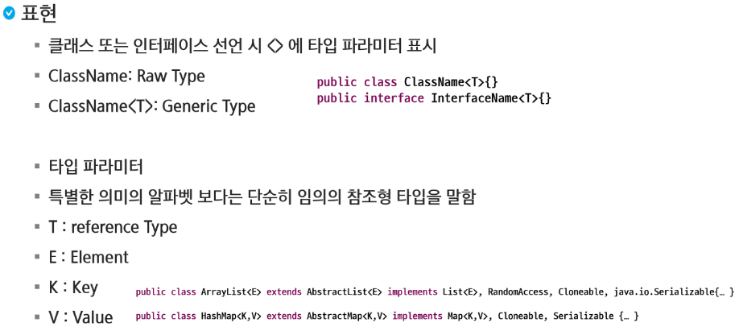
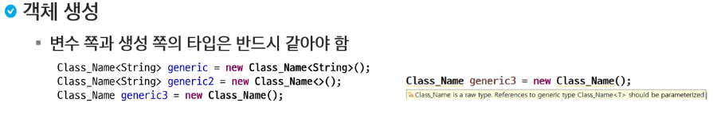
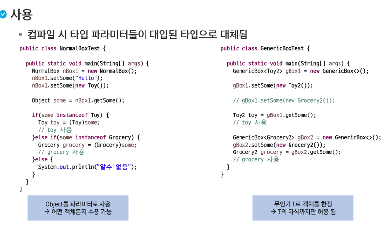
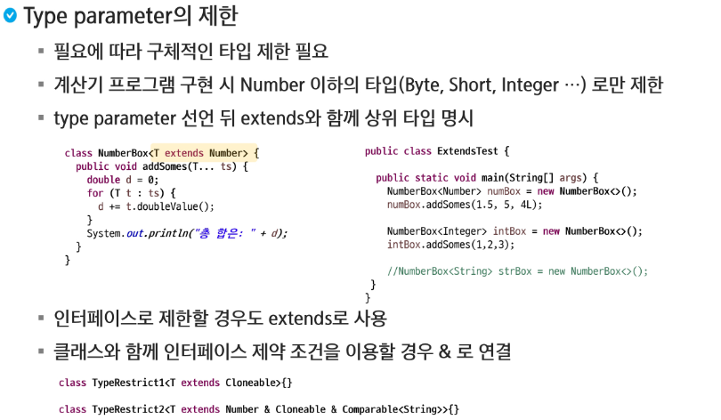
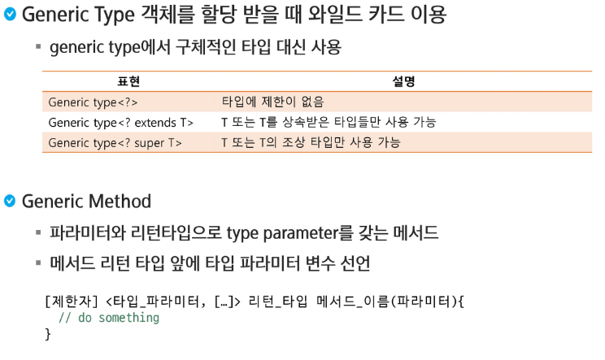

# Generic

### Generic이란?

- 다양한 타입의 객체를 다루는 메서드, 컬렉션 클래스에서 컴파일 시에 타입 체크
  - 미리 사용할 타입을 명시해서 형 변환을 하지 않아도 되게 함
  - 객체의 타입에 대한 안정성 향상 및 형 변환의 번거로움 감소






> 두 번째의 경우 객체 생성 시 `<>`안에 아무것도 작성하지 않아도 왼쪽에 선언한 타입을 자동으로 넣어줌

```java
package com.ssafy.generic;

public class UseBoxTest {
	public static void main(String[] args) {
		
		// 필드로 Object를 가지고 있으니 무엇이든지 저장할 수 있음.
		NormalBox nbox = new NormalBox();
		nbox.setSome("Hello");
		
		Object some = nbox.getSome();
		// String같은 경우 오버라이딩 되어 있어서 toString이 오버라이딩 된 것을 실행(동적 바인딩)
		System.out.println(some);
		System.out.println(some.getClass().getName());
		if (some instanceof String) {
			String someStr = (String) some;
			System.out.println(some);
		}
		
	}
}
```

```java
package com.ssafy.generic;

public class UseBoxTest {
	public static void main(String[] args) {
		
		
		// 미리 타입을 지정함.
		GenericBox<String> gbox = new GenericBox<>();
		gbox.setSome("Hi");
		String some = gbox.getSome();
		
		System.out.println(some);
	}
}
```





> ✔`T...`은 가변 인자로서 여러 개의 값을 받아서 `ts`라는 변수에 배열로 저장한다.
>
> 계산기인 경우 숫자 이외의 것은 오지 못하도록 제한이 필요

```java
package com.ssafy.generic;

class Person {
}


class Student extends Person{
}

// 뭐든지 받을 수 있는 Generic이다.
class PersonBox<T> {
}

public class WildCardTest {
	public static void main(String[] args) {
		PersonBox<Object> pobj = new PersonBox<>();
		PersonBox<Person> pper = new PersonBox<>();
		PersonBox<Student> pst = new PersonBox<>();
		
		PersonBox<?> pAll = pobj;
		pAll = pper;
		pAll = pst;
		
		//Person 또는 상속 받은 경우만 넣을 수 있다.
		PersonBox<? extends Person> pChild = pper;
		pChild = pst;
//		pChild = pobj;
		
		// Person 또는 조상만 받을 수 있다.
		PersonBox<? super Person> pSuper = pper;
//		pSuper = pst;
		pSuper = pobj;
	}
}
```

> T는 하나의 타입만, ?는 어떤 타입이 와도 상관없음.

