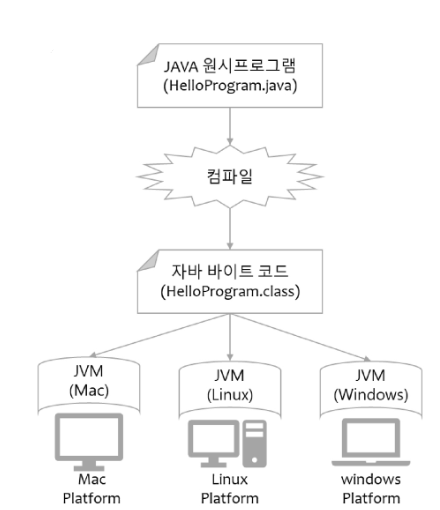

# 자바 가상 머신(JVM, Java virtual machine)이란?

- 자바 바이트코드를 실행할 수 있는 주체
- 자바 바이트코드는 플랫폼(OS)에 독립적이며 모든 JVM은 자바 가상 머신 규격에 정의된대로 자바 바이트 코드를 실행
  - 쉽게 말해서, JVM은 자바 바이트 코드를 실행해주는 존재다
  - JVM은 독립적인 것이 아니다(운영체제에 맞는 JVM이 존재)
  - JVM은 컴파일된 바이트 코드를 읽은 후 출력해준다.

> .java라는 파일을 컴파일을 통해 .class파일로 만들어준다. 자바 바이트코드가 컴퓨터가 바로 이해할 수 있는 기계어는 아니고 사람과 컴퓨터 사이의 중간 언어이다.

> JRE(Java Runtime Environment): 자바 실행 환경 , JVM이 자바 코드를 실행시킬 때 필요한 것들을 가지고 있음(JVM을 실행시키기 위한 환경-JRE가 기본적으로 있어야 함)
>
> JDK(Java Development Kit): JRE + 개발에 필요한 것들(컴파일러 등의 도구)