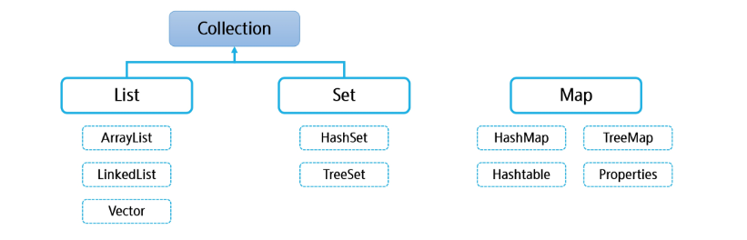
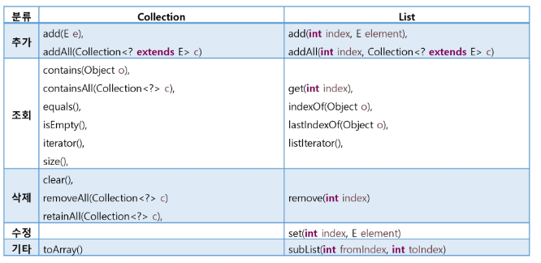
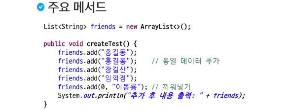

# Collection Framework

### Collection Framework란?

- 객체들을 한곳에 모아 놓고 편리하게 사용할 수 있는 환경을 제공
- 정적 자료구조(Static structure)
  - 고정된 크기의 자료구조
  - 배열이 대표적인 정적 자료구조
  - 선언 시 크기를 명시하면 바꿀 수 없음
- 동적 자료구조(Dynamic structure)
  - 요소의 개수에 따라 자료구조의 크기가 동적으로 증가하거나 감소
  - 리스트, 스택, 큐 등

- 자료구조들의 종류는 결국은 어떤 구조에서 얼마나 빨리 원하는 데이터를 찾는가에 따라 결정된다.
  - 순서를 유지할 것인가?
  - 중복을 허용할 것인가?
  - 다른 자료구조들에 비해서 어떤 단점과 장점을 가지고 있는가?

> `Collection`이라는 커다란 인터페이스를 `List`와 `Set`이 상속받고 있음, `List`, `Set`, `Map`은 인터페이스이다. `List` 아래에 있는 것들은 `List`의 구현체이다.
>
> Map: 키와 값의 형태로 이루어져 있음.
>
> Set: 중복된 자료를 허용하지 않음.
>
> List: 배열과 비슷하게 연결된 자료형

- java.util 패키지
  - 다수의 데이터를 쉽게 처리하는 방법 제공

---

### List

- 특징: 순서가 있고ㅡ 중복을 허용(배열과 유사)
- 구현 클래스
  - ArrayList
  - LinkedList

- 내부적으로 배열을 이용하여 데이터를 관리
- 배열과 다르게 크기가 유동적으로 변함(동적 자료구조)
- 배열을 다루는 것과 유사하게 사용할 수 있음
- 주요 메서드

> List는 Collection을 상속받고 있다.

> List의 칸이 너무 많으면 줄여주고, 너무 적으면 늘리면서 동적으로 크기가 변한다.

