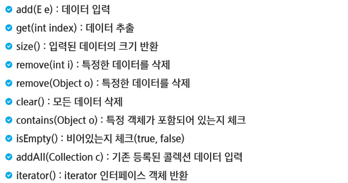

# Collection Framework

### ArrayList



```java
package com.ssafy.collection;

import java.util.ArrayList;
import java.util.List;

public class ListTest {
	public static void main(String[] args) {
		List<String> names = new ArrayList<>();
		
		names.add("Sangchan");
		names.add("Joonsoo");
		names.add("Hyunsoo");
		names.add("Hyunsoo");
		// 0번 인덱스에 추가 가능
		names.add(0, "Hannn");
		
		System.out.println(names);
		
		//비어있는지 확인
		System.out.println(names.isEmpty());
		System.out.println(names.size());
		
		
//		for (int i = 0; i < names.size(); i++) {
//			System.out.println(names.get(i));
//		}
//		
//		for(String name : names) {
//			System.out.println(name);
//		}
		names.remove(0);
		names.remove("Joonsoo");
		
		names.set(2, "Sony");
		System.out.println(names);
		
		
		//삭제할 때
		names.clear();
		names.add("Yang");
		names.add("Yang");
		names.add("Kim");
		
		// 하나를 삭제하면 size가 2가 되고 배열이 0 1로 되어버리는데 1을 가리키게 되어서 지워지지 않음
//		for(int i = 0; i < names.size(); i++) {
//			if(names.get(i).equals("Yang")) {
//				names.remove(i);
//			}
//		}
		
		// 방법 1. i--;를 붙여서 i를 조정한다
		
		// 방법 2. 뒤에서 부터 지운다
		for(int i = names.size() - 1; i >= 0; i--) {
			if (names.get(i).equals("Yang")) {
				names.remove(i);
			}
		}
		
		System.out.println(names);
	}
}
```

