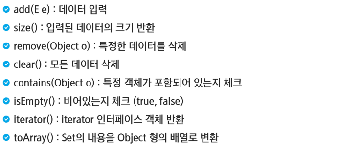
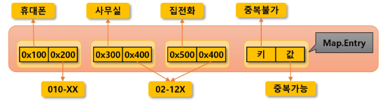
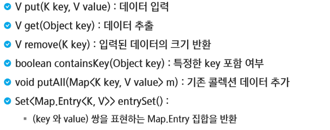
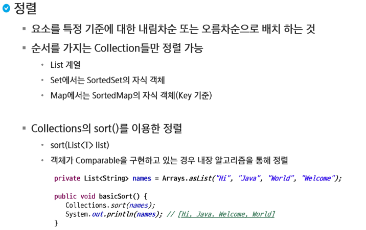
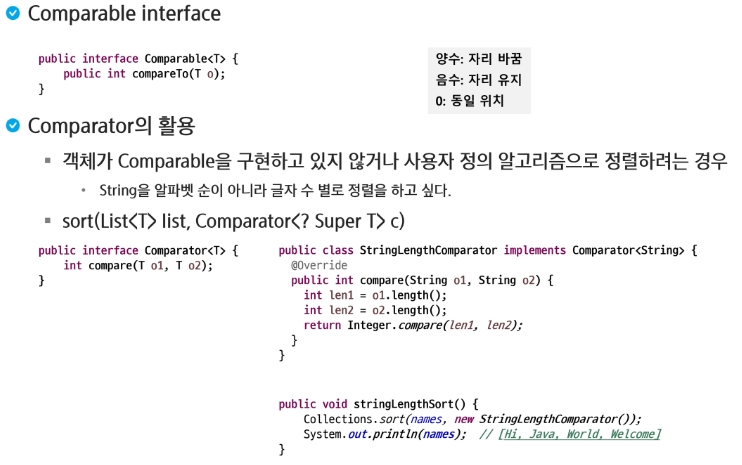
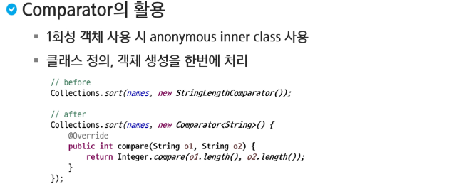

# Collection Framework

### Set

- 특징: 순서가 없고, 중복을 허용하지 않음
- 장점: 빠른 속도, 효율적인 중복 데이터 제거 수단
- 단점: 단순 집합의 개념으로 정렬하려면 별도의 처리가 필요하다.
- 구현 클래스
  - HashSet
  - TreeSet



```java
package com.ssafy.collection;

import java.util.HashSet;
import java.util.Set;

public class SetTest {
	public static void main(String[] args) {
		Set<String> set = new HashSet<>();
		
		set.add("Kim");
		set.add("Hong");
		set.add("Lim");
		// set은 중복을 허용하지 않음
		set.add("Kim");
		set.add("Apple");
		System.out.println(set);
		
		Person p1 = new Person("sangchan", "654");
		Person p2 = new Person("chulsoo", "654");
		
		// 생성자의 위치가 다르기 때문에 위에는 false
		System.out.println(p1 == p2);
		System.out.println(p1.equals(p2));
		
		Set<Person> pSet = new HashSet<>();
		pSet.add(new Person("Hyunsoo", "654"));
		pSet.add(new Person("Chulsoo", "654"));
		System.out.println(pSet);
		
	}
}
```

```java
package com.ssafy.collection;

import java.util.Objects;

public class Person {
	String name;
	String pNum;
	public Person(String name, String pNum) {
		super();
		this.name = name;
		this.pNum = pNum;
	}
	public Person() {
	}
	
	@Override
	public String toString() {
		return "name=" + name + ", pNum=" + pNum;
	}
	
    // hashcode로 비교하기 때문에 넣어주어야함.
	@Override
	public int hashCode() {
		return Objects.hash(pNum);
	}
	
	@Override
	public boolean equals(Object obj) {
		if(this == obj) return true;
		if(obj == null) return false;
		// 형변환을 시켜줘야함
		Person other = (Person) obj;
		return pNum.equals(other.pNum);
		// 기존 equals는 같은 주소를 가리키고 있으면 true를 반환
//		return super.equals(obj);
	}
}
```


### Map

- 특징: Key(키)와 value(값)를 하나의 Entry로 묶어서 데이터 관리, 순서는 없으며, 키에 대한 중복은 없음
- 장점: 빠른 속도
- 구현 클래스
  - HashMap
  - TreeMap





```java
package com.ssafy.collection;

import java.util.HashMap;
import java.util.Map;

public class MapTest {
	public static void main(String[] args) {
		//List가 index로 데이터를 식별
		//Map은 Key값으로 데이터를 식별
		
		Map<String, String> map = new HashMap<>();
		
		map.put("654", "sangchan");
		map.put("970", "chulsoo");
		map.put("234", "hyungsoo");
		
		System.out.println(map);
		
		// 키를 이용해서 값을 가지고 올 수 있다.
		System.out.println(map.get("654"));
		//없는 키를 사용하면 에러가 발생하진 않고 null반환
		System.out.println(map.get("111"));
		//해당 키가 있는지 없는지 검사를 해준다.
		System.out.println(map.containsKey("234"));
		
		map.put("234", "joonsoo");
		System.out.println(map);
	}
}
```







> 이 둘을 활용해서 객체끼리도 비교가 가능하다

```java
package com.ssafy.collection;

import java.util.ArrayList;
import java.util.Collections;
import java.util.List;

public class SortTest1 {
	public static void main(String[] args) {
		List<String> list = new ArrayList<>();
		
		list.add("sangchan");
		list.add("suenghwi");
		list.add("dohyun");
		list.add("asefe");
		list.add("bdsafs");
		list.add("samsung");
		list.add("SAMSUNG");
		
		Collections.sort(list);
		
		System.out.println(list);
	}
}
```

```java
package com.ssafy.collection;

import java.util.ArrayList;
import java.util.Collections;
import java.util.Comparator;
import java.util.List;

public class SortTest2 {
	public static void main(String[] args) {
		List<Person> list = new ArrayList<>();
		
		list.add(new Person("Mike1", "123"));
		list.add(new Person("Mike3", "111"));
		list.add(new Person("Mike2", "321"));
		list.add(new Person("Mike5", "987"));
		list.add(new Person("Mike6", "555"));
		list.add(new Person("Mike4", "456"));
		
		Collections.sort(list);
		
		System.out.println(list);
		
		for(Person p : list) {
			System.out.println(p);
		}
		
		System.out.println("----------------");
		
		Collections.sort(list, new Comparator<Person>() {

			@Override
			public int compare(Person o1, Person o2) {
				return o1.name.compareTo(o2.name);
			}
			
		});
		
		for(Person p : list) {
			System.out.println(p);
		}
	}
}
```

```java
// 클래스 내부에 정렬 기준을 적어줄 수 있음

package com.ssafy.collection;

import java.util.Objects;

public class Person implements Comparable<Person>{
	@Override
	public int compareTo(Person o) {
		// String타입에 compareTo가 정의되어 있음
		return this.pNum.compareTo(o.pNum);
	}

	String name;
	String pNum;
	
	public Person(String name, String pNum) {
		super();
		this.name = name;
		this.pNum = pNum;
	}
	public Person() {
	}
	
	@Override
	public String toString() {
		return "name=" + name + ", pNum=" + pNum;
	}
	
	@Override
	public int hashCode() {
		return Objects.hash(pNum);
	}
	
	@Override
	public boolean equals(Object obj) {
		if(this == obj) return true;
		if(obj == null) return false;
		// 형변환을 시켜줘야함
		Person other = (Person) obj;
		return pNum.equals(other.pNum);
		// 기존 equals는 같은 주소를 가리키고 있으면 true를 반환
//		return super.equals(obj);
	}
}
```

